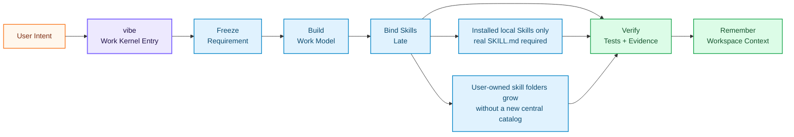

<div align="right">
  <b>🇬🇧 English</b> &nbsp;|&nbsp; <a href="./README.zh.md">🇨🇳 中文</a>
</div>

<br/>

<div align="center">

<a href="https://github.com/foryourhealth111-pixel/Vibe-Skills">
  
</a>

<br/>


<br/><br/>

### Give your AI agent a real work kernel

Install VibeSkills, type `vibe`, and let the kernel handle the real job: understand the goal, organize useful Skills into bounded work, complete the work, verify the result, and keep the context for next time. It is designed so new local domain Skills can plug into the same work loop without turning the system back into a giant routing surface.

&nbsp;
*You bring the goal. VibeSkills helps the agent move from idea to plan, from plan to work, and from work to verified delivery. The point is not more menu entries. The point is a smaller core that can organize skills into finished work.*

Installed local skills are the only specialist reference surface. Codex scans `~/.agents/skills` before `~/.codex/skills`; Claude Code scans `~/.claude/skills`. When the same skill id appears more than once, the earlier root wins, and `work_binding` stays the runtime truth for what was actually selected and run.

For this runtime boundary, Python owns task semantics, `work_binding`, specialist decision truth, and runtime summary data. PowerShell stays only as a thin host wrapper for launch, host receipts, shell-native checks, and leaf execution. A future full-Python runtime is optional, not required for this version.

<br/>

<table align="center">
<tr>
<td align="left">
  <pre><code>&gt; vibe
  intent.freeze()        -> requirement_doc
  plan.model()           -> bounded_work
  skills.bind_late()     -> helpful Skills by work unit
  evidence.verify()      -> tests, checks, artifacts
  memory.preserve()      -> next-session context</code></pre>
</td>
</tr>
</table>

<br/>

<a href="https://github.com/foryourhealth111-pixel/Vibe-Skills/stargazers">
  
</a>
<a href="https://github.com/foryourhealth111-pixel/Vibe-Skills/network/members">
  
</a>
<a href="https://github.com/foryourhealth111-pixel/Vibe-Skills/pulse">
  
</a>

&nbsp;

&nbsp;

&nbsp;

&nbsp;

&nbsp;


<br/><br/>

🧠 Planning · 🛠️ Engineering · 🤖 AI · 🔬 Research · 🎨 Creation

<br/><br/>

<a href="docs/install/one-click-install-release-copy.en.md">
  
</a>

<br/><br/>

<a href="docs/quick-start.en.md">
  
</a>
&nbsp;
<a href="./README.zh.md">
  
</a>

<br/><br/>

<kbd>Install</kbd> &nbsp;→&nbsp;
<kbd>vibe | vibe-upgrade</kbd> &nbsp;→&nbsp;
<kbd>Work Kernel</kbd> &nbsp;→&nbsp;
<kbd>Skill Composition</kbd> &nbsp;→&nbsp;
<kbd>TDD / Verification</kbd> &nbsp;→&nbsp;
<kbd>Persistent Context</kbd>

</div>

## 📋 Table of Contents

- [Runtime at a Glance](#-runtime-at-a-glance)
- [Practice Demos](#-practice-demos-real-work-you-can-see)
- [A New Kind of Work Entry](#-a-new-kind-of-work-entry)
- [What makes it different](#-what-makes-it-different)
- [Who is it for](#-who-is-it-for)
- [Work Organization](#-work-organization-how-skills-become-bounded-work)
- [Memory System](#-memory-system-resume-context-across-the-same-workspace)
- [Representative Work Areas](#-representative-work-areas-not-a-skill-menu)
- [Installation & Management](#️-installation--skills-management)
- [Getting Started](#-getting-started)


<details>
<summary><b>🔑 New here? Quick glossary of key terms (click to expand)</b></summary>

<br/>

| Term | Plain-English Meaning |
|:---|:---|
| **Harness** | The workflow layer around your AI agent. It decides the next step, calls the right Skills, checks the work, and saves useful context. |
| **Skill** | A focused expert capability, such as `tdd-guide`, `code-review`, data analysis, writing, or research support. |
| **Vibe / VCO** | The canonical runtime that runs the harness. Public entrypoints are `vibe` and `vibe-upgrade`. |
| **Bound skill composition** | The kernel calls different Skills only where they help the current work unit move forward. |
| **Local-skill-only reference plane** | The kernel treats declared local skill roots as the only specialist source. A skill must have a readable `SKILL.md` before it can be selected. |
| **TDD / verified delivery** | Work should be backed by tests, checks, artifacts, or explicit manual-review notes before completion is claimed. |
| **Workspace memory** | Structured project information, decisions, and evidence are stored so later sessions can continue without starting over. |
| **Work binding truth** | The final record of what skill was actually bound lives in `work_binding`, not in a discovery cache or a broad product claim. |

</details>

> [!IMPORTANT]
> ### 🎯 Core Vision
>
> VibeSkills starts from a simple idea: Skills are powerful, but a long tool list is not enough.
>
> A useful AI agent should know when to ask, when to plan, when to call an expert Skill, and when to prove the work is ready. You should not have to act as the full-time dispatcher.
>
> VibeSkills packages that rhythm into one work-kernel entry. It gives the agent a clear path to follow, pushes work toward tests and evidence, and keeps useful context for the next session.
>
> **Install it, call `vibe`, and your agent gets a better way to move.**
> The current public story is narrower and more practical: installed local skill roots are the only specialist source, duplicate skill ids are resolved by host root priority, and `work_binding` remains the runtime truth for what the kernel actually bound. This is a next-step architecture story, not a claim that the final architecture is complete.

<br/>


---

## 🛰️ Runtime at a Glance

VibeSkills is simple to use because `vibe` owns the flow. You bring the intent; the harness turns it into staged work, scans the local skill roots declared by the host, resolves duplicate skill ids by root priority, binds only the Skills that fit the bounded work, checks the result, and keeps the context for the next session.



<div align="center">

| Signal | What it means |
|:---|:---|
| `one entry` | Start with `vibe`; keep `vibe-upgrade` for updates. |
| `late skill binding` | Skills are attached after the work shape is clear, not used as the control plane. |
| `local-skill-only reference plane` | The kernel checks declared local skill roots and only considers entries with a readable `SKILL.md`. Duplicate skill ids keep the highest-priority root active. |
| `work_binding truth` | The runtime truth for selected skill provenance lives in `work_binding`, even when discovery or benchmark artifacts are also written. |
| `proof trail` | Tests, checks, artifacts, or manual-review state support delivery claims. |
| `memory plane` | Requirements, plans, decisions, and evidence survive the chat window. |

</div>

The normal closeout path should stay small: prove the governed runtime, entry truth, execution proof, release consistency, and repo cleanliness before reaching for wider audit gates.

---

## 🎬 Practice Demos: Real Work You Can See

_People asked what VibeSkills looks like in real work. These examples are easier to judge than a feature list: each one starts with a plain goal, goes through a governed `vibe` run, and ends with something you can open, inspect, or rerun._

> Current benchmark evidence is now anchored by external-style bounded-work briefs, matching release holdouts, and a smaller compatibility shell than the older route-era packet story. To regenerate the latest local proof bundle, run `py -3 -m vgo_cli.main benchmark-kernel --repo-root <repo-root> --suite development --phase phase_4`. That command writes a local bundle containing `kernel-benchmark-report.md`, `release-proof-summary.md`, `holdout-summary.md`, and `compatibility-cut-summary.md`. The claim stays narrow: more realistic bounded work, work-binding-first truth, and less compatibility residue, not final architecture completion.

<div align="center">


| Demo | Starting Point | How `vibe` Moves It Forward |
|:---|:---|:---|
| **Image Workbench** | Build a GPT-image workspace for prompt chat, reference uploads, and real image generation. | Turns the idea into a product scope, UI/API tasks, workflow checks, and screenshot review. |
| **Video Editing Pipeline** | Recut a rocket moon-landing history clip into a short-video style edit. | Breaks the media work into caption, music, pacing, render, and review passes, with rough edges recorded plainly. |
| **ML Experiment + Paper** | Build a face-recognition ML demo and turn the run into a paper. | Guides dataset and model choice, training, evaluation, figure generation, and LaTeX compilation. |


</div>

The useful pattern is not just the final screenshot. A good demo also shows how the work moved:



```mermaid
flowchart LR
    accTitle: VibeSkills Practice Demo Flow
    accDescr: A user goal moves through scope confirmation, planning, skill handoff, execution checks, and an openable result.

    goal["Plain Request"]
    freeze["Confirmed Scope"]
    plan["Work Plan"]
    route["Skill Handoff"]
    work["Build / Analyze / Render"]
    proof["Checks + Evidence"]
    show["Openable Result"]

    goal --> freeze --> plan --> route --> work --> proof --> show

    classDef goal fill:#fff7ed,stroke:#f97316,stroke-width:1.5px,color:#7c2d12
    classDef flow fill:#e0f2fe,stroke:#0284c7,stroke-width:1.5px,color:#0c4a6e
    classDef proof fill:#dcfce7,stroke:#16a34a,stroke-width:1.5px,color:#14532d

    class goal goal
    class freeze,plan,route,work flow
    class proof,show proof
```

> Inspired by the [VibeSkills 3.1.0 community practice cases](https://linux.do/t/topic/2061161): a GPT-image workbench, a video-editing run, and an ML experiment that produced a paper. The best examples link to concrete outputs: a running app, a rendered clip, a compiled paper, or the commands and evidence used to produce them.

---

## 🧬 A New Kind of Work Entry

The agent-skills world is moving past "give the model more tools."

Projects like **[Superpowers](https://github.com/obra/superpowers)** show that Skills can give coding agents real discipline: clarify before coding, design before implementation, test before claiming success. **[GSD / Get Shit Done](https://github.com/gsd-build/get-shit-done)** shows another useful truth: agents need specs, milestones, context, and a way to keep work moving instead of drifting in chat history.

VibeSkills builds on that same direction, but pushes the package shape further:

> **A normal Skill says:** "Here is one thing I can do."
>
> **A work entry says:** "Here is how the work should run."

VibeSkills is the second kind. It wraps the workflow, expert Skills, verification, and workspace memory into one portable work-kernel entry. More importantly, it organizes the Skills the user has actually installed: the same `vibe` entry can keep the work staged, checked, and easy to continue as the local skill set grows, without shipping a central specialist corpus.

<div align="center">

| Project style | What it is great at | Where VibeSkills goes further |
|:---|:---|:---|
| **Traditional skill collections** | Give the agent more tools | Turns those tools into a staged, checked workflow |
| **Superpowers-style methodology** | Gives coding agents stronger habits | Brings the same idea into a broader harness that can call expert Skills by stage |
| **GSD-style project flow** | Keeps projects moving with specs, context, and milestones | Adds Skill dispatch, verification, and workspace memory as part of the runtime |
| **VibeSkills** | One portable work-kernel entry for Skills-capable agents | One entry, less micromanagement, verified delivery, cross-session memory, and room for local domain Skills |

</div>

The point is not simply "more Skills." The point is that Skills should not sit in a list; they should help the agent move the work.

---


## ✨ What makes it different?

> Most skill repos answer: _"What tools can my AI use?"_
> **VibeSkills asks the question users actually feel every day: _"Can my AI pick the right Skill, use it at the right time, and prove the work is ready without making me manage every step?"_**

The operating model is intentionally simple:

<div align="center">

| Feature | What you get |
|:---|:---|
| **One entry** | Start with `vibe`; use `vibe-upgrade` to update. No long command menu to learn first. |
| **A clear work rhythm** | The agent moves through ask → plan → work → check → remember. |
| **Late skill binding** | The harness shapes the work first, then binds helpful Skills to the bounded units that need them. |
| **Less micromanagement** | You do not need to keep saying "plan first", "test it", or "save the context". |
| **Verified delivery** | Work is pushed toward tests, checks, evidence, and explicit acceptance. |
| **Cross-session context** | Requirements, plans, decisions, handoff notes, and evidence are stored in predictable places. |
| **Local installed extension** | Declared local skill roots are the main way to extend the workflow. A skill needs a real `SKILL.md` before the kernel can bind it. |
| **Portable entry** | The core is one work-kernel entry, so Skills-capable agents can get the same workflow upgrade across supported hosts. |

</div>

<br/>

<div align="center">

| Without a harness | With VibeSkills |
|:---|:---|
| You keep deciding the next prompt, tool, and quality check. | `vibe` gives the agent a path and asks for confirmation where it matters. |
| Skills are a long list the agent may forget. | Skills become expert helpers called by stage and task type. |
| Each new domain tends to create another workflow for the user to learn. | New user-owned skill folders can plug into the same `vibe` workflow without turning the product into a giant central catalog again. |
| "Done" can mean the model stopped talking. | Delivery is tied to tests, checks, artifacts, or explicit review state. |
| Long projects lose context across sessions. | Requirements, plans, decisions, and evidence are stored for continuation. |
| Every host needs a different workflow story. | The core stays one portable work-kernel entry, with host adapters around it. |

</div>

<br/>

---


## 👥 Who is it for?

VibeSkills is for people who want AI agents to be easy to start, useful across many kinds of work, and less exhausting to manage.

<details>
<summary>Is this for you? Click to expand</summary>

<br/>

<div align="center">

| Audience | Description |
|:---:|:---|
| 🎯 **Users who need reliable delivery** | Want the agent to clarify, plan, test, and verify instead of rushing to an answer. |
| ⚡ **Power users of AI agents** | Need one harness to coordinate many expert Skills without micromanaging every step. |
| 🏢 **Teams standardizing AI workflows** | Want repeatable requirements, plans, verification, and handoff artifacts. |
| 🧩 **Skill builders and integrators** | Want a plug-in package model that is easy to install and portable across hosts. |
| 😩 **Users tired of tool micromanagement** | Want the system to decide which Skill belongs in which stage. |

</div>

> _If you only need one isolated script, VibeSkills may be more structure than you need. If you want an AI agent that can handle real work across phases and sessions, this is the friendly layer that makes Skills usable at scale._

</details>

<br/>

---


## 🔀 Work Organization: How Skills Become Bounded Work

The core point is simple: the Skills are not the product by themselves. The work kernel is what turns them into a usable working system.

`vibe` owns the work loop. It decides when the agent should clarify, when it should plan, which Skills can help with the current work unit, when tests or checks should run, and when delivery can be claimed. The user gets one simple entry instead of a pile of routing decisions.

The discovery story stays intentionally narrow:

- installed local skill roots are the only specialist source
- a skill without a readable `SKILL.md` can be diagnostic only, never selected or locked
- `work_binding` is still the first runtime truth for what was actually selected

<div align="center">

| Common worry | What actually happens |
|:---|:---|
| "There are too many Skills." | You do not manually choose from the whole list. The kernel narrows the work, then uses only the Skills that help the current bounded unit. |
| "Similar Skills might conflict." | Selected Skills stay scoped to the current phase or work unit instead of taking over the whole run. |
| "Multi-agent work will get chaotic." | Larger work is split into bounded units, with explicit ownership, verification, and coordinator approval. |

</div>

### How the work kernel operates in practice

- **Start with one governed entry**: Most work enters through `vibe`, so the user does not have to choose a workflow tree manually.
- **Freeze intent before execution**: Requirements and plans become stable artifacts instead of disappearing into chat history.
- **Compose skills only where needed**: Requirement, planning, implementation, testing, review, and cleanup can each use different Skills without making discovery itself the control plane.
- **Drive toward evidence**: TDD, targeted checks, artifact review, and delivery acceptance keep completion claims grounded.
- **Preserve context**: The runtime stores enough structure for another session or agent to continue.
- **Record the actual binding**: `work_binding` records which skill was actually chosen for each bounded unit, with provenance that can be inspected later.

---

### Why many expert Skills can still coexist

- They are not all active at once.
- Some serve different stages: one clarifies, one plans, one implements, one reviews, one verifies.
- Some serve different domains: code, research, data, writing, design, documents, operations.
- The kernel stays in charge of the workflow, so individual Skills remain materials instead of becoming mini-runtimes.

---

### M / L / XL Work Sizes

After the kernel has a bounded work model, it still chooses how large the run should be:

<div align="center">

| Level | Use Case | Characteristics |
|:---:|:---|:---|
| **M** | Narrow-scope work with clear boundaries | Single-agent, token-efficient, fast response |
| **L** | Medium complexity requiring design, planning, and review | Governed multi-step execution, usually in planned serial order |
| **XL** | Large tasks with independent parts worth splitting | The coordinator breaks work into bounded units and can run independent units in parallel waves |

</div>

> Even in XL, this is not a free-for-all. The system first bounds the work, then attaches Skills to each bounded unit under the same governed coordinator.

---

<details>
<summary><b>🔍 Expand: wrapper entrypoints, grade overrides, and routing notes</b></summary>

<br/>

- Public discoverable entries are `vibe` and `vibe-upgrade`.
- `vibe` is progressive: it stops after `requirement_doc`, then after `xl_plan`, and only reaches `phase_cleanup` after explicit bounded re-entry approval at each boundary.
- `vibe-upgrade` runs the governed upgrade path.
- Compatibility stage IDs such as `vibe-what-do-i-want`, `vibe-how-do-we-do`, and `vibe-do-it` are disabled as public host entries. They may remain in runtime metadata for continuity, but installers must not materialize them as host-visible command or skill wrappers.
- The only lightweight public grade overrides are `--l` and `--xl`. Aliases like `vibe-l`, `vibe-xl`, or stage-plus-grade combinations are intentionally unsupported.
- When Skills such as `tdd-guide` or `code-review` are selected, they work only inside the current phase or bounded unit. They do not take over global coordination.
- In XL multi-agent work, worker lanes can surface candidate Skills, but the coordinator confirms the selected Skills.

</details>

<br/>

---


## 🧠 Memory System: Resume Context Across the Same Workspace

_Work state decides what still needs doing. Memory keeps the next session from starting cold._

<br/>

VibeSkills stores just enough governed context to make work easier to continue:

- **Resume the same project**: confirmed background, conventions, and decisions can be picked up again inside the same workspace.
- **Continue long tasks**: progress, handoff notes, and evidence anchors stay available after interruptions.
- **Reduce repeated explanation**: the agent can recover useful context without asking you to restate the same setup every session.
- **Stay scoped**: recall is bounded to the current workspace and task, so unrelated history does not flood the prompt.

| Situation | What VibeSkills helps recover |
|:---|:---|
| New session in the same workspace | Confirmed project context and working conventions |
| Interrupted task | Last useful progress, decisions, and verification clues |
| Agent handoff | Handoff notes and links to the relevant artifacts |
| Different project | Isolated memory by default |

Memory is a continuity layer, not a replacement for project truth. Git, README files, requirement docs, execution plans, and verification receipts remain the source of record. Durable memory writes stay governed, and failures are surfaced instead of silently pretending continuity exists.

See [workspace memory plane design](./docs/design/workspace-memory-plane.md) for the technical contract and [quantitative Codex memory simulation](./tests/runtime_neutral/test_codex_memory_user_simulation.py) for the benchmark coverage.


---


## ✦ Representative Work Areas: Not a Skill Menu

_This section is not a menu and not a warehouse list. It is a practical map of the kinds of work the kernel can organize with help from Skills._

_If you only want to judge whether VibeSkills fits your task, the table below is the fastest way to read it._

<br/>

<div align="center">

| Work Area | What It Helps With | Representative Skills |
|:---|:---|:---|
| **💡 Planning and Scoping** | Clarify messy asks, freeze requirements, and turn them into executable plans | `brainstorming`, `writing-plans`, `speckit-specify` |
| **🏗️ Engineering and Governed Delivery** | Design systems, implement changes, and coordinate bounded multi-step execution | `aios-architect`, `autonomous-builder`, `vibe` |
| **🔧 Debugging and Verification** | Investigate failures, add tests, review risk, and prove the change is ready | `systematic-debugging`, `verification-before-completion`, `code-review` |
| **📊 Data, ML, and Research Work** | Analyze data, train or evaluate models, and support research-heavy workflows | `statistical-analysis`, `scikit-learn`, `literature-review` |
| **🎨 Output and External Delivery** | Turn results into docs, figures, browser actions, or deployable outputs | `docs-write`, `plotly`, `playwright` |

</div>

<br/>

The point of this section is to show shape, not to turn the README into a catalog. If your work looks roughly like one of these rows, the kernel is meant to organize it. If not, the normal extension path is still a user-owned skill folder under a declared local skill root, not a bigger central catalog.

<br/>

---


## 📊 Why is it powerful?

_The point is not a bigger catalog. The point is a smaller core that still carries real work to completion._

The runtime core behind **VibeSkills** is **VCO**. It is not trying to be a smarter router or a longer menu. It is trying to be a thinner work kernel:

<br/>

<div align="center">

|                           🧩 Skill Materials                            |                              ✅ Work Loop                               |                             ⚖️ Boundary Discipline                             |
| :-------------------------------------------------------------------: | :--------------------------------------------------------------------: | :------------------------------------------------------------------------: |
| <h2>Composable</h2>Installed local Skills only<br/>with real entry files required | <h2>Practical</h2>Goals become bounded work<br/>then tests, checks, and artifacts | <h2>Thin</h2>Small kernel and clear boundaries<br/>so extension stays cheaper than router surgery |

</div>

<br/>

---


## ⚙️ Installation & Skills Management

Install first, learn the internals later. The public install path is now intentionally small: choose a skills directory, then place the `vibe` skill there.

The default target is `~/.agents/skills`, so the shortest Windows install is:

```powershell
.\install.ps1
.\check.ps1
```

To install into a specific skills directory, pass it directly:

```powershell
.\install.ps1 -SkillsDir C:\Users\you\.agents\skills
.\check.ps1 -SkillsDir C:\Users\you\.agents\skills
```

Update and uninstall use the same boundary:

```powershell
.\update.ps1 -SkillsDir C:\Users\you\.agents\skills
.\uninstall.ps1 -SkillsDir C:\Users\you\.agents\skills
```

The installer writes only `<SkillsDir>/vibe`. It does not edit Codex, Claude, Agents, host settings, command wrappers, or global prompt files.

After install, Vibe scans these default skill roots in order:

- `~/.agents/skills`
- `~/.codex/skills`
- `~/.claude/skills`

Extra scan roots are runtime configuration, not installation. Put them in `~/.vibeskills/skill-roots.json` for user-wide roots or `<workspace>/.vibeskills/skill-roots.json` for project roots.

Old host/profile install docs are legacy migration material. They are useful for understanding older installs, but they are not the recommended path for new installs.

### Open More Docs Only When Needed

- Need legacy host/profile details for an existing old install? Use the [legacy command reference](docs/install/recommended-full-path.en.md).
- Need offline setup? Use the [manual install guide](docs/install/manual-copy-install.en.md), but keep the target as a skills directory.

<details>
<summary><b>🔧 Advanced install details</b></summary>

Only read this part if you are debugging install state or integrating custom Skills.

**What install creates**

- installed runtime entry: `<SkillsDir>/vibe`
- install receipt: `<SkillsDir>/vibe/.vibeskills/install-receipt.json`

Duplicate skill ids are recorded, but only the first root by scan order stays active. Later copies are reported as shadowed duplicates.

**Uninstall and custom skills**

- uninstall path: `uninstall.ps1 -SkillsDir <skills-dir>`
- custom skill onboarding: [custom workflow & skill onboarding guide](docs/install/custom-workflow-onboarding.en.md)

</details>

## 📦 Standing on the Shoulders of Giants

_These capabilities were not built in isolation. VibeSkills draws on existing open-source projects, patterns, and tools, then adapts them into one governed runtime._

VibeSkills does not claim to replace or fully reproduce every upstream project listed below. The practical goal is narrower: reuse proven ideas where they fit, then keep the user-facing surface smaller than the pile of sources behind it.

> 🙏 **Acknowledgements**
>
> This project references, adapts, or integrates ideas, workflows, or tooling from projects such as:
>
> `superpower` · `claude-scientific-skills` · `get-shit-done` · `OpenSpec` · `spec-kit` · `mem0` · `scrapling` · `claude-flow` · `serena`
>
> _We try to attribute upstream work carefully. If we missed a source or described a dependency inaccurately, please open an Issue and we will correct it._
>
> Contributor thanks: [xiaozhongyaonvli](https://github.com/xiaozhongyaonvli) and [ruirui2345](https://github.com/ruirui2345) for community contributions to this project.

<br/>

---


## 🚀 Getting Started

_If VibeSkills is already installed, start with one invocation._

> ⚠️ **Invocation note**: VibeSkills uses a **Skills-format runtime**. Invoke it through your host's Skills entrypoint, not as a standalone CLI program.

<br/>

<div align="center">

| Host Environment | Invocation | Example |
|:---:|:---:|:---|
| **Claude Code** | `/vibe` | `Plan this task /vibe` |
| **Codex** | `$vibe` | `Plan this task $vibe` |
| **OpenCode** | `/vibe` | `Plan this task with vibe.` |
| **OpenClaw** | Skills entry | Refer to the host docs |
| **Cursor / Windsurf** | Skills entry | Refer to each platform's Skills docs |

</div>

<br/>

- First try a small request such as planning, clarifying, or breaking down a task.
- If you want later turns to stay inside the governed workflow, append `$vibe` or `/vibe` to each message.
- If VibeSkills is not installed yet, start with [Prompt-based install (recommended)](docs/install/one-click-install-release-copy.en.md).

> Note: `$vibe` or `/vibe` only enters the governed runtime. It does not by itself prove that host plugins, providers, or online enhancement are fully configured.

**Public host status**: `codex` and `claude-code` are the clearest install-and-use paths today. `cursor`, `windsurf`, `openclaw`, and `opencode` are available too, but some of those paths are still preview-oriented or host-specific.

<br/>

---

<details>
<summary><b>📚 Documentation & Installation Guides (click to expand)</b></summary>

<br/>

**Start here**

- ⚡️ [Prompt-based install (recommended)](docs/install/one-click-install-release-copy.en.md)
- 📖 [System architecture & philosophy](docs/quick-start.en.md)

**Open only if needed**

- 🛠 [Command install reference](docs/install/recommended-full-path.en.md)
- 🧩 [Custom workflow onboarding](docs/install/custom-workflow-onboarding.en.md)
- 📄 [OpenClaw host notes](docs/install/openclaw-path.en.md)
- 📄 [OpenCode host notes](docs/install/opencode-path.en.md)
- 📁 [Manual copy install (offline)](docs/install/manual-copy-install.en.md)
- 🧊 [Cold start & other environments](docs/cold-start-install-paths.en.md)

</details>

<br/>

<div align="center">

### 🤝 Join the Community · Build Together

Give it a try! If you have questions, ideas, or suggestions, feel free to open an issue — I'll take every piece of feedback seriously and make improvements.

<br/>

**This project is fully open source. All contributions are welcome!**

Whether it's fixing bugs, improving performance, adding features, or improving documentation — every PR is deeply appreciated.

```
Fork → Modify → Pull Request → Merge ✅
```

<br/>

> ⭐ If this project helps you, a **Star** is the greatest support you can give!
> Its underlying philosophy has been well-received; however, the current codebase carries some technical debt, and certain features still require refinement. We welcome you to point out any such issues in the Issues section.
> Your support is the enriched uranium that fuels this nuclear-powered donkey 🫏

<br/>

Thank you to the **LinuxDo** community for your support!

[](https://linux.do/)

Tech discussions, AI frontiers, AI experience sharing — all at Linuxdo!

</div>

<br/>

---

## Star History
<div align="center">
<a href="https://www.star-history.com/?repos=foryourhealth111-pixel%2FVibe-Skills&type=date&legend=top-left">
 <picture>
   <source media="(prefers-color-scheme: dark)" srcset="https://api.star-history.com/image?repos=foryourhealth111-pixel/Vibe-Skills&type=date&theme=dark&legend=top-left" />
   <source media="(prefers-color-scheme: light)" srcset="https://api.star-history.com/image?repos=foryourhealth111-pixel/Vibe-Skills&type=date&legend=top-left" />
   
 </picture>
</a>

---

<div align="center">
  <p><i>Transform the parts of real work most prone to going off the rails into a system that is more callable, more governable, and more maintainable over time.</i></p>
  <br/>
  <sub>Made with ❤️ &nbsp;·&nbsp; <a href="https://github.com/foryourhealth111-pixel/Vibe-Skills">GitHub</a> &nbsp;·&nbsp; <a href="./README.zh.md">中文</a></sub>
</div>
