  <strong>English</strong> | <a href="./README.zh.md">中文</a>

<h1>VibeSkills</h1>

<h3>Make local Skills work as a system.</h3>

<strong>Complex tasks often trigger only the most obvious Skills.</strong> 
VibeSkills maps the whole task first, then organizes relevant local Skills around each module, 
so more of the capability you already installed can contribute where it actually helps.

 

 

<a href="./docs/quick-start.en.md">Quick start</a> ·
<a href="https://github.com/foryourhealth111-pixel/Vibe-Skills/releases/tag/v4.0.0">v4.0.0 release</a> ·
<a href="./docs/README.md">Documentation</a> ·
<a href="https://github.com/foryourhealth111-pixel/Vibe-Skills/stargazers">Star the project</a>

---

## Why VibeSkills exists

> [!IMPORTANT]
> A complex task often contains several kinds of work. If it has four parts, the
> AI may think to use a Skill for only two of them and handle the rest on the
> spot, even when better local Skills are already installed. VibeSkills looks at
> the whole task before deciding where a Skill can help.

| Passive Skill triggering | With VibeSkills |
|:---|:---|
| The AI reacts to a few obvious words | It splits the whole task first |
| The same familiar Skills are used repeatedly | Each part is checked for a better-fitting Skill |
| Unmatched work is handled on the spot | A useful Skill is assigned to specific work with a stated result |
| Separate calls are left disconnected | All results are brought together and checked at the end |

VibeSkills first makes the task clear, then organizes the Skills that can help
with each part. It keeps the work coordinated and brings the results back
together. Only Skills that are useful for the task are selected.

## How VibeSkills organizes the work

  

The diagram puts VibeSkills between the task modules and local Skills. It splits
the task, chooses Skills for the parts that need them, coordinates the work, and
brings the results together. Four parts can use four different Skills, or the
task may need only some of the available Skills. Which Skills are used depends
on the task.

## Real case: completing a machine-learning experiment

> **Task**
>
> Use public data to complete a reproducible classification experiment and
> deliver a data audit, statistical review, 4 result figures, a scientific
> report, and a 7-slide group-meeting deck.

```mermaid
%%{init: {"flowchart": {"curve": "linear", "nodeSpacing": 18, "rankSpacing": 36}}}%%
flowchart LR
    subgraph DISC["Skill discovery"]
        direction TB
        A["Configured Skill folders<br/>100+ Skills"]
        B["Shortlist candidates<br/>Read SKILL.md"]
        SEL["Skill selection<br/>7 Skills assigned"]
        A --> B
        B --> SEL
    end

    subgraph EXEC["Execution · 5 work groups · 10 work units"]
        direction TB

        subgraph G1["G1 · 01 Environment and data"]
            direction LR
            u01["U01<br/>Environment setup"]
            u02["U02<br/>Data audit"]
            u01 --> u02
        end

        subgraph G2["G2 · 02 Modeling and reproduction"]
            direction LR
            u03["U03<br/>Baseline experiment"]
        end

        subgraph G3["G3 · 03 Statistics and scientific review"]
            direction LR
            u04["U04<br/>Statistical analysis"]
            u05["U05<br/>Scientific review"]
            u04 --> u05
        end

        subgraph G4["G4 · 04 Figures and report"]
            direction LR
            u06["U06<br/>Result figures"]
            u07["U07<br/>Report draft"]
            u08["U08<br/>Report review"]
            u06 --> u07
            u07 --> u08
        end

        subgraph G5["G5 · 05 Slides and acceptance"]
            direction LR
            u09["U09<br/>Group-meeting slides"]
            u10["U10<br/>Case package and consistency"]
            u09 --> u10
        end

        G1 --> G2
        G2 --> G3
        G3 --> G4
        G4 --> G5
    end

    subgraph MID["Run and outputs"]
        direction TB
        S(["Run status<br/>10 / 10 completed<br/>0 failed · 0 blocked"])
        D["Real outputs<br/>4 figures · Scientific report<br/>7-slide deck"]
        S --> D
    end

    subgraph VERIFY["Verification · 17 checks"]
        direction TB

        subgraph V1["V1 · Foundation and plan"]
            direction LR
            t01["T01<br/>required-files"]
            t02["T02 module-output-<br/>patterns"]
            t03["T03 runtime-plan-<br/>binding"]
            t04["T04 environment-<br/>contract"]
            t01 --> t02
            t02 --> t03
            t03 --> t04
        end

        subgraph V2["V2 · Data, model, and reproduction"]
            direction LR
            t05["T05<br/>dataset-contract"]
            t06["T06 split-and-model-<br/>contract"]
            t07["T07<br/>baseline-results"]
            t08["T08 exact-<br/>reproduction"]
            t05 --> t06
            t06 --> t07
            t07 --> t08
        end

        subgraph V3["V3 · Statistics and deliverables"]
            direction LR
            t09["T09 uncertainty-<br/>consistency"]
            t10["T10 statistics-write-<br/>protection"]
            t11["T11 figure-<br/>traceability"]
            t12["T12 report-<br/>consistency"]
            t13["T13 slides-<br/>consistency"]
            t09 --> t10
            t10 --> t11
            t11 --> t12
            t12 --> t13
        end

        subgraph V4["V4 · Publication and boundaries"]
            direction LR
            t14["T14 bilingual-summary-<br/>consistency"]
            t15["T15 visual-material-<br/>guidance"]
            t16["T16 manifest-<br/>boundary"]
            t17["T17 artifact-path-<br/>boundary"]
            t14 --> t15
            t15 --> t16
            t16 --> t17
        end

        V1 --> V2
        V2 --> V3
        V3 --> V4
    end

    E(["Final acceptance<br/>17 / 17 checks passed<br/>PASS"])

    DISC --> EXEC
    EXEC --> MID
    MID --> VERIFY
    VERIFY --> E

    classDef source fill:#EAF4F8,stroke:#1479A8,color:#182026;
    classDef selected fill:#E6F4F1,stroke:#167C70,color:#182026;
    classDef unit fill:#FFFFFF,stroke:#3A7CA5,color:#182026;
    classDef status fill:#FFF3E2,stroke:#D97706,color:#182026,stroke-width:2px;
    classDef output fill:#EAF5F3,stroke:#2D7F75,color:#182026;
    classDef check fill:#FFFFFF,stroke:#8A9AA7,color:#182026;
    classDef result fill:#EAF5EE,stroke:#237A45,color:#182026,stroke-width:2px;
    class A,B source;
    class SEL selected;
    class u01,u02,u03,u04,u05,u06,u07,u08,u09,u10 unit;
    class S status;
    class D output;
    class t01,t02,t03,t04,t05,t06,t07,t08,t09,t10,t11,t12,t13,t14,t15,t16,t17 check;
    class E result;

    style DISC fill:transparent,stroke:#AAB7C4,stroke-width:1px,stroke-dasharray:4 3;
    style EXEC fill:transparent,stroke:#AAB7C4,stroke-width:1px,stroke-dasharray:4 3;
    style MID fill:transparent,stroke:#AAB7C4,stroke-width:1px,stroke-dasharray:4 3;
    style VERIFY fill:transparent,stroke:#AAB7C4,stroke-width:1px,stroke-dasharray:4 3;
    style G1 fill:#FFFFFF,stroke:#DCE4EA,stroke-width:1px;
    style G2 fill:#FFFFFF,stroke:#DCE4EA,stroke-width:1px;
    style G3 fill:#FFFFFF,stroke:#DCE4EA,stroke-width:1px;
    style G4 fill:#FFFFFF,stroke:#DCE4EA,stroke-width:1px;
    style G5 fill:#FFFFFF,stroke:#DCE4EA,stroke-width:1px;
    style V1 fill:#FFFFFF,stroke:#DCE4EA,stroke-width:1px;
    style V2 fill:#FFFFFF,stroke:#DCE4EA,stroke-width:1px;
    style V3 fill:#FFFFFF,stroke:#DCE4EA,stroke-width:1px;
    style V4 fill:#FFFFFF,stroke:#DCE4EA,stroke-width:1px;
    linkStyle default stroke:#8A98A5,stroke-width:1px;
```

`U01` through `U10` are the 10 actual work units. `T01` through `T17` follow
the order recorded in `consistency-check.json`; arrows between check nodes show
reading order, not business dependencies.

The run searched the configured local Skill folders. During publication
preparation, those folders contained more than 100 Skills; VibeSkills read the
shortlisted candidates' `SKILL.md` files and selected 7.

**10 / 10 work units completed** · **0 failed** · **0 blocked** ·
**17 / 17 cross-artifact checks passed**

[View the complete case](./docs/cases/ml-experiment/README.md) ·
[View the source materials](./docs/cases/ml-experiment/README.md#source-materials) ·
[View final acceptance](./docs/cases/ml-experiment/evidence/delivery-acceptance-report.md)

## From requirement to final checks

VibeSkills keeps requirement confirmation, task-level recommendation, Skill
assignments, execution records, and final checks in one process. The task record
shows which Skills were used, what they owned, and whether the planned work
passed its checks.

  

- **Confirms the requirement.** Before work begins, VibeSkills confirms the goal,
  constraints, available material, and expected delivery. It does not begin
  execution while the requirement is still waiting for approval.

- **Saves the task record.** The requirement, plan, progress, and final result are
  saved with the run. A later session can continue from those records, and a
  review can trace what was agreed and what was actually done.

- **Checks the final result.** VibeSkills compares every planned item with the
  actual result. If required work is incomplete, failed, or blocked, the task is
  not reported as complete.

<strong>Task levels and code testing</strong>

- **Recommends a task level.** VibeSkills recommends `L` or `XL` from the task's
  scope, steps, dependencies, and opportunities for parallel work. The user can
  also choose.

| Level | Best for | How it works |
|:---|:---|:---|
| `L` | Multi-step work of manageable size | Splits the task, then works through the parts in order with less time and context overhead |
| `XL` | Larger work with several relatively independent parts | Uses a more detailed breakdown and can run up to two non-conflicting parts at the same time, with additional coordination and result collection |

- **Plans tests for code work.** When a task involves code, VibeSkills prefers
  test-driven development when appropriate: demonstrate the problem with a
  failing test, make the change, then run the tests again. Test results are saved
  with the rest of the task record.

## How it finds the right Skill

VibeSkills looks only in the local Skill folders you configure. A Skill needs a
readable `SKILL.md`, a name that does not conflict with another Skill, and a
clear fit for the current work before the AI can select it.

You can add more local folders in the configuration. This lets your own Skills
and third-party Skills take part without waiting for the VibeSkills repository
to include them. VibeSkills does not call every installed Skill automatically;
it selects the ones that fit the task.

<strong>For developers: where these choices are saved</strong>

During planning, `agent_skill_organization` stores which Skills are intended for
each part of the task. During execution, `module_assignments` stores the actual
assignment. Finding a Skill means it can be considered; it does not mean the
Skill has already taken part in the work.

---

## What gets saved

VibeSkills saves the installation state, task record, approved plan, actual
result, and final check separately. These records answer different questions,
so a screenshot or a sentence saying "done" is not enough on its own.

<strong>View the saved files</strong>

| File or directory | What it is for |
|:---|:---|
| `install-receipt.json` | Records the files written by the installer so `check` can find missing or changed files |
| `session_root` | Stores the input, progress, important decisions, and summary for one task |
| `module-work-plan.json` | Stores the approved work plan, including responsibility, expected output, and checks |
| `module-execution.json` | Stores what each part actually produced and whether it completed, failed, or was blocked |
| `delivery-acceptance-report.json` or `.md` | Stores the final check and shows which items passed |

A successful installation does not mean the task ran, and a task record does
not mean the final result passed its checks. A public example should let readers
follow the requirement, plan, actual result, and final check.

Maintainers can use the
[pre-release checklist](docs/status/non-regression-proof-bundle.md). Start with
the checks in that list and run wider audits only when there is a reason.

## Install

Download the published release zip and extract it outside the Skills folder you
plan to use. The default target is `~/.agents/skills`.

Install, update, check, uninstall, and migration commands are kept in one guide:

**[Open the complete installation guide](./docs/install/README.en.md)**

Current asset:
[vibe-skills-4.0.0-public.zip](https://github.com/foryourhealth111-pixel/Vibe-Skills/releases/download/v4.0.0/vibe-skills-4.0.0-public.zip)

## What installation changes

- You only need to remember one entry: `vibe`.
- The installer manages VibeSkills files only under `<SkillsDir>/vibe`. It does
  not install a separate built-in collection of Skills.
- Your other Skills stay where they are. VibeSkills finds them in the shared
  Skills directory or in local folders listed in
  `~/.vibeskills/skill-roots.json` and
  `<workspace>/.vibeskills/skill-roots.json`.
- The installer does not change AI tool settings, system prompts, or commands,
  and it does not configure MCP servers automatically.
- After you approve the plan, the current AI completes the work. VibeSkills
  records which parts completed, failed, or were blocked.
- Requirements, plans, source files, and Git history remain the main project
  records. Workspace memory helps continue the task but does not replace them.

For implementation details, including the roles of Python and PowerShell, see
the [architecture guide](./docs/architecture/local-agent-kernel-v2.md).

## Documentation

| Need | Start here |
|:---|:---|
| See a complete real run | [Machine-learning experiment case](./docs/cases/ml-experiment/README.md) |
| Install, update, uninstall | [Simple install](./docs/install/README.en.md) |
| First use | [Quick start](./docs/quick-start.en.md) |
| Current release | [v4.0.0 notes](./docs/releases/v4.0.0.md) |
| See which AI tools have been tested | [Support status](./docs/universalization/host-capability-matrix.md) |
| How it works | [Documentation index](./docs/README.md) |
| Troubleshooting | [Troubleshooting guide](./docs/troubleshooting.md) |
| Contributing | [Contribution guide](./CONTRIBUTING.md) |

## Community and credits

Questions, corrections, and well-scoped contributions are welcome through
[GitHub Issues](https://github.com/foryourhealth111-pixel/Vibe-Skills/issues)
and pull requests. The project reuses and adapts ideas from open-source work
including Superpowers, Get Shit Done, OpenSpec, spec-kit, mem0, Scrapling, and
Serena; attribution details live in [NOTICE](./NOTICE) and
[third-party licenses](./THIRD_PARTY_LICENSES.md).

VibeSkills discussions and community practice can also continue on
[LINUX DO](https://linux.do/). It is a place to exchange technical questions,
AI practice, and experience. Thank you to the LINUX DO community for supporting
this project.

The [VibeSkills 3.1.0 community practice cases](https://linux.do/t/topic/2061161)
collect several examples that were shared with the community.

Community contributors include
[xiaozhongyaonvli](https://github.com/xiaozhongyaonvli) and
[ruirui2345](https://github.com/ruirui2345).

## Star History

  <a href="https://www.star-history.com/?repos=foryourhealth111-pixel%2FVibe-Skills&type=date&legend=top-left">
    <picture>
      <source media="(prefers-color-scheme: dark)" srcset="https://api.star-history.com/chart?repos=foryourhealth111-pixel%2FVibe-Skills&type=date&theme=dark&legend=top-left">
      <source media="(prefers-color-scheme: light)" srcset="https://api.star-history.com/chart?repos=foryourhealth111-pixel%2FVibe-Skills&type=date&legend=top-left">
      
    </picture>
  </a>

