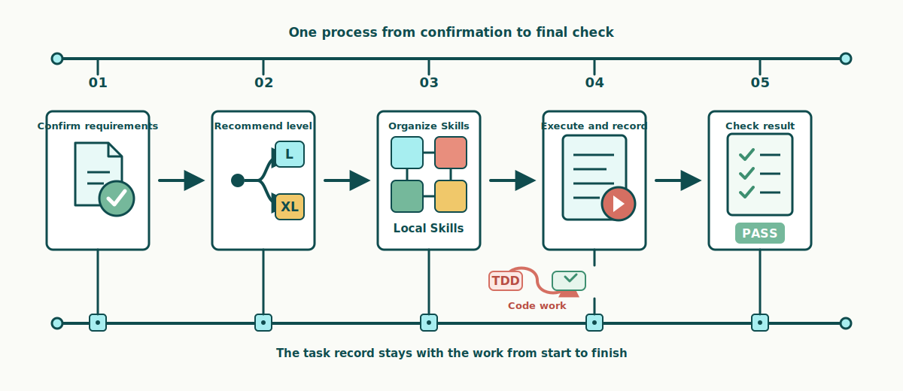
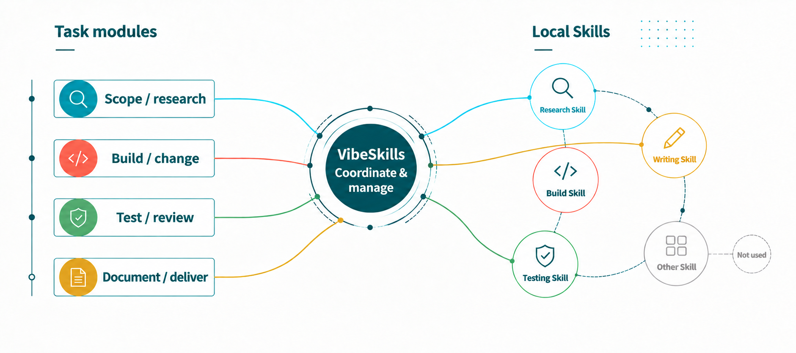

  <strong>English</strong> | <a href="./README.zh.md">中文</a>

<h1>VibeSkills</h1>

<h3>Organize the right local Skills and carry complex tasks through to delivery.</h3>

Skills preserve valuable, proven ways of working. As a task grows more complex, an agent often falls back on the few Skills that are easiest to trigger. The rest rarely make it into the plan, and when several Skills are involved, responsibilities and outputs can fail to connect. 
VibeSkills aims to organize those existing local capabilities through a complete harness. 
It draws on the engineering discipline of Superpowers and the phased planning approach of GSD-Lite. A fixed state machine connects requirement confirmation, execution planning, Skill organization, state-driven execution, testing and evaluation, and final acceptance. 
This gives users an end-to-end delivery experience from the initial request to final acceptance, while lowering the cognitive overhead and barrier to entry of working with AI agents. 
The Skill library can keep growing. Skills that are not needed today can stay available until the right task arrives, while the workflow selects and assigns what each task needs.

 

 

<a href="./docs/quick-start.en.md">Quick start</a> ·
<a href="https://github.com/foryourhealth111-pixel/Vibe-Skills/releases/tag/v4.0.0">v4.0.0 release</a> ·
<a href="./docs/README.md">Documentation</a> ·
<a href="https://github.com/foryourhealth111-pixel/Vibe-Skills/stargazers">Star the project</a>

---

## A real run: completing a machine-learning experiment

> **Task**
>
> Use public data to complete a reproducible classification experiment and
> deliver a data audit, statistical review, 4 result figures, a scientific
> report, and a 7-slide group-meeting deck.

The diagram shows what happened after the requirement and plan were approved:
how the task was executed, what it produced, and how the result was checked.

The task used the `L` workflow and proceeded in order. During publication
preparation, the configured folders on the same host contained more than 100
Skills. VibeSkills reviewed the candidates and their `SKILL.md` files, selected
7 for this task, and arranged the work into 5 groups and 10 work units. Those
units covered environment setup, data audit, modeling, statistical review,
figures, the report, and the slide deck.

After the work finished, VibeSkills ran 17 checks across the data, experiment
results, figures, report, and slides. The task passed final acceptance after the
required files, cross-deliverable consistency, and core reproduction all passed.

**10 / 10 work units completed** · **0 failed** · **0 blocked** ·
**17 / 17 cross-artifact checks passed**

[View case execution](./docs/cases/ml-experiment/README.md#case-execution) ·
[View final delivery](./docs/cases/ml-experiment/README.md#final-delivery)

## How VibeSkills carries a task through to delivery

VibeSkills gives an Agent one process from receiving a task to checking the
delivery. Each stage answers a concrete question: what needs to be done, how the
work should proceed, which Skills should take part, what actually happened, and
whether the result is ready to deliver.

  

- **Confirms the requirement.** Before work begins, it confirms the goal,
  constraints, available material, and expected delivery. The process stops here
  until the requirement is approved, giving the plan and final check a clear basis.

- **Recommends a level.** VibeSkills recommends `L` or `XL` from the task's scope,
  steps, dependencies, and opportunities for parallel work. You then
  confirms the level. Manageable work proceeds in order; larger work is split
  more finely.

- **Organizes Skills.** VibeSkills reviews the local Skill folders, selects the
  methods that fit each part, and states what each Skill owns, what it should
  deliver, and how completion will be checked.

- **Executes and records.** After plan approval, the current Agent completes the
  work. Code tasks can use test-driven development (TDD) when appropriate: show
  the problem with a failing test, make the change, and run the tests again.
  Completed, failed, and blocked states are recorded so a later session can continue.

- **Checks the result.** VibeSkills compares the actual result with every planned
  item. Required work that is incomplete, failed, or blocked prevents final
  acceptance.

<strong>When to use L or XL</strong>

| Level | Best for | How it works |
|:---|:---|:---|
| `L` | Multi-step work of manageable size | Splits the task, then works through the parts in order with less time and context overhead |
| `XL` | Larger work with several relatively independent parts | Uses a more detailed breakdown and can run up to two non-conflicting parts at the same time, with additional coordination and result collection |

## How local Skills take part

Local Skills can store tool usage, working steps, decision rules, and checking
methods. VibeSkills reviews the local Skill folders you configure, then
shortlists the Skills that fit the work required by each part of the task.

  

The left side shows the different kinds of work in the task, VibeSkills makes
the assignment in the middle, and the local Skill folders are on the right. A
selected Skill is tied to concrete work, expected delivery, and a check. The
current Agent then follows the shared plan.

| Passive Skill triggering | With VibeSkills |
|:---|:---|
| The AI reacts to a few obvious words | It splits the whole task first |
| The same familiar Skills are used repeatedly | Each part is checked for a better-fitting Skill |
| Unmatched work is handled on the spot | A useful Skill is assigned to specific work with a stated result |
| Separate calls are left disconnected | All results are brought together and checked at the end |

VibeSkills does something straightforward: **it first makes the whole task
clear, then assigns the right Skills to the relevant parts**. It coordinates
the work and checks the combined result at the end. The task uses the Skills it
needs; the rest of the local library stays available without entering the plan.

You can keep adding your own Skills, team Skills, and third-party Skills.
VibeSkills does not call every installed Skill automatically; it selects the
Skills that fit the current task. The size of the library defines the available
choices, not a list that every task must use.

<strong>Will a large Skill library use a lot of tokens?</strong>

VibeSkills checks the Skill folders you configure, but finding files locally
and placing their full contents in the model context are different operations.

Discovery and index generation happen locally. VibeSkills first extracts compact
information such as each Skill's name, description, intended use, and boundaries,
then uses that information to shortlist candidates for each part of the task.

Only retained candidates are then read as complete `SKILL.md` files. Execution
uses only the Skills written into the plan. Token usage therefore depends mainly
on how many candidates the task retains, how long those documents are, and how
complex the task is. It is not the same as reading the full local Skill library
into the model context.

This overhead is not zero. More candidates, longer Skill documents, or a more
finely divided task will use more context. The current design bounds that cost
with a local index, candidate shortlisting, and on-demand reading.

<strong>Local folders and selection records</strong>

Alongside the shared Skills directory, more local folders can be listed in
`~/.vibeskills/skill-roots.json` or
`<workspace>/.vibeskills/skill-roots.json`.

A Skill needs a readable `SKILL.md`, a name that does not conflict with another
Skill, and a clear fit for the current work before it can be selected. Adding a
local folder makes those Skills available to later tasks without waiting for the
VibeSkills repository to include them.

During planning, `agent_skill_organization` stores which Skills are intended for
each part of the task. During execution, `module_assignments` stores the actual
assignment. Finding a Skill means it can be considered; it does not mean the
Skill has already taken part in the work.

## How a task can continue and be reviewed

VibeSkills keeps the approved requirement, plan, execution progress, and final
check in the same task record. A later session can continue from the saved
progress, and a review can compare the original plan with the actual result.
Installation state is recorded separately so it is not confused with task
completion.

<strong>View the record files</strong>

| File or directory | What it is for |
|:---|:---|
| `install-receipt.json` | Records the files written by the installer so `check` can find missing or changed files |
| `session_root` | Stores the input, progress, important decisions, and summary for one task |
| `module-work-plan.json` | Stores the approved work plan, including responsibility, expected output, and checks |
| `module-execution.json` | Stores what each part actually produced and whether it completed, failed, or was blocked |
| `delivery-acceptance-report.json` or `.md` | Stores the final check and shows which items passed |

Maintainers can use the
[pre-release checklist](docs/status/non-regression-proof-bundle.md). Start with
the checks in that list and run wider audits only when there is a reason.

A successful installation does not mean the task ran, and a task record does
not mean the final result passed its checks. A public example lets readers
follow the requirement, plan, actual result, and final check.

## Install

Download the published release zip and extract it outside the Skills folder you
plan to use. The default target is `~/.agents/skills`.

Install, update, check, uninstall, and migration commands are kept in one guide:

**[Open the complete installation guide](./docs/install/README.en.md)**

Current asset:
[vibe-skills-4.0.0-public.zip](https://github.com/foryourhealth111-pixel/Vibe-Skills/releases/download/v4.0.0/vibe-skills-4.0.0-public.zip)

## After installation

- You only need to remember one entry: `vibe`.
- The installer manages VibeSkills files only under `<SkillsDir>/vibe`. It does
  not install a separate built-in collection of Skills.
- Your other Skills stay where they are. VibeSkills finds them in the shared
  Skills directory or in local folders listed in
  `~/.vibeskills/skill-roots.json` and
  `<workspace>/.vibeskills/skill-roots.json`.
- The installer does not change AI tool settings, system prompts, or commands,
  and it does not configure MCP servers automatically.
- After you approve the plan, the current AI completes the work. VibeSkills
  records which parts completed, failed, or were blocked.
- Requirements, plans, source files, and Git history remain the main project
  records. Workspace memory helps continue the task but does not replace them.

For implementation details, including the roles of Python and PowerShell, see
the [architecture guide](./docs/architecture/local-agent-kernel-v2.md).

## More documentation

| Need | Start here |
|:---|:---|
| See a complete real run | [Machine-learning experiment case](./docs/cases/ml-experiment/README.md) |
| Install, update, uninstall | [Simple install](./docs/install/README.en.md) |
| First use | [Quick start](./docs/quick-start.en.md) |
| Current release | [v4.0.0 notes](./docs/releases/v4.0.0.md) |
| See which AI tools have been tested | [Support status](./docs/universalization/host-capability-matrix.md) |
| How it works | [Documentation index](./docs/README.md) |
| Troubleshooting | [Troubleshooting guide](./docs/troubleshooting.md) |
| Contributing | [Contribution guide](./CONTRIBUTING.md) |

## Community and credits

Questions, corrections, and well-scoped contributions are welcome through
[GitHub Issues](https://github.com/foryourhealth111-pixel/Vibe-Skills/issues)
and pull requests.

VibeSkills discussions and community practice can also continue on
[LINUX DO](https://linux.do/). It is a place to exchange technical questions,
AI practice, and experience. Thank you to the LINUX DO community for supporting
this project.

The [VibeSkills 3.1.0 community practice cases](https://linux.do/t/topic/2061161)
collect several examples that were shared with the community.

Community contributors include
[xiaozhongyaonvli](https://github.com/xiaozhongyaonvli) and
[ruirui2345](https://github.com/ruirui2345).

Third-party software attribution and license information are listed in
[NOTICE](./NOTICE) and [third-party licenses](./THIRD_PARTY_LICENSES.md).

## Star History

  <a href="https://www.star-history.com/?repos=foryourhealth111-pixel%2FVibe-Skills&type=date&legend=top-left">
    <picture>
      <source media="(prefers-color-scheme: dark)" srcset="https://api.star-history.com/chart?repos=foryourhealth111-pixel%2FVibe-Skills&type=date&theme=dark&legend=top-left">
      <source media="(prefers-color-scheme: light)" srcset="https://api.star-history.com/chart?repos=foryourhealth111-pixel%2FVibe-Skills&type=date&legend=top-left">
      
    </picture>
  </a>

