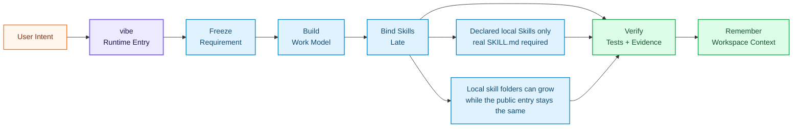

<div align="right">
  <b>🇬🇧 English</b> &nbsp;|&nbsp; <a href="./README.zh.md">🇨🇳 中文</a>
</div>

<br/>

<div align="center">

<a href="https://github.com/foryourhealth111-pixel/Vibe-Skills">
  
</a>

<br/>


<br/><br/>

### Coordinate local Skills for composite agent work

VibeSkills is a workflow runtime for AI agents. It takes one request, splits it into bounded parts, and lets the right local Skills handle planning, implementation, testing, docs, research, or review inside the same run.

<div align="center">

| Core function | Best at | Works with |
|:---|:---|:---|
| Organize multiple local Skills in one task | Composite work such as code changes plus tests plus docs plus review, or research plus writing plus delivery | Codex, Claude Code, Windsurf, Cursor, OpenCode, OpenClaw, and other Skills-compatible hosts |

</div>

Start with `vibe`. The runtime handles scoping, task breakdown, skill coordination, and verification so the agent can finish multi-step work with less manual steering.

<details>
<summary><b>Runtime notes for advanced readers</b></summary>

Installed local skills are the only specialist reference surface in the public runtime story. Host-declared extra local roots extend that same local surface without a new central catalog. This is not a claim that the final architecture is complete.

A skill counts as actually used only when the Agent returns its work in `module-execution.json` and canonical acceptance passes. `module_assignments` records the approved binding, not proof that the work ran.

For this runtime boundary, Python owns canonical validation, task semantics, `module_assignments`, and the truth chain from `agent_skill_organization` through `module-work-plan.json`, `agent-execution-handoff.json`, and `module-execution.json`. PowerShell performs stage orchestration, environment setup, script bridging, host receipts, and shell-native checks. The current Agent performs the approved module work. Do not add new task semantics or task execution to PowerShell; existing PowerShell stage scripts are transitional orchestration surfaces. A future full-Python runtime is optional, not required for this version.

</details>

<br/>

<a href="https://github.com/foryourhealth111-pixel/Vibe-Skills/stargazers">
  
</a>
<a href="https://github.com/foryourhealth111-pixel/Vibe-Skills/network/members">
  
</a>
<a href="https://github.com/foryourhealth111-pixel/Vibe-Skills/pulse">
  
</a>

&nbsp;

&nbsp;

&nbsp;

&nbsp;

&nbsp;


<br/><br/>

🧠 Planning · 🛠️ Engineering · 🤖 AI · 🔬 Research · 🎨 Creation

<br/><br/>

<a href="docs/install/README.en.md">
  
</a>

<br/><br/>

<a href="docs/quick-start.en.md">
  
</a>
&nbsp;
<a href="./README.zh.md">
  
</a>

<br/><br/>

<kbd>Install</kbd> &nbsp;→&nbsp;
<kbd>vibe | update</kbd> &nbsp;→&nbsp;
<kbd>Structured Workflow</kbd> &nbsp;→&nbsp;
<kbd>Local Skill Binding</kbd> &nbsp;→&nbsp;
<kbd>TDD / Verification</kbd> &nbsp;→&nbsp;
<kbd>Persistent Context</kbd>

</div>

## 📋 Table of Contents

- [Runtime at a Glance](#-runtime-at-a-glance)
- [Practice Demos](#-practice-demos-real-work-you-can-see)
- [One runtime entry, small public surface](#-one-runtime-entry-small-public-surface)
- [What makes it different](#-what-makes-it-different)
- [Who is it for](#-who-is-it-for)
- [Work Organization](#-work-organization-how-skills-become-bounded-work)
- [Memory System](#-memory-system-resume-context-across-the-same-workspace)
- [Representative Work Areas](#-representative-work-areas)
- [Installation & Management](#️-installation--skills-management)
- [Getting Started](#-getting-started)


<details>
<summary><b>🔑 New here? Quick glossary of key terms (click to expand)</b></summary>

<br/>

| Term | Plain-English Meaning |
|:---|:---|
| **Harness** | The workflow layer around your AI agent. It decides the next step, calls the right Skills, checks the work, and saves useful context. |
| **Skill** | A focused expert capability, such as `tdd-guide`, `code-review`, data analysis, writing, or research support. |
| **Vibe / VCO** | The canonical runtime that runs the harness. The public work entry is `vibe`; installed-copy updates stay on the `update` management path. |
| **Late skill binding** | The runtime binds different Skills only where they help the current work unit move forward. |
| **Local skill roots** | The runtime reads declared local skill roots as the only source for additional Skills. A skill must have a readable `SKILL.md` before it can be selected. |
| **TDD / verified delivery** | Work should be backed by tests, checks, artifacts, or explicit manual-review notes before completion is claimed. |
| **Workspace memory** | Structured project information, decisions, and evidence are stored so later sessions can continue without starting over. |
| **Actual binding record** | The final record of what skill was actually bound lives in `module_assignments`, not in a discovery cache or a broad product claim. |

</details>

> [!IMPORTANT]
> ### 🎯 Core Vision
>
> VibeSkills is built for agents that need more than a tool list.
>
> The runtime clarifies the request, plans the work, binds local Skills where they fit, records the actual binding in `module_assignments`, and keeps the proof needed for review or continuation.
>
> In the current release, the public entry stays narrow: `vibe` is the public entry, additional Skills are discovered only from declared local skill roots, duplicate skill ids follow host root priority, and `module_assignments` is the runtime record of what was actually bound.

<br/>


---

## 🛰️ Runtime at a Glance

Start with `vibe`. The runtime freezes the request, builds bounded work, scans the local skill roots declared by the host, binds relevant Skills when needed, verifies the result, and saves context for the next session. That matters most when the task is composite and needs more than one local Skill to finish well.



<div align="center">

| Signal | What it means |
|:---|:---|
| `one entry` | Start with `vibe`; use `update` to refresh the same installed skills directory. |
| `late skill binding` | Skills are attached after the work shape is clear, not used as the control plane. |
| `local skill roots` | The runtime checks declared local skill roots and only considers entries with a readable `SKILL.md`. Duplicate skill ids keep the highest-priority root active. |
| `actual binding record` | The Agent freezes `agent_skill_organization`; `module_assignments` is its validated execution projection. Discovery and benchmark artifacts remain audit evidence only. |
| `proof trail` | Tests, checks, artifacts, or manual-review state support delivery claims. |
| `memory plane` | Requirements, plans, decisions, and evidence survive the chat window. |

</div>

The normal closeout path should stay small: prove the governed runtime, entry truth, execution proof, release consistency, and repo cleanliness before reaching for wider audit gates.

---

## 🎬 Practice Demos: Real Work You Can See

_People asked what VibeSkills looks like in real work. These examples are easier to judge than a feature list: each one starts with a plain goal, goes through a governed `vibe` run, and ends with something you can open, inspect, or rerun._

> Keep the public proof story narrow and explicit:
>
> - `installed locally`: run `py -3 -m vgo_cli.main check --repo-root <repo-root> --skills-dir <skills-dir>`.
> - `runtime coherent`: after a real `vibe` run returns a `session_root`, inspect `host-launch-receipt.json`, `runtime-input-packet.json`, `governance-capsule.json`, `stage-lineage.json`, and `runtime-summary.json`.
> - `delivery accepted`: inspect `delivery-acceptance-report.json` or `delivery-acceptance-report.md`.
>
> Release proof bundles stay as explicitly named local operator artifacts. `check` proves only `installed locally`; it does not prove task completion, `runtime coherent`, or `delivery accepted`.

<div align="center">


| Demo | Starting Point | How `vibe` Moves It Forward |
|:---|:---|:---|
| **Image Workbench** | Build a GPT-image workspace for prompt chat, reference uploads, and real image generation. | Turns the idea into a product scope, UI/API tasks, workflow checks, and screenshot review. |
| **Video Editing Pipeline** | Recut a rocket moon-landing history clip into a short-video style edit. | Breaks the media work into caption, music, pacing, render, and review passes, with rough edges recorded plainly. |
| **ML Experiment + Paper** | Build a face-recognition ML demo and turn the run into a paper. | Guides dataset and model choice, training, evaluation, figure generation, and LaTeX compilation. |


</div>

A useful demo should show both the result and the path that produced it:

```mermaid
flowchart LR
    accTitle: VibeSkills Practice Demo Flow
    accDescr: A user goal moves through scope confirmation, planning, skill handoff, execution checks, and an openable result.

    goal["Plain Request"]
    freeze["Confirmed Scope"]
    plan["Work Plan"]
    route["Skill Handoff"]
    work["Build / Analyze / Render"]
    proof["Checks + Evidence"]
    show["Openable Result"]

    goal --> freeze --> plan --> route --> work --> proof --> show

    classDef goal fill:#fff7ed,stroke:#f97316,stroke-width:1.5px,color:#7c2d12
    classDef flow fill:#e0f2fe,stroke:#0284c7,stroke-width:1.5px,color:#0c4a6e
    classDef proof fill:#dcfce7,stroke:#16a34a,stroke-width:1.5px,color:#14532d

    class goal goal
    class freeze,plan,route,work flow
    class proof,show proof
```



> Inspired by the [VibeSkills 3.1.0 community practice cases](https://linux.do/t/topic/2061161): a GPT-image workbench, a video-editing run, and an ML experiment that produced a paper. The best examples link to concrete outputs: a running app, a rendered clip, a compiled paper, or the commands and evidence used to produce them.

---

## 🧬 One runtime entry, small public surface

Projects like **[Superpowers](https://github.com/obra/superpowers)** show the value of stronger development habits: clarify before coding, design before implementation, and test before claiming success. **[GSD / Get Shit Done](https://github.com/gsd-build/get-shit-done)** shows the value of specs, milestones, context, and steady project flow.

VibeSkills applies the same discipline at the runtime entry. The public entry is `vibe`. During a run, it can bind relevant local Skills from declared roots when those entries have readable `SKILL.md` files and match the current bounded work. The distinguishing part is the organization step: on composite tasks, the runtime can decompose the request and let different local Skills cover different bounded units inside the same run.

<div align="center">

| Related direction | Useful idea | How VibeSkills applies it |
|:---|:---|:---|
| **Traditional skill collections** | Give the agent more tools | Keeps the public entry small and turns those tools into staged, checked work |
| **Superpowers-style methodology** | Gives coding agents stronger habits | Extends that discipline to a runtime that can bind relevant local Skills by stage |
| **GSD-style project flow** | Keeps projects moving with specs, context, and milestones | Adds Skill binding, verification, and workspace memory inside the same runtime |
| **VibeSkills** | Provides one portable runtime entry for Skills-capable agents | Uses one public entry, explicit checks, continuation context, and local-skill extension |

</div>

---


## ✨ What makes it different?

VibeSkills focuses on the execution path after a user gives a request. The runtime clarifies the task, plans it, binds local Skills where needed, and asks for evidence before it claims delivery.

Its main advantage is local-skill coordination. When a task is composite, the runtime does not have to funnel the whole job through one Skill. It can split the request into bounded units, then bind the right local Skill to each unit.

The operating model is intentionally simple:

<div align="center">

| Feature | What you get |
|:---|:---|
| **One entry** | Start with `vibe`; use `update` to refresh the installed copy. No long command menu to learn first. |
| **A clear workflow** | The agent moves through ask → plan → work → check → remember. |
| **Late skill binding** | The harness shapes the work first, then binds helpful Skills to the bounded units that need them. |
| **Multi-skill coordination** | Composite tasks can be decomposed so different local Skills handle different bounded units in the same run. |
| **Less micromanagement** | You do not need to keep saying "plan first", "test it", or "save the context". |
| **Verified delivery** | Work is pushed toward tests, checks, evidence, and explicit acceptance. |
| **Cross-session context** | Requirements, plans, decisions, handoff notes, and evidence are stored in predictable places. |
| **Local extension** | Declared local skill roots are the main way to extend the workflow. A skill needs a real `SKILL.md` before the runtime can bind it. |
| **Portable entry** | The core is one portable runtime entry, so Skills-capable agents can use the same workflow across supported hosts. |

</div>

<br/>

<div align="center">

| Common workflow problem | How VibeSkills handles it |
|:---|:---|
| The user keeps deciding the next prompt, tool, and quality check. | `vibe` provides a governed path and asks for confirmation where it matters. |
| Skills are easy to forget or overuse. | Skills are bound by stage and task type, and only when they fit the bounded work. |
| New domains create extra workflow overhead. | New local skill folders can plug into the same `vibe` workflow through declared roots. |
| "Done" can mean the model stopped talking. | Delivery stays tied to tests, checks, artifacts, or explicit review state. |
| Long projects lose context across sessions. | Requirements, plans, decisions, and evidence are stored for continuation. |
| Every host needs a different workflow explanation. | The core stays one portable runtime entry, with host adapters around it. |

</div>

<br/>

---


## 👥 Who is it for?

VibeSkills is for people who want AI agents to be easy to start, useful across many kinds of work, and less exhausting to manage.

<details>
<summary>Is this for you? Click to expand</summary>

<br/>

<div align="center">

| Audience | Description |
|:---:|:---|
| 🎯 **Users who need reliable delivery** | Want the agent to clarify, plan, test, and verify instead of rushing to an answer. |
| ⚡ **Power users of AI agents** | Need one harness to coordinate many expert Skills without micromanaging every step. |
| 🏢 **Teams standardizing AI workflows** | Want repeatable requirements, plans, verification, and handoff artifacts. |
| 🧩 **Skill builders and integrators** | Want a plug-in package model that is easy to install and portable across hosts. |
| 😩 **Users tired of tool micromanagement** | Want the system to decide which Skill belongs in which stage. |

</div>

> _VibeSkills fits longer tasks better than isolated scripts. Its value shows up when work has requirements, multiple stages, and follow-up._

</details>

<br/>

---


## 🔀 Work Organization: How Skills Become Bounded Work

`vibe` owns the workflow. It decides when the agent should clarify, when it should plan, how a composite task should be split, which local Skills can help with each work unit, when tests or checks should run, and when delivery can be claimed.

The discovery rules stay narrow:

- additional Skills are discovered only from declared local skill roots
- a skill without a readable `SKILL.md` can be diagnostic only, never selected or locked
- `module_assignments` is still the first runtime truth for what was bound

<div align="center">

| Common concern | Runtime behavior |
|:---|:---|
| "There are too many Skills." | You do not manually choose from the whole list. The runtime narrows the work, then uses only the Skills that help the current bounded unit. |
| "Similar Skills might conflict." | Selected Skills stay scoped to the current phase or work unit instead of taking over the whole run. |
| "How do several Skills work together?" | The runtime first breaks the task into bounded units, then assigns Skills to those units with explicit ownership and verification. |
| "Multi-agent work will get chaotic." | Larger work is split into bounded units, with explicit ownership, verification, and coordinator approval. |

</div>

### How the runtime works in practice

- **Start with one governed entry**: Most work enters through `vibe`, so the user does not have to choose a workflow tree manually.
- **Freeze intent before execution**: Requirements and plans become stable artifacts.
- **Split composite tasks before binding Skills**: The runtime turns one large request into bounded units that can be owned and checked separately.
- **Bind Skills only where needed**: Requirement work, planning, implementation, testing, review, and cleanup can each use different Skills when they fit the bounded unit.
- **Drive toward evidence**: TDD, targeted checks, artifact review, and delivery acceptance keep completion claims grounded.
- **Preserve context**: The runtime stores enough structure for another session or agent to continue.
- **Record the actual binding**: `module_assignments` records which skill was actually chosen for each bounded unit.

---

### Why many local Skills can still coexist

- Different Skills serve different stages: clarifying, planning, implementation, review, and verification.
- Different Skills also serve different domains: code, research, data, writing, design, documents, and operations.
- A single delivery can mix several local Skills, as long as each one has a clear bounded unit.
- The runtime keeps workflow control, so each Skill stays scoped to the work it was selected for.

---

### M / L / XL Work Sizes

After the runtime has a bounded work model, it still chooses how large the run should be:

<div align="center">

| Level | Use Case | Characteristics |
|:---:|:---|:---|
| **M** | Narrow-scope work with clear boundaries | Single-agent, token-efficient, fast response |
| **L** | Medium complexity requiring design, planning, and review | Governed multi-step execution, usually in planned serial order |
| **XL** | Large tasks with independent parts worth splitting | The coordinator breaks work into bounded units and can run independent units in parallel waves |

</div>

> Even in XL, the runtime still bounds the work first, then attaches Skills to each bounded unit under the same coordinator.

---

<details>
<summary><b>🔍 Expand: wrapper entrypoints, grade overrides, and routing notes</b></summary>

<br/>

- The public discoverable work entry is `vibe`.
- `vibe` is progressive: it stops after `requirement_doc`, then after `xl_plan`, and only reaches `phase_cleanup` after explicit bounded re-entry approval at each boundary.
- Installed-copy upgrades stay on the command path: use `update` with the same `--skills-dir`.
- Older stage aliases are not public entries and are not installed as host-visible command or skill wrappers.
- The only lightweight public grade overrides are `--l` and `--xl`. Aliases like `vibe-l`, `vibe-xl`, or stage-plus-grade combinations are intentionally unsupported.
- When Skills such as `tdd-guide` or `code-review` are selected, they work only inside the current phase or bounded unit. They do not take over global coordination.
- Before `xl_plan`, the Agent searches declared local roots, reads candidate `SKILL.md` files, and freezes `agent_skill_organization`; XL worker lanes inherit that choice instead of selecting Skills again.

</details>

<br/>

---


## 🧠 Memory System: Resume Context Across the Same Workspace

_Work state decides what still needs doing. Memory keeps the next session from starting cold._

<br/>

VibeSkills stores just enough governed context to make work easier to continue:

- **Resume the same project**: confirmed background, conventions, and decisions can be picked up again inside the same workspace.
- **Continue long tasks**: progress, handoff notes, and evidence anchors stay available after interruptions.
- **Reduce repeated explanation**: the agent can recover useful context without asking you to restate the same setup every session.
- **Stay scoped**: recall is bounded to the current workspace and task, so unrelated history does not flood the prompt.

| Situation | What VibeSkills helps recover |
|:---|:---|
| New session in the same workspace | Confirmed project context and working conventions |
| Interrupted task | Last useful progress, decisions, and verification clues |
| Agent handoff | Handoff notes and links to the relevant artifacts |
| Different project | Isolated memory by default |

Memory helps the next session continue. Git, README files, requirement docs, execution plans, and verification receipts remain the source of record. Memory writes stay governed, and missing memory support is surfaced as a real issue.

See [workspace memory plane design](./docs/design/workspace-memory-plane.md) for the technical contract and [non-regression proof bundle](./docs/status/non-regression-proof-bundle.md) for the release/operator closeout proof contract.


---


## ✦ Representative Work Areas

_Use this table to judge whether VibeSkills fits your task. It groups the kinds of work that the `vibe` entry can organize._

<br/>

<div align="center">

| Work Area | What It Helps With | Typical Capabilities |
|:---|:---|:---|
| **💡 Planning and Scoping** | Clarify messy asks, freeze requirements, and turn them into executable plans | Requirement clarification, plan writing, specification drafting |
| **🏗️ Engineering and Governed Delivery** | Design systems, implement changes, and coordinate bounded multi-step execution | Architecture work, implementation support, governed execution |
| **🔧 Debugging and Verification** | Investigate failures, add tests, review risk, and prove the change is ready | Debugging, test design, review, verification |
| **📊 Data, ML, and Research Work** | Analyze data, train or evaluate models, and support research-heavy workflows | Statistical analysis, modeling, experiment design, literature review |
| **🎨 Output and External Delivery** | Turn results into docs, figures, browser actions, or deployable outputs | Documentation, charts, browser-driven checks, deliverable packaging |

</div>

<br/>

The capability column gives examples of the kind of local Skills the runtime can use. The actual available Skills still depend on the local skill roots declared on your host.

<br/>

---


## 📊 What the runtime core does

The runtime core behind **VibeSkills** is **VCO**. It keeps workflow control in a small runtime, leaves domain-specific work to local Skills, and keeps extension boundaries explicit.

<br/>

<div align="center">

|                              🧩 Local Skills                              |                              ✅ Work Loop                               |                               ⚖️ Runtime Boundaries                               |
| :-------------------------------------------------------------------: | :--------------------------------------------------------------------: | :------------------------------------------------------------------------: |
| <h2>Selection rules</h2>Declared local Skills only<br/>with real entry files required | <h2>Execution flow</h2>Goals become bounded work<br/>then tests, checks, and artifacts | <h2>Extension rules</h2>Small runtime surface<br/>clear boundaries for review and extension |

</div>

<br/>

---


## ⚙️ Installation & Skills Management

Public installation starts from the [GitHub Releases page](https://github.com/foryourhealth111-pixel/Vibe-Skills/releases). Download the release zip, extract it, and run the wrappers from that extracted directory.

The v4 public asset is the host-neutral, SkillsDir-centered bundle `vibe-skills-4.0.0-public.zip`. The installer writes Vibe-owned files under `<SkillsDir>/vibe`. The public release installs the `vibe` runtime itself. It does not add a separate built-in skill catalog. After install, the only public runtime entry is `vibe`, and additional Skills are discovered separately from that shared skills directory and any configured local skill roots.

The default target is `~/.agents/skills`, so the shortest Windows install from a published release zip is:

```powershell
.\install.ps1
.\check.ps1
```

To install into a specific skills directory, pass it directly from the extracted release copy:

```powershell
.\install.ps1 -SkillsDir C:\Users\you\.agents\skills
.\check.ps1 -SkillsDir C:\Users\you\.agents\skills
```

Update and uninstall use the same boundary. For updates, download the newer published release zip first, extract it, and then run `update` from that newer release copy against the same `SkillsDir`:

```powershell
.\update.ps1 -SkillsDir C:\Users\you\.agents\skills
.\uninstall.ps1 -SkillsDir C:\Users\you\.agents\skills
```

When upgrading from v3 to v4, keep the same `SkillsDir`, run the v4 `update` wrapper, then run `check`. Retired legacy entry names are not part of the v4 public runtime; use `vibe` for governed work.

The installer writes only Vibe-owned files under `<SkillsDir>/vibe`. It does not edit Codex, Claude, Agents, host settings, command wrappers, or global prompt files. Re-running install or update preserves user-added files and refuses unowned path conflicts instead of deleting the directory.

After install, Vibe treats `<SkillsDir>` as the shared skills directory. If a host or your own workflow needs a different skills directory, pass that path explicitly. The runtime contract still stays SkillsDir-centered.

Extra scan roots are runtime configuration, not installation. Put them in `~/.vibeskills/skill-roots.json` for user-wide roots or `<workspace>/.vibeskills/skill-roots.json` for project roots.

Repo checkout install is now a developer/internal path. Public installation should start from a published release zip. Old host/profile install docs remain as legacy migration material for existing installs.

### Open More Docs Only When Needed

- Need legacy host/profile details for an existing old install? Start with the [simple install guide](docs/install/README.en.md); it points to archived legacy material when needed.
- Need offline setup? Start with the [simple install guide](docs/install/README.en.md), then follow the archived notes only if the default path does not fit.

<details>
<summary><b>🔧 Advanced install details</b></summary>

Only read this part if you are debugging install state or integrating custom Skills.

**What install creates**

- installed runtime entry: `<SkillsDir>/vibe`
- install receipt: `<SkillsDir>/vibe/.vibeskills/install-receipt.json`

Duplicate skill ids are recorded, but only the first root by scan order stays active. Later copies are reported as shadowed duplicates.

**Uninstall and custom skills**

- uninstall path: `uninstall.ps1 -SkillsDir <skills-dir>`
- custom skill onboarding: [simple install & local roots guide](docs/install/README.en.md)

</details>

## 📦 Upstream references and reused ideas

_VibeSkills reuses ideas and tools from existing open-source projects, then adapts the parts that fit this runtime._

VibeSkills does not claim to replace or fully reproduce every upstream project listed below. The goal is narrower: reuse proven ideas where they fit, then keep the user-facing surface smaller and easier to follow.

> 🙏 **Acknowledgements**
>
> This project references, adapts, or integrates ideas, workflows, or tooling from projects such as:
>
> `superpower` · `claude-scientific-skills` · `get-shit-done` · `OpenSpec` · `spec-kit` · `mem0` · `scrapling` · `serena`
>
> _We try to attribute upstream work carefully. If we missed a source or described a dependency inaccurately, please open an Issue and we will correct it._
>
> Contributor thanks: [xiaozhongyaonvli](https://github.com/xiaozhongyaonvli) and [ruirui2345](https://github.com/ruirui2345) for community contributions to this project.

<br/>

---


## 🚀 Getting Started

_If VibeSkills is already installed, start with one invocation._

> ⚠️ **Invocation note**: VibeSkills uses a **Skills-format runtime**. Invoke it through your host's Skills entrypoint, not as a standalone CLI program.

<br/>

<div align="center">

| Host Environment | Invocation | Example |
|:---:|:---:|:---|
| **Claude Code** | `/vibe` | `Plan this task /vibe` |
| **Codex** | `$vibe` | `Plan this task $vibe` |
| **OpenCode** | `/vibe` | `Plan this task with vibe.` |
| **OpenClaw** | Skills entry | Refer to the host docs |
| **Cursor / Windsurf** | Skills entry | Refer to each platform's Skills docs |

</div>

<br/>

- First try a small request such as planning, clarifying, or breaking down a task.
- If you want later turns to stay inside the governed workflow, append `$vibe` or `/vibe` to each message.
- If VibeSkills is not installed yet, start with [Simple install (recommended)](docs/install/README.en.md).

> Note: `$vibe` or `/vibe` only enters the governed runtime. It does not by itself prove that host plugins, providers, or online enhancement are fully configured.

**Public host status**: `codex` and `claude-code` are the clearest install-and-use paths today. `cursor`, `windsurf`, `openclaw`, and `opencode` are available too, but some of those paths are still preview-oriented or host-specific.

<br/>

---

<details>
<summary><b>📚 Documentation & Installation Guides (click to expand)</b></summary>

<br/>

**Start here**

- ⚡️ [Simple install (recommended)](docs/install/README.en.md)
- 📖 [Quick start and runtime overview](docs/quick-start.en.md)

**Open only if needed**

- 🛠 [Command install reference](docs/install/README.en.md)
- 🧩 [Custom workflow onboarding](docs/install/README.en.md)
- 📁 [Manual copy install (offline)](docs/install/README.en.md)
- 🧊 [Other environments & legacy host notes](docs/cold-start-install-paths.en.md)

</details>

<br/>

<div align="center">

### 🤝 Join the Community · Build Together

Try it and open an issue if something feels unclear or broken. Questions, suggestions, and corrections are welcome.

<br/>

**This project is fully open source. All contributions are welcome!**

Bug fixes, performance work, features, and documentation updates all help.

```
Fork → Modify → Pull Request → Merge ✅
```

<br/>

> ⭐ If this project helps, a **Star** helps more people find it.
> The current codebase is usable, but it still has technical debt and rough edges. Clear issue reports and well-scoped PRs are useful.

<br/>

Thank you to the **LinuxDo** community for your support!

[](https://linux.do/)

Tech discussions, AI practice notes, and experience sharing all continue on LinuxDo.

</div>

<br/>

---

## Star History
<div align="center">
<a href="https://www.star-history.com/?repos=foryourhealth111-pixel%2FVibe-Skills&type=date&legend=top-left">
 <picture>
   <source media="(prefers-color-scheme: dark)" srcset="https://api.star-history.com/image?repos=foryourhealth111-pixel/Vibe-Skills&type=date&theme=dark&legend=top-left" />
   <source media="(prefers-color-scheme: light)" srcset="https://api.star-history.com/image?repos=foryourhealth111-pixel/Vibe-Skills&type=date&legend=top-left" />
   
 </picture>
</a>

---

<div align="center">
  <p><i>Transform the parts of real work most prone to going off the rails into a system that is more callable, more governable, and more maintainable over time.</i></p>
  <br/>
  <sub>Made with ❤️ &nbsp;·&nbsp; <a href="https://github.com/foryourhealth111-pixel/Vibe-Skills">GitHub</a> &nbsp;·&nbsp; <a href="./README.zh.md">中文</a></sub>
</div>
