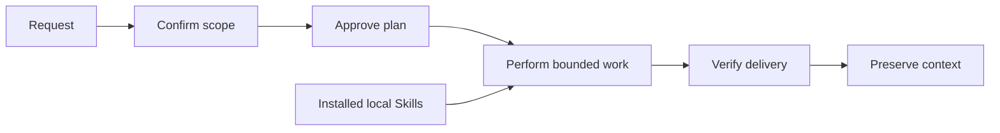

<div align="right">
  <strong>English</strong> | <a href="./README.zh.md">中文</a>
</div>

<p align="center">
  
</p>

# VibeSkills

**A governed workflow for complex AI work.**

VibeSkills turns one difficult request into confirmed scope, bounded work,
local-skill assistance, verification evidence, and context that can be resumed.
You start with one public entry, `vibe`; the runtime provides the work rhythm
around the AI agent instead of leaving every next step to the user.

[Install](#install) · [Quick start](./docs/quick-start.en.md) ·
[v4.0.0 release](https://github.com/foryourhealth111-pixel/Vibe-Skills/releases/tag/v4.0.0) ·
[Documentation](./docs/README.md)

[](https://github.com/foryourhealth111-pixel/Vibe-Skills/releases/latest)
[](./LICENSE)
[](https://github.com/foryourhealth111-pixel/Vibe-Skills/stargazers)

## What It Changes

Complex agent work usually breaks down in predictable places: the request is
still vague when execution begins, the plan grows without clear ownership,
specialist tools are chosen too early, or completion is claimed without proof.
VibeSkills puts those decisions into one inspectable workflow.

| The runtime helps you | What that means in practice |
|:---|:---|
| Confirm the task before work begins | Requirements become a reviewable artifact instead of an assumption hidden in chat. |
| Turn the task into bounded units | Each unit has an owner, output, dependency, and verification condition. |
| Use local Skills where they actually fit | The Agent reads candidate Skill contracts after the work shape is clear. |
| Keep delivery tied to evidence | Tests, checks, artifacts, or explicit review state support completion claims. |
| Resume without reconstructing the whole conversation | Requirements, plans, decisions, and proof remain available in the workspace. |

## The Workflow



1. **Scope**: clarify the goal, constraints, inputs, and expected delivery.
2. **Plan**: split composite work into bounded modules and confirm the plan.
3. **Work**: the current Agent performs the approved modules, using selected
   local Skills where their contracts match the work.
4. **Verify**: check the declared outputs and keep failed, blocked, or
   incomplete work visible.
5. **Resume**: retain the requirement, plan, decisions, and evidence needed for
   the next session.

Approval boundaries are real stops. A requirement stop is not a completed
plan, and a plan stop is not completed execution.

## Where Local Skills Fit

Installed local Skills are the only specialist reference surface in the public
runtime. A candidate must come from a declared local root and have a readable `SKILL.md` before the Agent can select it.

For composite work, the Agent freezes `agent_skill_organization`; the runtime
projects that decision into `module_assignments`. `module_assignments` is the
runtime truth for the Skill bound to each approved module. Discovery results
remain candidate evidence, not proof that a Skill ran.

Host-declared roots can extend the available local Skills without a new central catalog. This is not a claim that the final architecture is complete; it is the current public boundary for v4.

## Evidence You Can Inspect

VibeSkills keeps three public proof layers separate:

| Proof layer | Evidence | What it proves |
|:---|:---|:---|
| `installed locally` | Install receipt plus `check` | The receipt-owned installed files are present and have not drifted. |
| `runtime coherent` | A returned `session_root` with launch, input, governance, lineage, and summary artifacts | A real governed run crossed the runtime boundary coherently. |
| `delivery accepted` | `delivery-acceptance-report.json` or `.md` | The declared work met its delivery criteria. |

These layers are intentionally not interchangeable. A successful install does
not prove task execution, and an execution artifact does not prove acceptance.
A public case should link the complete evidence chain rather than rely on a
screenshot or a success sentence.

For the operator closeout contract, see the
[non-regression proof bundle](docs/status/non-regression-proof-bundle.md).
The normal closeout path should stay small: prove the governed runtime, entry
truth, execution proof, release consistency, and repository cleanliness before
running wider audits.

### Current Release Facts

| Item | Published value |
|:---|:---|
| Release | [`v4.0.0`](https://github.com/foryourhealth111-pixel/Vibe-Skills/releases/tag/v4.0.0), published 2026-07-17 |
| Asset | `vibe-skills-4.0.0-public.zip` |
| SHA-256 | `0b16a5f615a485b8d082407d458cc5c4ffe2cee443c6211fc941cd6678987dc9` |
| Tag target | `9cf0dcbf7c6e377806c00b2e0d2ffe75cb612d35` |

The [v4 release notes](./docs/releases/v4.0.0.md) record the validation and
migration evidence used for publication.

## Install

Public installation starts from a published release zip, not a repository
checkout. Download the release zip, extract it outside the managed Skills
directory, and run the wrappers from the extracted folder.

[Download `vibe-skills-4.0.0-public.zip`](https://github.com/foryourhealth111-pixel/Vibe-Skills/releases/download/v4.0.0/vibe-skills-4.0.0-public.zip)

The default target is `~/.agents/skills`.

### Windows

```powershell
pwsh -NoProfile -File .\install.ps1 -SkillsDir "$HOME\.agents\skills"
pwsh -NoProfile -File .\check.ps1 -SkillsDir "$HOME\.agents\skills"
```

For a Codex-only install, target its Skills directory explicitly:

```powershell
pwsh -NoProfile -File .\install.ps1 -SkillsDir "$HOME\.codex\skills"
pwsh -NoProfile -File .\check.ps1 -SkillsDir "$HOME\.codex\skills"
```

### Linux and macOS

```bash
bash ./install.sh --skills-dir "$HOME/.agents/skills"
bash ./check.sh --skills-dir "$HOME/.agents/skills"
```

`check` proves only `installed locally`; it does not prove `runtime coherent`
or `delivery accepted`.

### Update

Download and extract the newer release, then run `update` and `check` from that
newer copy against the same Skills directory:

```powershell
pwsh -NoProfile -File .\update.ps1 -SkillsDir "$HOME\.agents\skills"
pwsh -NoProfile -File .\check.ps1 -SkillsDir "$HOME\.agents\skills"
```

Uninstall is a separate action. The generic Windows form is
`uninstall.ps1 -SkillsDir <skills-dir>`; the shell equivalent is
`uninstall.sh --skills-dir <skills-dir>`.

See the [install guide](./docs/install/README.en.md) for the full Windows and
shell commands, update behavior, receipt location, and v3-to-v4 migration.

## Start A Run

VibeSkills is invoked through a host's Skills entry, not as a standalone
terminal application.

| Host | Typical invocation |
|:---|:---|
| Codex | Append `$vibe` to the request. |
| Claude Code | Append `/vibe` to the request. |
| OpenCode | Use `/vibe` or the host-supported Skills invocation. |
| Cursor, Windsurf, OpenClaw | Use the host's documented Skills entry. |

Codex and Claude Code are the clearest install-and-use paths today. Other
Skills-compatible hosts retain host-specific setup and invocation details.

Try a bounded request first:

> Clarify this requirement, confirm the scope with me, and turn it into a plan
> `$vibe`

## Public Boundaries

- The public runtime entry is `vibe`.
- The release installs Vibe-owned files under `<SkillsDir>/vibe`; it does not
  install a separate built-in Skill catalog.
- Additional Skills come from the shared Skills directory or configured local
  roots in `~/.vibeskills/skill-roots.json` and
  `<workspace>/.vibeskills/skill-roots.json`.
- The installer does not rewrite host settings, system prompts, or command
  wrappers, and it does not automatically provision MCP servers.
- The current Agent performs the approved work. Runtime artifacts record what
  was assigned, returned, verified, failed, or blocked.
- Git, source documents, requirement files, plans, and verification receipts
  remain the source of record; workspace memory helps continuation but does not
  replace them.

<details>
<summary><strong>Current runtime ownership</strong></summary>

Python owns canonical validation, task semantics, `module_assignments`, and the
truth chain from `agent_skill_organization` through `module-work-plan.json`,
`agent-execution-handoff.json`, and `module-execution.json`.

PowerShell performs stage orchestration, environment setup, script bridging,
host receipts, and shell-native checks. The current Agent performs the approved module work.

Do not add new task semantics or task execution to PowerShell; existing PowerShell stage scripts are transitional orchestration surfaces. A future full-Python runtime is optional, not required for this release.

</details>

## Documentation

| Need | Start here |
|:---|:---|
| Install, update, uninstall | [Simple install](./docs/install/README.en.md) |
| First governed run | [Quick start](./docs/quick-start.en.md) |
| Current release | [v4.0.0 notes](./docs/releases/v4.0.0.md) |
| Runtime and design contracts | [Documentation index](./docs/README.md) |
| Troubleshooting | [Troubleshooting guide](./docs/troubleshooting.md) |
| Contributing | [Contribution guide](./CONTRIBUTING.md) |

## Community And Credits

Questions, corrections, and well-scoped contributions are welcome through
[GitHub Issues](https://github.com/foryourhealth111-pixel/Vibe-Skills/issues)
and pull requests. The project reuses and adapts ideas from open-source work
including Superpowers, Get Shit Done, OpenSpec, spec-kit, mem0, Scrapling, and
Serena; attribution details live in [NOTICE](./NOTICE) and
[third-party licenses](./THIRD_PARTY_LICENSES.md).

Community contributors include
[xiaozhongyaonvli](https://github.com/xiaozhongyaonvli) and
[ruirui2345](https://github.com/ruirui2345).

## Star History

<p align="center">
  <a href="https://www.star-history.com/?repos=foryourhealth111-pixel%2FVibe-Skills&type=date&legend=top-left">
    <picture>
      <source media="(prefers-color-scheme: dark)" srcset="https://api.star-history.com/image?repos=foryourhealth111-pixel/Vibe-Skills&type=date&theme=dark&legend=top-left">
      <source media="(prefers-color-scheme: light)" srcset="https://api.star-history.com/image?repos=foryourhealth111-pixel/Vibe-Skills&type=date&legend=top-left">
      
    </picture>
  </a>
</p>
