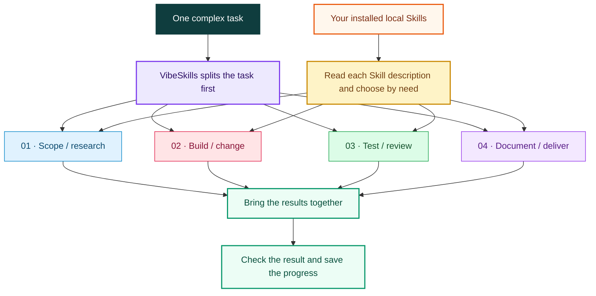

  <strong>English</strong> | <a href="./README.zh.md">中文</a>

<h1>VibeSkills</h1>

<h3>Make local Skills work as a system.</h3>

<strong>Complex tasks often trigger only the most obvious Skills.</strong> 
VibeSkills maps the whole task first, then organizes relevant local Skills around each module, 
so more of the capability you already installed can contribute where it actually helps.

  

  

<a href="./docs/quick-start.en.md">Quick start</a> ·
<a href="https://github.com/foryourhealth111-pixel/Vibe-Skills/releases/tag/v4.0.0">v4.0.0 release</a> ·
<a href="./docs/README.md">Documentation</a> ·
<a href="https://github.com/foryourhealth111-pixel/Vibe-Skills/stargazers">Star the project</a>

  

---

## Why VibeSkills exists

> [!IMPORTANT]
> A complex task often contains several kinds of work. If it has four parts, the
> AI may think to use a Skill for only two of them and handle the rest on the
> spot, even when better local Skills are already installed. VibeSkills looks at
> the whole task before deciding where a Skill can help.

| Passive Skill triggering | With VibeSkills |
|:---|:---|
| The AI reacts to a few obvious words | It splits the whole task first |
| The same familiar Skills are used repeatedly | Each part is checked for a better-fitting Skill |
| Unmatched work is handled on the spot | A useful Skill is assigned to specific work with a stated result |
| Separate calls are left disconnected | All results are brought together and checked at the end |

VibeSkills first makes the task clear, then lets the right Skills help with the
right parts. It selects only the Skills that are useful for the task. Work that
does not need a dedicated Skill stays with the current AI.

## Decompose first, then organize Skills

The task is split before Skills are chosen. If four parts need four different
kinds of help, each part can use a different Skill. Work that does not need a
dedicated Skill stays with the current AI. The goal is to complete the task, not
to increase the number of calls.

## What else VibeSkills does

- **Confirms the requirement.** Before work begins, VibeSkills confirms the goal,
  constraints, available material, and expected delivery. It does not begin
  execution while the requirement is still waiting for approval.

- **Saves the task record.** The requirement, plan, progress, and final result are
  saved with the run. A later session can continue from those records, and a
  review can trace what was agreed and what was actually done.

- **Recommends a task level.** VibeSkills recommends `L` or `XL` from the task's
  scope, steps, dependencies, and opportunities for parallel work. The user can
  also choose.

| Level | Best for | How it works |
|:---|:---|:---|
| `L` | Multi-step work of manageable size | Splits the task, then works through the parts in order with less time and context overhead |
| `XL` | Larger work with several relatively independent parts | Uses a more detailed breakdown and can run up to two non-conflicting parts at the same time, with additional coordination and result collection |

- **Checks the final result.** VibeSkills compares every planned item with the
  actual result. If required work is incomplete, failed, or blocked, the task is
  not reported as complete.

- **Plans tests for code work.** When a task involves code, VibeSkills prefers
  test-driven development when appropriate: demonstrate the problem with a
  failing test, make the change, then run the tests again. Test results are saved
  with the rest of the task record.

## How it finds the right Skill

VibeSkills looks only in the local Skill folders you configure. A Skill needs a
readable `SKILL.md`, a name that does not conflict with another Skill, and a
clear fit for the current work before the AI can select it.

You can add more local folders in the configuration. This lets your own Skills
and third-party Skills take part without waiting for the VibeSkills repository
to include them. VibeSkills does not call every installed Skill automatically;
it selects the ones that fit the task.

<strong>For developers: where these choices are saved</strong>

During planning, `agent_skill_organization` stores which Skills are intended for
each part of the task. During execution, `module_assignments` stores the actual
assignment. Finding a Skill means it can be considered; it does not mean the
Skill has already taken part in the work.

---

## What gets saved

VibeSkills saves the installation state, task record, approved plan, actual
result, and final check separately. These records answer different questions,
so a screenshot or a sentence saying "done" is not enough on its own.

<strong>View the saved files</strong>

| File or directory | What it is for |
|:---|:---|
| `install-receipt.json` | Records the files written by the installer so `check` can find missing or changed files |
| `session_root` | Stores the input, progress, important decisions, and summary for one task |
| `module-work-plan.json` | Stores the approved work plan, including responsibility, expected output, and checks |
| `module-execution.json` | Stores what each part actually produced and whether it completed, failed, or was blocked |
| `delivery-acceptance-report.json` or `.md` | Stores the final check and shows which items passed |

A successful installation does not mean the task ran, and a task record does
not mean the final result passed its checks. A public example should let readers
follow the requirement, plan, actual result, and final check.

Maintainers can use the
[pre-release checklist](docs/status/non-regression-proof-bundle.md). Start with
the checks in that list and run wider audits only when there is a reason.

## Install

Download the published release zip and extract it outside the Skills folder you
plan to use. The default target is `~/.agents/skills`.

Install, update, check, uninstall, and migration commands are kept in one guide:

**[Open the complete installation guide](./docs/install/README.en.md)**

Current asset:
[vibe-skills-4.0.0-public.zip](https://github.com/foryourhealth111-pixel/Vibe-Skills/releases/download/v4.0.0/vibe-skills-4.0.0-public.zip)

## Use it with different AI tools

VibeSkills does not depend on the interface or command format of Codex, Claude
Code, or Cursor. A tool needs a way to find local Skills, start `vibe`, wait for
user confirmation, and save the run result.

| What | Requirement |
|:---|:---|
| Local Skill | Any local Skill can participate when it is in a configured folder, has a readable and valid `SKILL.md`, has a unique name, and fits the work. |
| AI tool | The tool needs to know where to find Skills, how to start `vibe`, when to wait for confirmation, and where to save the result. |
| Current support | A tool may be able to connect before every workflow has been fully tested. The project reports the tested status of each tool separately. |

<strong>Tools tested so far</strong>

The repository includes the files needed to use VibeSkills with Codex, Claude
Code, Cursor, Windsurf, OpenClaw, and OpenCode. Codex and Claude Code have been
tested through the main workflow with some conditions. The other tools are in
an earlier stage. Tools outside this list have general integration guidance,
but are not described as fully supported before they are tested.

See the [support status](./docs/universalization/host-capability-matrix.md) for
the current details.

The start command can differ by tool. Codex can use `$vibe`, while Claude Code
can use `/vibe`. The project records how far each tool has been tested.

## What installation changes

- You only need to remember one entry: `vibe`.
- The installer manages VibeSkills files only under `<SkillsDir>/vibe`. It does
  not install a separate built-in collection of Skills.
- Your other Skills stay where they are. VibeSkills finds them in the shared
  Skills directory or in local folders listed in
  `~/.vibeskills/skill-roots.json` and
  `<workspace>/.vibeskills/skill-roots.json`.
- The installer does not change AI tool settings, system prompts, or commands,
  and it does not configure MCP servers automatically.
- After you approve the plan, the current AI completes the work. VibeSkills
  records which parts completed, failed, or were blocked.
- Requirements, plans, source files, and Git history remain the main project
  records. Workspace memory helps continue the task but does not replace them.

For implementation details, including the roles of Python and PowerShell, see
the [architecture guide](./docs/architecture/local-agent-kernel-v2.md).

## Documentation

| Need | Start here |
|:---|:---|
| Install, update, uninstall | [Simple install](./docs/install/README.en.md) |
| First use | [Quick start](./docs/quick-start.en.md) |
| Current release | [v4.0.0 notes](./docs/releases/v4.0.0.md) |
| How it works | [Documentation index](./docs/README.md) |
| Troubleshooting | [Troubleshooting guide](./docs/troubleshooting.md) |
| Contributing | [Contribution guide](./CONTRIBUTING.md) |

## Community and credits

Questions, corrections, and well-scoped contributions are welcome through
[GitHub Issues](https://github.com/foryourhealth111-pixel/Vibe-Skills/issues)
and pull requests. The project reuses and adapts ideas from open-source work
including Superpowers, Get Shit Done, OpenSpec, spec-kit, mem0, Scrapling, and
Serena; attribution details live in [NOTICE](./NOTICE) and
[third-party licenses](./THIRD_PARTY_LICENSES.md).

Community contributors include
[xiaozhongyaonvli](https://github.com/xiaozhongyaonvli) and
[ruirui2345](https://github.com/ruirui2345).

## Star history

  <a href="https://www.star-history.com/?repos=foryourhealth111-pixel%2FVibe-Skills&type=date&legend=top-left">
    <picture>
      <source media="(prefers-color-scheme: dark)" srcset="https://api.star-history.com/image?repos=foryourhealth111-pixel/Vibe-Skills&type=date&theme=dark&legend=top-left">
      <source media="(prefers-color-scheme: light)" srcset="https://api.star-history.com/image?repos=foryourhealth111-pixel/Vibe-Skills&type=date&legend=top-left">
      
    </picture>
  </a>

