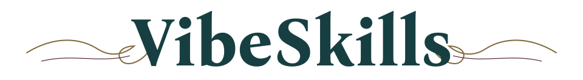
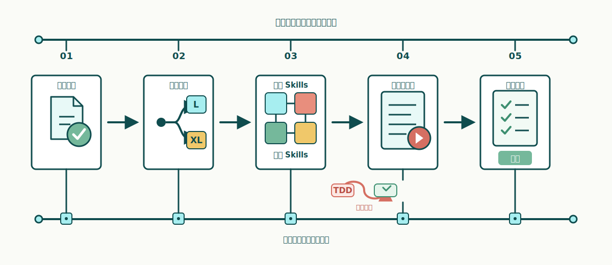
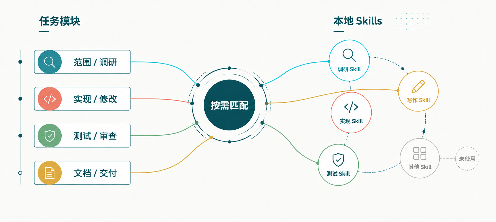

  <a href="./README.md">English</a> | <strong>中文</strong>

<h1 align="center">
  <picture>
    <source media="(prefers-color-scheme: dark)" srcset="./docs/assets/readme-wordmark-dark.svg">
    
  </picture>
</h1>

<picture>
  <source media="(prefers-color-scheme: dark)" srcset="./docs/assets/readme-tagline-cn-dark.svg">
  
</picture>

 

 

 

<a href="./docs/quick-start.md">快速开始</a> ·
<a href="https://github.com/foryourhealth111-pixel/Vibe-Skills/releases/tag/v4.0.0">v4.0.0 发布页</a> ·
<a href="./docs/README.md">文档索引</a> ·
<a href="https://github.com/foryourhealth111-pixel/Vibe-Skills/stargazers">Star 项目</a>

Skills 是优秀的实践资产，但是任务一复杂，Agent 往往反复调用最容易触发的几个，其余 Skills 很少被安排进计划；多个 Skills 一起参与时，分工和结果也容易接不上。

VibeSkills 会通过一套规范化、宿主中立的 harness 把这些资源组织起来，可用于所有支持本地 Skills 的 AI 应用。

它参考了 Superpowers 和 GSD-Lite 的 harness 方式，拥有完整的 harness 流程和状态机，把需求确认、执行规划、Skills 组织、框架化 harness 执行、测试与评估连接为一个整体。

<em>最终想要给用户完成具体任务的端到端交付体验，降低 AI 使用时的认知负担和门槛。</em>

<em>让用户不再担心下载不常用的 Skills 而闲置，也不再担心不知道该用哪些 Skills 而需要反复记忆。</em>

<h2 align="center">
  <picture>
    <source media="(prefers-color-scheme: dark)" srcset="./docs/assets/readme-chapter-01-cn-dark.svg">
    
  </picture>
</h2>

> **任务**
>
> *使用公开数据完成一个可复现的分类实验，并交付数据审计、统计复核、4 张结果图、科学报告和 7 页组会 Slides。*

这张图展示的是需求和计划确认之后，这次任务怎样实际执行并完成检查。

这次任务按 `L` 级计划顺序推进。发布准备时，同一台主机的已配置
目录中统计到 100 多个 Skills；VibeSkills 查看候选并读取相关的 `SKILL.md`，最后
选出适合这次任务的 7 个 Skills，再把工作安排成 5 个工作组和 10 个工作单元。
这些工作依次完成环境准备、数据审计、建模、统计复核、图表、报告和 Slides。

所有工作完成后，VibeSkills 对数据、实验结果、图表、报告和 Slides 做了 17 项检查。
文件齐全、内容一致、核心实验可以复现后，这次任务通过最终验收。

```mermaid
%%{init: {"flowchart": {"curve": "monotoneX", "nodeSpacing": 18, "rankSpacing": 36}}}%%
flowchart LR
    subgraph DISC["Skill 发现"]
        direction TB
        A["本地 Skill 目录<br/>100+ Skills"]
        B["筛选候选<br/>读取 SKILL.md"]
        SEL["Skill 选择<br/>7 个 Skills 已分配"]
        A --> B
        B --> SEL
    end

    subgraph EXEC["执行 · 5 个工作组 · 10 个工作单元"]
        direction TB

        subgraph G1["G1 · 01 环境与数据"]
            direction LR
            u01["U01<br/>环境准备"]
            u02["U02<br/>数据审计"]
            u01 --> u02
        end

        subgraph G2["G2 · 02 建模与复现"]
            direction LR
            u03["U03<br/>基线实验"]
        end

        subgraph G3["G3 · 03 统计与科学复核"]
            direction LR
            u04["U04<br/>统计分析"]
            u05["U05<br/>科学复核"]
            u04 --> u05
        end

        subgraph G4["G4 · 04 图表与报告"]
            direction LR
            u06["U06<br/>结果图"]
            u07["U07<br/>报告初稿"]
            u08["U08<br/>报告复核"]
            u06 --> u07
            u07 --> u08
        end

        subgraph G5["G5 · 05 Slides 与验收"]
            direction LR
            u09["U09<br/>组会 Slides"]
            u10["U10<br/>案例打包与一致性检查"]
            u09 --> u10
        end

        G1 --> G2
        G2 --> G3
        G3 --> G4
        G4 --> G5
    end

    subgraph MID["运行与产物"]
        direction TB
        S(["运行状态<br/>10 / 10 完成<br/>0 失败 · 0 阻塞"])
        D["实际产物<br/>4 张图 · 科学报告<br/>7 页 Slides"]
        S --> D
    end

    subgraph VERIFY["验证 · 17 项检查"]
        direction TB

        subgraph V1["V1 · 基础与计划"]
            direction LR
            t01["T01<br/>必需文件"]
            t02["T02<br/>模块输出匹配"]
            t03["T03<br/>运行与计划绑定"]
            t04["T04<br/>环境合同"]
            t01 --> t02
            t02 --> t03
            t03 --> t04
        end

        subgraph V2["V2 · 数据、模型与复现"]
            direction LR
            t05["T05<br/>数据集合同"]
            t06["T06<br/>数据拆分与模型合同"]
            t07["T07<br/>基线结果"]
            t08["T08<br/>精确复现"]
            t05 --> t06
            t06 --> t07
            t07 --> t08
        end

        subgraph V3["V3 · 统计与交付物"]
            direction LR
            t09["T09<br/>不确定性一致性"]
            t10["T10<br/>统计文件写入保护"]
            t11["T11<br/>图表可追溯性"]
            t12["T12<br/>报告一致性"]
            t13["T13<br/>Slides 一致性"]
            t09 --> t10
            t10 --> t11
            t11 --> t12
            t12 --> t13
        end

        subgraph V4["V4 · 发布与边界"]
            direction LR
            t14["T14<br/>中英文摘要一致性"]
            t15["T15<br/>可视材料指引"]
            t16["T16<br/>Manifest 边界"]
            t17["T17<br/>产物路径边界"]
            t14 --> t15
            t15 --> t16
            t16 --> t17
        end

        V1 --> V2
        V2 --> V3
        V3 --> V4
    end

    E(["最终验收<br/>17 / 17 检查通过<br/>PASS"])

    DISC --> EXEC
    EXEC --> MID
    MID --> VERIFY
    VERIFY --> E

    classDef source fill:#EAF3F3,stroke:#2B6F73,color:#182026;
    classDef selected fill:#F5EBEE,stroke:#8A5363,color:#182026;
    classDef unit fill:#FFFFFF,stroke:#5B7F83,color:#182026;
    classDef status fill:#F7EEF1,stroke:#8A5363,color:#182026,stroke-width:2px;
    classDef output fill:#E8F2F0,stroke:#2D7F75,color:#182026;
    classDef check fill:#FFFFFF,stroke:#8A9AA7,color:#182026;
    classDef result fill:#EAF4EE,stroke:#2F7A4B,color:#182026,stroke-width:2px;
    class A,B source;
    class SEL selected;
    class u01,u02,u03,u04,u05,u06,u07,u08,u09,u10 unit;
    class S status;
    class D output;
    class t01,t02,t03,t04,t05,t06,t07,t08,t09,t10,t11,t12,t13,t14,t15,t16,t17 check;
    class E result;

    style DISC fill:transparent,stroke:#AAB7C4,stroke-width:1px,stroke-dasharray:4 3;
    style EXEC fill:transparent,stroke:#AAB7C4,stroke-width:1px,stroke-dasharray:4 3;
    style MID fill:transparent,stroke:#AAB7C4,stroke-width:1px,stroke-dasharray:4 3;
    style VERIFY fill:transparent,stroke:#AAB7C4,stroke-width:1px,stroke-dasharray:4 3;
    style G1 fill:#FFFFFF,stroke:#DCE4EA,stroke-width:1px;
    style G2 fill:#FFFFFF,stroke:#DCE4EA,stroke-width:1px;
    style G3 fill:#FFFFFF,stroke:#DCE4EA,stroke-width:1px;
    style G4 fill:#FFFFFF,stroke:#DCE4EA,stroke-width:1px;
    style G5 fill:#FFFFFF,stroke:#DCE4EA,stroke-width:1px;
    style V1 fill:#FFFFFF,stroke:#DCE4EA,stroke-width:1px;
    style V2 fill:#FFFFFF,stroke:#DCE4EA,stroke-width:1px;
    style V3 fill:#FFFFFF,stroke:#DCE4EA,stroke-width:1px;
    style V4 fill:#FFFFFF,stroke:#DCE4EA,stroke-width:1px;
    linkStyle default stroke:#6D878B,stroke-width:1px;
```

<strong>选用 7 个 Skills · 拆分为 5 个工作组 · 完成 10 / 10 个工作单元 · 通过 17 / 17 项检查</strong>

  <a href="./docs/cases/ml-experiment/README.zh.md#案例执行过程">查看案例执行过程</a> ·
  <a href="./docs/cases/ml-experiment/README.zh.md#最终交付结果">查看最终交付结果</a>

<h2 align="center">
  <picture>
    <source media="(prefers-color-scheme: dark)" srcset="./docs/assets/readme-chapter-02-cn-dark.svg">
    
  </picture>
</h2>

*VibeSkills 为 Agent 提供一套从接收任务到检查交付的完整流程。*

每个阶段都回答一个具体问题：要做什么、怎样推进、哪些 Skills 参与、实际完成了什么，
以及最终能否交付。

  

<ol type="I">
  <li><strong>确认需求。</strong> 开始工作前，先确认任务目标、限制条件、已有材料和最后要交付的内容。需求没有确认时，流程会停在这里，后面的计划和检查都有明确依据。</li>
  <li><strong>推荐级别。</strong> VibeSkills 根据任务范围、步骤、依赖关系和可并行的工作推荐 <code>L</code> 或 <code>XL</code>，再由你确认。规模可控的任务按顺序推进，较大的任务拆得更细。</li>
  <li><strong>组织 Skills。</strong> VibeSkills 查看本地 Skill 目录，为任务各部分选择合适的方法，并写清每个 Skill 负责什么、需要交付什么、怎样确认完成。</li>
  <li><strong>执行并记录。</strong> 计划确认后，当前 Agent 按计划完成工作。代码任务可以在适合时使用测试驱动开发（TDD），先用失败测试确认问题，再修改并重新测试。完成、失败和阻塞都会记录，中断后也可以从已有进度继续。</li>
  <li><strong>检查结果。</strong> 工作结束后，VibeSkills 把实际结果和计划逐项对照。必做内容没有完成、执行失败或仍然被卡住时，任务不会通过最终检查。</li>
</ol>

<strong>L 和 XL 分别适合什么任务</strong>

| 级别 | 适合的任务 | 处理方式 |
|:---|:---|:---|
| `L` | 步骤较多，但规模仍然可控 | 拆分后按顺序推进，处理过程较简单，使用的时间和上下文较少 |
| `XL` | 包含多个相对独立部分的大任务 | 拆得更细，互不影响时最多同时推进两项工作，并增加协调和结果汇总 |

<h2 align="center">
  <picture>
    <source media="(prefers-color-scheme: dark)" srcset="./docs/assets/readme-chapter-03-cn-dark.svg">
    
  </picture>
</h2>

*本地 Skills 可以保存工具用法、工作步骤、判断标准和检查方法。*

VibeSkills 会从你配置的本地 Skill 目录中查看可用 Skills，再根据任务每一部分需要
完成的工作筛选候选。

  

图中左边是任务包含的不同工作，中间是 VibeSkills 做出的安排，右边是本地 Skill
目录。被选中的 Skill 会对应到具体工作、交付内容和检查方式，最后由当前 Agent
按照同一份计划完成。

<table align="center" width="94%">
  <thead>
    <tr>
      <th width="50%" align="center">只靠被动触发</th>
      <th width="50%" align="center">使用 VibeSkills</th>
    </tr>
  </thead>
  <tbody>
    <tr>
      <td>AI 临时根据几个关键词决定用什么</td>
      <td><strong>先把整个任务完整拆开</strong></td>
    </tr>
    <tr>
      <td>容易反复使用最熟悉的一两个 Skills</td>
      <td><strong>每一部分都看看有没有更合适的 Skill</strong></td>
    </tr>
    <tr>
      <td>没匹配到的部分继续临场处理</td>
      <td><strong>把合适的 Skill 安排到具体工作上，并写清要做出什么</strong></td>
    </tr>
    <tr>
      <td>各次调用互不衔接</td>
      <td><strong>最后把所有结果汇总起来一起检查</strong></td>
    </tr>
  </tbody>
</table>

VibeSkills 做的事情很直接：**先把任务拆清楚，再把合适的 Skills 安排到对应部分**。
它负责协调这些工作，并在最后汇总检查。任务需要哪些 Skills 就使用哪些，不会把
本地的 Skills 全部调用一遍。

你可以继续添加自己编写的 Skill、团队内部 Skill 和第三方 Skill。VibeSkills 不会自动调用你安装的所有 Skills，
只会选择当前任务真正用得上的部分。安装数量代表
可选范围，不会变成每次任务都要使用的清单。

<strong>Skill 很多时，会不会消耗很多 token？</strong>

VibeSkills 会检查你配置的 Skill 目录，但在本机发现文件和把文件全文放进模型上下文
是两件事。

目录发现和索引生成在本机完成。VibeSkills 先提取 Skill 的名称、说明、适用场景和
边界等紧凑信息，用这些信息为任务的不同部分筛选候选。

只有保留下来的候选才会由 Agent 继续阅读完整的 `SKILL.md`。执行时也只使用已经写进
计划的 Skills。因此，token 开销主要取决于这次任务保留了多少候选、这些文档有多长，
以及任务本身的复杂度，不会等同于把整个 Skill 库全文读一遍。

这部分开销仍然存在。候选较多、Skill 文档较长或任务拆分较细时，会使用更多上下文。
当前设计通过本地索引、候选筛选和按需阅读控制范围。

<strong>本地目录和选择记录</strong>

除了共享 Skills 目录，还可以通过 `~/.vibeskills/skill-roots.json` 或工作区中的
`<workspace>/.vibeskills/skill-roots.json` 增加其他本地目录。

一个 Skill 需要有可读取的 `SKILL.md`，名称不能与另一个 Skill 冲突，并且用途适合
当前工作，才会进入选择范围。新增本地目录后，其中的 Skills 就可以参与后续任务，
不需要等待 VibeSkills 项目收录。

计划阶段，`agent_skill_organization` 保存每一部分准备使用哪些 Skills。开始执行后，
`module_assignments` 保存实际分配。发现一个 Skill 只说明它可以考虑，不代表它
已经参与了工作。

<h2 align="center">
  <picture>
    <source media="(prefers-color-scheme: dark)" srcset="./docs/assets/readme-chapter-04-cn-dark.svg">
    
  </picture>
</h2>

*公开案例会让人能顺着需求、计划、实际结果和最终检查一路看下来。*

VibeSkills 会把确认过的需求、计划、执行进度和最终检查保存在同一次任务记录中。
任务中断后，Agent 可以从已有进度继续；复查时，也能对照原来的计划和实际结果。
安装状态单独记录，避免把“已经安装”和“任务已经完成”混在一起。

<strong>查看记录文件</strong>

| 文件或目录 | 用来做什么 |
|:---|:---|
| `install-receipt.json` | 记录安装器写入的文件，供 `check` 检查安装是否完整、文件有没有被改动 |
| `session_root` | 保存一次任务的输入、进度、重要决定和运行摘要 |
| `module-work-plan.json` | 保存已经确认的任务安排，包括各部分由谁负责、需要交付什么、怎样检查 |
| `module-execution.json` | 保存各部分实际完成的结果，以及完成、失败或被卡住的状态 |
| `delivery-acceptance-report.json` 或 `.md` | 保存最终检查结果，说明哪些项目已经通过 |

维护项目时，可以使用这份[提交前检查清单](docs/status/non-regression-proof-bundle.md)。
一般先完成清单里的基础检查；只有发现风险时，再扩大检查范围。

这些记录不能互相代替。安装成功，不代表任务已经跑完；有运行记录，也不代表
最终结果已经通过检查。

<h2 align="center">
  <picture>
    <source media="(prefers-color-scheme: dark)" srcset="./docs/assets/readme-chapter-05-cn-dark.svg">
    
  </picture>
</h2>

<ol type="I">
  <li><strong>调用。</strong> 在任何支持本地 Skills 的 AI 应用中，通过应用自己的 Skills 入口调用 VibeSkills，可使用 <code>$vibe</code>、<code>/vibe</code> 或该应用提供的入口语法。</li>
  <li><strong>发现。</strong> VibeSkills 会扫描 Skills 安装目录，以及你配置的其他本地 Skill 目录，找到当前可用的 Skills。</li>
  <li><strong>组织。</strong> 它会根据任务选择合适的 Skills，安排到对应工作中，再统一推进和检查结果。你不需要自己记住每个 Skill 应该在什么时候使用。</li>
</ol>

  <picture>
    <source media="(prefers-color-scheme: dark)" srcset="./docs/assets/readme-wave-divider-dark.svg">
    
  </picture>

<h2 align="center">更多文档</h2>

<table align="center" width="90%">
  <thead>
    <tr>
      <th width="50%" align="center">你想做什么</th>
      <th width="50%" align="center">从这里开始</th>
    </tr>
  </thead>
  <tbody>
    <tr><td align="center">查看一次完整的真实运行</td><td align="center"><strong><a href="./docs/cases/ml-experiment/README.zh.md">机器学习实验案例</a></strong></td></tr>
    <tr><td align="center">安装、更新、卸载</td><td align="center"><strong><a href="./docs/install/README.md">简明安装指南</a></strong></td></tr>
    <tr><td align="center">第一次使用</td><td align="center"><strong><a href="./docs/quick-start.md">快速开始</a></strong></td></tr>
    <tr><td align="center">当前发布版本</td><td align="center"><strong><a href="./docs/releases/v4.0.0.md">v4.0.0 发布说明</a></strong></td></tr>
    <tr><td align="center">了解它怎么工作</td><td align="center"><strong><a href="./docs/README.md">文档索引</a></strong></td></tr>
    <tr><td align="center">排查问题</td><td align="center"><strong><a href="./docs/troubleshooting.md">故障排查</a></strong></td></tr>
    <tr><td align="center">参与贡献</td><td align="center"><strong><a href="./CONTRIBUTING.md">贡献指南</a></strong></td></tr>
  </tbody>
</table>

  <picture>
    <source media="(prefers-color-scheme: dark)" srcset="./docs/assets/readme-wave-divider-dark.svg">
    
  </picture>

<h2 align="center">社区与致谢</h2>

问题、纠错和范围清晰的贡献都可以通过
[GitHub Issues](https://github.com/foryourhealth111-pixel/Vibe-Skills/issues)
与 Pull Request 提交。

VibeSkills 的使用讨论和社区实践也可以在 [LINUX DO](https://linux.do/) 继续交流。
那里有技术讨论、AI 实践和使用经验分享。感谢 LINUX DO 社区一直以来对这个项目
的支持。

想看已经公开分享过的实践，可以从
[VibeSkills 3.1.0 社区实践案例](https://linux.do/t/topic/2061161) 开始。

社区贡献者包括
[xiaozhongyaonvli](https://github.com/xiaozhongyaonvli) 和
[ruirui2345](https://github.com/ruirui2345)。

第三方软件的归属和许可证信息见 [NOTICE](./NOTICE) 与
[第三方许可证](./THIRD_PARTY_LICENSES.md)。

  <picture>
    <source media="(prefers-color-scheme: dark)" srcset="./docs/assets/readme-wave-divider-dark.svg">
    
  </picture>

<h2 align="center">Star History</h2>

  <a href="https://www.star-history.com/?repos=foryourhealth111-pixel%2FVibe-Skills&type=date&legend=top-left">
    <picture>
      <source media="(prefers-color-scheme: dark)" srcset="https://api.star-history.com/chart?repos=foryourhealth111-pixel/Vibe-Skills&type=date&theme=dark&legend=top-left&sealed_token=w0EqeLTm9wszGWgyHu06UcCcyQfiKZ7ok_801GPc3z6UHK3z6fsOGq9IfgXQYFpeGcDW9tJHUt4_60YrIc-4SYwecEzSccTbp4CTOESt9m6zQUu4Z4FGmFDSSwSX1m_N0QO7EaWdF9pNSNWvxLxLhOmZ8QdEZEsVK1MmLGm1SpggAS3tk9gWfYCFBb1A">
      <source media="(prefers-color-scheme: light)" srcset="https://api.star-history.com/chart?repos=foryourhealth111-pixel/Vibe-Skills&type=date&legend=top-left&sealed_token=w0EqeLTm9wszGWgyHu06UcCcyQfiKZ7ok_801GPc3z6UHK3z6fsOGq9IfgXQYFpeGcDW9tJHUt4_60YrIc-4SYwecEzSccTbp4CTOESt9m6zQUu4Z4FGmFDSSwSX1m_N0QO7EaWdF9pNSNWvxLxLhOmZ8QdEZEsVK1MmLGm1SpggAS3tk9gWfYCFBb1A">
      
    </picture>
  </a>

