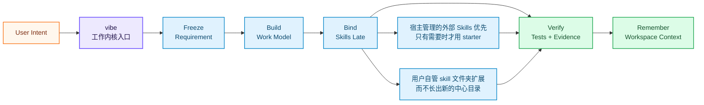

<div align="right">
  <a href="./README.md">🇬🇧 English</a> &nbsp;|&nbsp; <b>🇨🇳 中文</b>
</div>

<br/>

<div align="center">

<a href="https://github.com/foryourhealth111-pixel/Vibe-Skills">
  
</a>

<br/>


<br/><br/>

### 让 AI Agent 真正会推进任务

#### 安装 VibeSkills，输入 `vibe`，把繁琐流程交给 harness：理解任务、建立工作模型、只在需要时绑定合适的 Skills、检查结果，并把上下文留给下一次。它也为未来扩展而生，新的本地领域 Skills 可以接入同一套流程，不用每个领域都从零开始。

&nbsp;
*你只需要带来目标。VibeSkills 帮 AI 从想法走到计划，从计划走到执行，再从执行走到有证据的交付。这就是工作内核的意义：不是更多按钮，而是让 AI 更会把事情做完。*

现在公开主叙事改成“外部 skills 优先，但本地 override 仍先赢”：宿主管理的外部 skills 和其他用户自管 skill 文件夹一起构成主要参考面；如果同一个 skill id 同时出现在多个地方，本地用户自管 override 仍然优先。starter 集合只保留为很小的 fallback，真正记录这次运行实际绑定了什么的，仍然是 `work_binding`。


<table align="center">
<tr>
<td align="left">
<pre><code>&gt; vibe
  intent.freeze()        -> requirement_doc
  plan.model()           -> bounded_work
  skills.bind_late()     -> helpful Skills by work unit
  evidence.verify()      -> tests, checks, artifacts
  memory.preserve()      -> next-session context</code></pre>
</td>
</tr>
</table>

<br/>

<a href="https://github.com/foryourhealth111-pixel/Vibe-Skills/stargazers">
  
</a>
<a href="https://github.com/foryourhealth111-pixel/Vibe-Skills/network/members">
  
</a>
<a href="https://github.com/foryourhealth111-pixel/Vibe-Skills/pulse">
  
</a>

&nbsp;

&nbsp;

&nbsp;

&nbsp;

&nbsp;


<br/><br/>

🧠 规划 · 🛠️ 工程 · 🤖 AI · 🔬 科研 · 🎨 创作

<br/><br/>

<a href="docs/install/one-click-install-release-copy.md">
  
</a>

<br/><br/>

<a href="docs/quick-start.md">
  
</a>
&nbsp;
<a href="./README.md">
  
</a>

<br/><br/>

<kbd>安装</kbd> &nbsp;→&nbsp;
<kbd>vibe | vibe-upgrade</kbd> &nbsp;→&nbsp;
<kbd>工作内核</kbd> &nbsp;→&nbsp;
<kbd>晚绑定 Skills</kbd> &nbsp;→&nbsp;
<kbd>TDD / 验证</kbd> &nbsp;→&nbsp;
<kbd>持续上下文</kbd>

</div>

## 📋 目录

- [运行时一眼看懂](#-运行时一眼看懂)
- [实践演示](#-实践演示看得见的真实任务)
- [一种新的工作入口范式](#-一种新的工作入口范式)
- [为什么与众不同](#-为什么它与众不同)
- [适合你吗](#-适用人群)
- [工作组织](#-工作组织skills-如何变成有边界的工作)
- [记忆系统](#-记忆系统让-ai-在同一工作区里持续接上上下文)
- [代表性工作领域](#-代表性工作领域不是技能菜单)
- [安装与管理](#️-安装与-skills-管理)
- [开始使用](#-开启你的-vibe-体验)


<details>
<summary><b>🔑 初次使用？点击展开关键概念说明</b></summary>

<br/>

| 术语 | 通俗解释 |
|:---|:---|
| **Harness** | 包在 AI Agent 外层的工作流层。它判断下一步、调用合适的 Skills、检查结果，并保存有用上下文。 |
| **Skill** | 一个聚焦的专家能力，例如 `tdd-guide`、`code-review`、数据分析、文档处理、科研写作等。 |
| **Vibe / VCO** | 运行这套 harness 的 canonical runtime。公开入口是 `vibe` 和 `vibe-upgrade`。 |
| **晚绑定 Skills** | harness 先把工作边界定清楚，再把 Skills 绑定到真正需要它们的工作单元。 |
| **external-skill-first 参考面** | kernel 会把宿主声明的外部或其他用户自管 skill 文件夹当作主要参考面，只有需要时才退回到很小的 starter 集合；如果同一个 skill 同时出现，本地用户自管 override 仍然先赢。 |
| **TDD / 验证交付** | 完成不能只靠模型一句“做好了”，而要有测试、检查、产物证据，或明确的人工复核状态。 |
| **工作区记忆** | 结构化保存需求、计划、决策和证据，让后续会话不用从零开始。 |
| **work_binding 真相面** | 最终到底绑定了哪个 skill，要以 `work_binding` 为准，而不是以发现缓存或宽泛产品说法为准。 |

</details>

> [!IMPORTANT]
> ### 🎯 核心愿景
>
> VibeSkills 的出发点很直接：Skills 很强，但一长串工具列表还不够好用。
>
> 真正好用的 AI Agent，应该知道什么时候该问清需求，什么时候该写计划，什么时候该调用专家 Skill，什么时候必须测试和验证。用户不应该一直当调度员。
>
> VibeSkills 把这套节奏封装成一个工作内核入口。它给 AI 一条清楚的工作路径，把任务推向测试和证据，并把有用上下文留给下一次会话。
>
> **安装后调用 `vibe`，AI Agent 就有了更好的推进方式。**
> 现在对外的主叙事更收敛，也更实用：宿主管理的外部或其他用户自管 skill 文件夹是主要参考面，本地用户自管 override 在重复 skill 冲突里仍然先赢，内置 starter 集合只是小 fallback，而 `work_binding` 继续作为内核运行时第一真相面。这描述的是下一步架构方向，不是“最终架构已经完成”的宣称。

<br/>


---

## 🛰️ 运行时一眼看懂

VibeSkills 好上手，是因为 `vibe` 接管了流程。你给出目标，harness 把目标变成有边界的工作模型，优先参考宿主管理的外部或其他用户自管 skill 文件夹，只在真正需要的地方绑定 Skills，检查结果，并把上下文留给下一次。



<div align="center">

| 信号 | 它代表什么 |
|:---|:---|
| `one entry` | 从 `vibe` 开始，用 `vibe-upgrade` 更新。 |
| `late skill binding` | 先把工作边界说清楚，再在合适步骤绑定合适 Skills。 |
| `external-skill-first reference plane` | kernel 会先检查宿主声明的外部根和其他用户自管 skill 文件夹，再考虑 starter helper；如果有重复项，本地用户自管 override 会压过外部重复条目。 |
| `work_binding truth` | 选中 skill 的来源和最终绑定结果，运行时以 `work_binding` 为准，即使同时也会写 discovery 或 benchmark 产物。 |
| `proof trail` | 测试、检查、产物证据或人工复核状态支撑交付声明。 |
| `memory plane` | 需求、计划、决策和证据不会随着聊天窗口消失。 |

</div>

---

## 🎬 实践演示：看得见的真实任务

_社区里有人问：VibeSkills 实际用起来是什么样？下面这些案例比功能清单更容易判断。它们都从一个普通目标出发，经过一次受管的 `vibe` 流程，最后落到能打开、能检查、能复现的东西。_

> 当前这套 benchmark 证据，已经开始由更像真实工作的外部风格 brief、配套 release holdout，以及更小的兼容壳来支撑。要重新生成最新的本地 proof bundle，请运行 `py -3 -m vgo_cli.main benchmark-kernel --repo-root <repo-root> --suite development --phase phase_4`。这个命令会生成一组本地产物，其中包括 `kernel-benchmark-report.md`、`release-proof-summary.md`、`holdout-summary.md` 和 `compatibility-cut-summary.md`。这版说法保持克制：证明的是更真实的 bounded work、以 work_binding 为先的真相路径，以及更少的兼容残留，不是“最终架构已经完成”。

<div align="center">

| 演示 | 起点 | `vibe` 如何推进 |
|:---|:---|:---|
| **图像生成工作台** | 做一个能对话改提示词、上传参考图、调用真实生图接口的 GPT-image 工作台。 | 把想法拆成产品范围、UI/API 任务、流程检查和截图复核。 | 
| **视频剪辑流水线** | 把火箭登月历史素材剪成短视频节奏。 | 拆出字幕、配乐、节奏、渲染和复核几轮工作，并把粗糙点直接记下来。 | 
| **机器学习实验 + 论文** | 做一个人脸识别 ML 演示，并把实验整理成论文。 | 推进数据集与模型选择、训练、评估、图表生成和 LaTeX 编译。 | 

</div>

好演示不只展示最终截图，也要让任务推进过程看得见：


> 这些例子参考了 [VibeSkills 3.1.0 社区实践案例](https://linux.do/t/topic/2061161)：GPT-image 工作台、视频剪辑流程，以及直出论文的机器学习实验。README 里最好链接到具体东西：可运行应用、渲染视频、编译论文，或产生它们的命令和证据。

---

## 🧬 一种新的工作入口范式

AI Skills 的发展，正在从“给模型更多工具”，走向“让模型更会推进工作”。

像 **[Superpowers](https://github.com/obra/superpowers)** 这样的项目证明了：Skills 可以让 coding agent 更有纪律，先澄清、再设计、再实现、再测试。**[GSD / Get Shit Done](https://github.com/gsd-build/get-shit-done)** 则证明了另一件事：Agent 需要规格、里程碑、上下文和推进节奏，否则工作很容易散在聊天记录里。

VibeSkills 站在同一个方向上，但进一步改变了封装形态：

> **普通 Skill 说：**“我能做某件事。”
>
> **工作入口说：**“我知道这件事应该怎么推进。”

VibeSkills 属于第二种。它把工作流程、专家 Skills、验证和工作区记忆，封装成一个可迁移的工作内核入口。更重要的是，它给宿主管理的外部和其他用户自管 skill 文件夹留出了接入位置：随着 skill 变多，同一个 `vibe` 入口仍然能让任务有阶段、有检查、能继续，而内置 starter 集合保持很小。

<div align="center">

| 项目类型 | 擅长什么 | VibeSkills 往前推进的地方 |
|:---|:---|:---|
| **传统 Skills 集合** | 给 Agent 增加更多工具 | 把这些工具组织成有阶段、有检查的工作流 |
| **Superpowers 式方法论** | 让 coding agent 更有开发习惯 | 把这个思路扩展成能按阶段调用专家 Skills 的 harness |
| **GSD 式项目流** | 用规格、上下文和里程碑推进项目 | 把 Skill 调度、验证和工作区记忆放进 runtime |
| **VibeSkills** | 面向 Skills Agent 的通用工作内核入口 | 一个入口、更少手动控制、验证交付、跨会话记忆，并能接入新的本地领域 Skills |

</div>

重点不是“Skills 更多”。重点是让 Skills 不再躺在列表里，而是真正帮 AI 把任务往前推进。

---


## ✨ 为什么它与众不同？

> 大多数 Skills 仓库回答的是：_"我的 AI 能用哪些工具？"_
> **VibeSkills 更关心用户每天都会遇到的问题：_"AI 能不能自己选对 Skill、在合适时间用上它，并证明任务真的做好了？"_**

<sub>适用于 **Claude Code** · **Codex** · **Windsurf** · **OpenClaw** · **OpenCode** · **Cursor** 及所有支持 Skills 协议的 AI 环境。</sub>

<br/>

<div align="center">

| 能力 | 用户得到什么 |
|:---|:---|
| **一个入口** | 从 `vibe` 开始，用 `vibe-upgrade` 更新，先不用学一长串命令。 |
| **清楚的推进节奏** | AI 按「问清楚 → 写计划 → 做任务 → 检查 → 记住上下文」推进。 |
| **按工作单元绑定 Skills** | harness 只在当前工作真正需要的时候绑定合适的 Skills。 |
| **更少手动控制** | 你不用一直提醒 AI “先计划”“去测试”“别忘了保存上下文”。 |
| **验证交付** | 任务结果落到测试、检查、证据或明确人工复核状态上。 |
| **跨会话上下文** | 需求、计划、决策、交接信息和证据会存下来，方便下次接着做。 |
| **外部优先扩展** | 宿主管理的外部和其他用户自管 skill 文件夹，是扩展这套流程的主要方式。 |
| **通用入口** | 核心是一个可移植的工作内核入口，能给支持 Skills 的 AI Agent 带来同一套工作流升级。 |

</div>

<br/>

<div align="center">

| 没有 harness 时 | 使用 VibeSkills 后 |
|:---|:---|
| 用户自己决定下一句提示词、下一个工具、下一步质量检查。 | `vibe` 给 AI 一条路径，并在关键位置要求确认。 |
| Skills 只是一长串能力列表，AI 可能根本想不起来用。 | Skills 变成按阶段、按任务选中的工作能力。 |
| 每个新领域都容易变成一套新的使用方式。 | 新的本地领域 Skills 可以接入同一个 `vibe` 流程。 |
| “完成”可能只是模型停止输出。 | 交付要绑定测试、检查、产物证据或明确复核状态。 |
| 长任务跨会话后上下文丢失。 | 需求、计划、决策和证据被保存，方便继续。 |
| 每个宿主都要重新设计一套使用方式。 | 核心保持为一个可迁移的工作内核入口，宿主适配围绕它展开。 |

</div>

<br/>

---


## 👥 适用人群

VibeSkills 适合希望 AI Agent 更容易上手、更泛用、更少手动控制的人。

<details>
<summary>适合你吗？点击展开</summary>

<br/>

<div align="center">

| 人群 | 描述 |
|:---:|:---|
| 🎯 **追求稳定交付的用户** | 希望 AI 先澄清、再规划、再测试验证，而不是直接给一个答案。 |
| ⚡ **重度使用 AI Agent 的人** | 需要一个 harness 来协调大量专家 Skills，不想每一步都自己调度。 |
| 🏢 **想规范 AI 工作流的团队** | 需要可复用的需求、计划、验证和交接产物。 |
| 🧩 **Skill 构建者与集成者** | 希望用易安装、可迁移的工作内核入口作为核心封装，适配多种宿主环境。 |
| 😩 **厌倦手动调工具的人** | 希望系统自动判断哪个阶段该用哪个 Skill。 |

</div>

> _如果你只想要一个孤立小脚本，VibeSkills 可能偏重。但如果你希望 AI Agent 能跨阶段、跨会话承接真实工作，它就是让 Skills 规模化可用、又不难上手的那层基础。_

</details>

<br/>

---


## 🔀 工作组织：Skills 如何变成有边界的工作

核心点其实很简单：Skills 本身不是完整产品。work kernel 才是把它们组织成工作系统的关键。

`vibe` 负责整个流程：什么时候澄清，什么时候建立工作模型，什么时候把相关 Skills 绑定到当前工作单元，什么时候跑测试或检查，以及什么时候允许声明交付完成。用户只需要一个简单入口，不需要面对一堆选择题。

这套发现规则故意保持很窄：

- 宿主管理的外部或其他用户自管 skill 文件夹，是主要参考面；如果有重复 skill，本地用户自管 override 仍然先赢
- 内置 starter 集合只保留为很小的 fallback
- 运行时第一真相面仍然是 `work_binding`，它记录了实际绑定了什么

<div align="center">

| 用户常见担心 | 实际怎么处理 |
|:---|:---|
| “Skills 太多了，我怎么选？” | 不需要你从完整列表里手动挑。kernel 会先把工作边界定清楚，再只绑定当前单元真正需要的 Skills。 |
| “相似 Skills 会不会冲突？” | 每个 Skill 只在当前工作单元里承担有限职责，不会接管整条流程。 |
| “多代理会不会乱跑？” | 大任务会先拆成有边界的单元，再明确所有权、验证方式和协调者批准。 |

</div>

### kernel 在实际里怎么协同

- **一个受管入口开始**：多数任务从 `vibe` 进入，用户不用手动选择一棵 workflow 树。
- **执行前先冻结意图**：需求和计划会变成稳定产物，而不是散落在聊天记录里。
- **按工作单元绑定 Skills**：需求、规划、实现、测试、评审、清理，可以各自绑定不同 Skills，而不是让技能发现本身接管控制平面。
- **结果必须落到证据**：TDD、定向检查、产物审阅和交付验收共同约束完成声明。
- **上下文要能延续**：运行时保存足够结构，方便下一个会话或下一个代理继续工作。
- **实际绑定要可回看**：`work_binding` 会记录每个工作单元最终绑定了哪个 skill，以及可审计的来源信息。

---

### 为什么大量 Skills 可以共存

- 它们不会一次性全部启动。
- 有些服务不同阶段：澄清、规划、实现、评审、验证。
- 有些服务不同领域：代码、科研、数据、写作、设计、文档、运维。
- 最终掌控工作流的是 harness，而不是某个单独 Skill。

---

### M / L / XL 工作规模

当内核已经把工作组织成有边界的模型后，运行时还会决定这次工作应该按多大规模推进：

<div align="center">

| 级别 | 适用场景 | 特点 |
|:---:|:---|:---|
| **M** | 窄范围执行，边界清楚的小范围工作 | 单代理，省 token，响应快 |
| **L** | 中等复杂任务，需要设计、计划与评审 | 受管的多步骤执行，通常按计划串行推进 |
| **XL** | 适合拆分的大任务，存在彼此独立的工作单元 | 先拆单元，再由协调者按波次调度，可对独立单元并行推进 |

</div>

> 即使到了 XL，也不是“大家各自找技能乱跑”。系统会先把工作边界定清楚，再给任务单元绑定需要的 Skills，整个过程仍由同一个受管协调者控制。

---

<details>
<summary><b>🔍 展开：入口 wrapper、级别覆盖与路由补充说明</b></summary>

<br/>

- 公开可发现入口固定是 `vibe` 和 `vibe-upgrade`。
- `vibe` 是渐进式入口：先在 `requirement_doc` 停止，再在 `xl_plan` 停止，只有在每个边界都得到明确 re-entry 批准后才进入 `phase_cleanup`。
- `vibe-upgrade` 负责受管升级路径。
- `vibe-what-do-i-want`、`vibe-how-do-we-do`、`vibe-do-it` 这类阶段 ID 已禁用为公开宿主入口。它们可以作为运行时连续性元数据保留，但安装器不应把它们物化成宿主可见的 command 或 skill wrapper。
- 公开允许的轻量级别覆盖只有 `--l` 和 `--xl`。像 `vibe-l`、`vibe-xl` 或阶段入口叠加级别的组合别名是故意不支持的。
- 当内部调用 `tdd-guide`、`code-review` 这类专项技能时，它们只负责当前阶段或当前任务单元，不会接管全局协调。
- 在 XL 多代理流程里，子代理可以提出候选 skill，但最终由协调者确认选中项。

</details>

<br/>

---


## 🧠 记忆系统：让 AI 在同一工作区里持续接上上下文

_工作状态决定还有什么没做完。记忆让下一次会话不用从零开始。_

<br/>

VibeSkills 只保留继续工作真正需要的受管上下文：

- **接上同一个项目**：同一工作区内，可以恢复已确认的背景、约定和关键决策。
- **继续长任务**：中断之后，进度、交接信息和证据线索仍然可用。
- **减少重复解释**：不用每次开新会话都重新讲一遍项目设定。
- **保持边界清楚**：记忆按当前工作区和当前任务取回，不把无关历史塞进提示词。

| 场景 | VibeSkills 帮你恢复什么 |
|:---|:---|
| 同一工作区的新会话 | 已确认的项目背景和工作约定 |
| 中断后继续任务 | 最近的有效进度、关键决策和验证线索 |
| 代理交接 | 交接说明和相关产物链接 |
| 切到另一个项目 | 默认隔离，不串上下文 |

记忆是连续性辅助层，不是项目真相来源的替代品。Git、README、需求文档、执行计划和验证 receipt 仍然是权威记录。持久记忆写入受治理约束；如果记忆能力不可用，系统会直接暴露问题，而不是假装自己还记得。

技术契约见 [工作区记忆平面设计](./docs/design/workspace-memory-plane.md)，量化验证见 [Codex 记忆仿真测试](./tests/runtime_neutral/test_codex_memory_user_simulation.py)。


---


## ✦ 代表性工作领域：不是技能菜单

_这一节不是菜单，也不是技能库存表，而是帮助你快速判断：这个内核大致能组织哪些类型的工作。_

_如果你只是想先判断它适不适合你的任务，看下面这张表就够了。_

<br/>

<div align="center">

| 工作方向 | 它主要能帮你做什么 | 代表能力 |
|:---|:---|:---|
| **💡 规划与需求澄清** | 把模糊请求讲清楚，冻结需求，并转成可执行计划 | `brainstorming`, `writing-plans`, `speckit-specify` |
| **🏗️ 工程开发与受管交付** | 设计边界、落地改动，并协调有边界的多步骤执行 | `aios-architect`, `autonomous-builder`, `vibe` |
| **🔧 调试与核验** | 排查问题、补测试、做 review，并证明改动真的完成 | `systematic-debugging`, `verification-before-completion`, `code-review` |
| **📊 数据、模型与研究工作** | 分析数据、训练或评估模型，并支撑研究型任务 | `statistical-analysis`, `scikit-learn`, `literature-review` |
| **🎨 输出与外部交付** | 把结果变成文档、图表、浏览器动作或可交付产物 | `docs-write`, `plotly`, `playwright` |

</div>

<br/>

这张表的作用是让你快速判断“这个内核大概能不能组织我的工作”，而不是把 README 继续写成技能大全。如果你的任务大致落在这些行里，内核就该能组织起来；如果不在，正常扩展路径仍然是宿主声明的用户自管 skill 目录，或本地 `skills/local/<skill-id>/SKILL.md`，而不是继续长一个中心技能目录。

<br/>

---


## 📊 为什么说它强大？

_重点不是技能更多，而是内核更小，但仍然能把真实工作推进到完成。_

**VibeSkills** 背后的运行时核心是 **VCO**。它不是一个更花哨的路由器，也不是更长的 skill 菜单，而是一个更薄的工作内核：

<br/>

<div align="center">

|                               🧩 能力材料                               |                               ✅ 工作闭环                               |                               ⚖️ 边界纪律                                |
| :---------------------------------------------------------------------: | :--------------------------------------------------------------------: | :----------------------------------------------------------------------: |
| <h2>可组合</h2>宿主管理的外部和用户自管 Skills 优先<br/>只有一层很薄的 starter fallback | <h2>可落地</h2>目标会变成有边界的工作<br/>再走向测试、检查和产物 | <h2>清边界</h2>小内核和薄外壳<br/>让扩展成本低于路由手术 |

</div>

<br/>

---


## ⚙️ 安装与 Skills 管理

先装起来，再慢慢了解内部机制。现在公开安装路径分成两种：**提示词安装** 和 **命令安装**。

如果你不想处理路径和命令，选提示词安装；如果你已经熟悉终端，想自己控制执行过程，选命令安装。两条路径安装的是同一套 `vibe` / `vibe-upgrade` 公开入口。

### 方式一：提示词安装（推荐）

这是最省心的路径。你只需要选三件事，然后复制一段提示词给正在使用的 AI 客户端：

1. 选宿主：`codex`、`claude-code`、`cursor`、`windsurf`、`openclaw`、`opencode`
2. 选动作：第一次安装选 `install`，已经装过再选 `update`
3. 选版本：默认推荐 `minimal`。它给你的是小工作内核，再加两个很薄的内置 starter helper：`tdd-guide` 和 `systematic-debugging`。只有你还想多带 `verification-before-completion` 时，再选 `full`
4. 打开安装入口：
   [提示词安装（推荐）](docs/install/one-click-install-release-copy.md)
5. 把对应提示词粘贴到你的 AI 客户端里，让它执行安装和检查

提示词安装会要求安装助手先确认宿主和公开版本，再运行安装与检查；它不会要求你把密钥、URL 或模型名粘贴到聊天里。

### 方式二：命令安装

如果你想直接在终端执行，打开：

[多宿主命令参考](docs/install/recommended-full-path.md)

命令安装适合这些情况：

- 你已经知道目标宿主根目录，比如 Codex 的真实根目录是 `~/.codex`
- 你希望自己控制 `install` / `check` 的执行顺序
- 你在 CI、测试机器或隔离目录里验证安装行为

最常见的形态是：

```bash
bash ./install.sh --host <host> --profile minimal
bash ./check.sh --host <host> --profile minimal
```

Windows / PowerShell 路径见命令参考页。

### `full` 还是 `minimal`？

- 想获得默认的 work-first 内核，让宿主声明或用户自管的 skill 文件夹继续作为主要参考面，并且在重复 skill id 时仍由本地用户自管 override 先赢，同时只带 `tdd-guide` 和 `systematic-debugging` 这两个 starter helper，就选 `minimal`
- 只有你还想在同一个小内核上预装 `verification-before-completion` 时，再选 `full`
- 如果你想一眼看清当前边界，可以直接看 [bundled skill 保留矩阵](docs/governance/bundled-skill-retention-matrix.md)。这里会把内置 starter、仅作参考语料的 repo bundled 目录，以及为什么“磁盘上目录很多”不等于“默认公开扩展面很大”写清楚。

### 安装时不会要求配置什么？

公开安装暂时只关注本地安装、`vibe` 可发现和基础检查。内置在线增强能力仍按未开放配置处理，安装说明不会引导普通用户配置这部分 provider、凭据或模型。

### 什么时候再看更多文档？

- 不确定宿主根目录：看 [冷启动宿主矩阵](docs/cold-start-install-paths.md)
- 想直接看命令：看 [多宿主命令参考](docs/install/recommended-full-path.md)
- 需要 OpenClaw / OpenCode 细节：看 [OpenClaw 宿主说明](docs/install/openclaw-path.md) 或 [OpenCode 宿主说明](docs/install/opencode-path.md)
- 需要离线安装：看 [手动复制安装](docs/install/manual-copy-install.md)

<details>
<summary><b>🔧 高级安装细节</b></summary>

下面这些内容只在你需要手动配置路径、排查安装状态或接入自定义 Skills 时再看。

**手动配置路径**

- Codex：`~/.codex/settings.json`
- Claude Code：`~/.claude/settings.json`
- Cursor：`~/.cursor/settings.json`
- OpenCode：`~/.config/opencode/opencode.json`
- Windsurf / OpenClaw sidecar：`<target-root>/.vibeskills/host-settings.json`

**安装会创建什么**

- 对外运行时入口：`<target-root>/skills/vibe`
- 正常本地扩展路径：`<target-root>/skills/local/<skill-id>/SKILL.md`
- 内部 bundled 语料：`<target-root>/skills/vibe/bundled/skills/*`
- 兼容性辅助文件：只有宿主明确需要时才生成

如果宿主还声明了额外的用户自管 skill 文件夹，kernel 会先把这些外部根当作主要参考面，再在必要时退回到 starter 集合；如果出现重复 skill id，本地用户自管 override 仍然先赢。bundled 语料不是公开主扩展叙事。按当前打包合同，`minimal` 默认只带两个 starter helper，`full` 只是在同一个小内核上再加一个验证 helper；仓库里现在仍然存在的大量 bundled 目录，除非被打包清单明确列入，否则都应视为参考或迁移材料，而不是默认公开扩展面。

`.vibeskills` 被拆成两层：

- host-sidecar：`<target-root>/.vibeskills/host-settings.json`、`host-closure.json`、`install-ledger.json`、`bin/*`
- workspace-sidecar：`<workspace-root>/.vibeskills/project.json`、`.vibeskills/docs/requirements/*`、`.vibeskills/docs/plans/*`、`.vibeskills/outputs/runtime/vibe-sessions/*`

**已验证的安装行为**

| 宿主 | 已验证的范围 |
|:---|:---|
| `codex` | planning、debug、governed execution、memory continuity |
| `claude-code` | planning、debug、governed execution、memory continuity |
| `openclaw` | planning、debug、governed execution、memory continuity |
| `opencode` | planning、debug、governed execution、memory continuity |

这些检查说明：安装后的 `vibe` 仍然能负责工作组织、写出治理和清理记录，并保持记忆连续性；但不等于每一种宿主调用方式都在同一次验证里完整跑过。

**卸载和自定义**

- 卸载入口：`uninstall.ps1 -HostId <host>`、`uninstall.sh --host <host>`
- 卸载治理说明：[`docs/uninstall-governance.md`](docs/uninstall-governance.md)
- 自定义 Skill 接入：[自定义工作流与 Skill 接入指南](docs/install/custom-workflow-onboarding.md)

</details>

## 📦 集众家之所长：资源整合

_这些能力不是闭门造车做出来的。VibeSkills 会参考现有开源项目、方法和工具，再把适合的部分接入同一套受管运行时。_

VibeSkills 并不声称要替代、也不会完整复刻下面列出的每一个上游项目。更实际的目标是：在合适的地方复用已经被验证的方法和能力，再通过同一套运行时与治理层把它们串起来，减少日常使用时的切换和拼装成本。
更重要的是，用户最终看到的产品面应该比背后参考过的来源更小，而不是更重。

> 🙏 **鸣谢**
>
> 本项目参考、适配或接入了以下项目中的部分思路、工作流或工具能力：
>
> `superpower` · `claude-scientific-skills` · `get-shit-done` · `OpenSpec` · `spec-kit` · `mem0` · `scrapling` · `claude-flow` · `serena`
>
> _我们会尽量认真处理上游来源的署名与说明。如果有遗漏，或某处表述不准确，欢迎在 Issue 中指出，我们会及时修正。_
>
> 贡献者鸣谢：[xiaozhongyaonvli](https://github.com/xiaozhongyaonvli) 和 [ruirui2345](https://github.com/ruirui2345)，感谢你们对本项目的社区贡献。

<br/>

---


## 🚀 开启你的 Vibe 体验

_如果你已经装好了 VibeSkills，接下来只需要一次调用。_

> ⚠️ **调用说明**：VibeSkills 采用 **Skills 格式运行时**，请从宿主环境的 Skills 入口调用，**不要**把它当成独立 CLI 程序直接运行。

<br/>

<div align="center">

| 宿主环境 | 调用方式 | 示例 |
|:---:|:---:|:---|
| **Claude Code** | `/vibe` | `请帮我规划这个任务 /vibe` |
| **Codex** | `$vibe` | `请帮我规划这个任务 $vibe` |
| **OpenCode** | `/vibe` | `请用 vibe 帮我规划这次改动。` |
| **OpenClaw** | Skills 入口 | 参考宿主说明 |
| **Cursor / Windsurf** | Skills 入口 | 参考各平台 Skills 调用文档 |

</div>

<br/>

- 第一次可以先从一个很小的请求开始，比如让它先帮你澄清、规划或拆分任务。
- 如果你希望后续每一轮都留在受管工作流里，就在每条消息后面继续附上 `$vibe` 或 `/vibe`。
- 如果你还没安装，先回到 [提示词安装（默认推荐）](docs/install/one-click-install-release-copy.md)。

> 说明：`$vibe` 或 `/vibe` 只表示进入 governed runtime，不单独证明宿主插件、provider 或在线增强已经完成。

**当前宿主状态**：`codex` 和 `claude-code` 是目前最清晰、最完整的安装与使用路径。`cursor`、`windsurf`、`openclaw`、`opencode` 也可用，但其中一部分仍偏 preview 或带宿主特定约束。

<br/>

---

<details>
<summary><b>📚 文档导航与安装指引（点击展开）</b></summary>

<br/>

**先看这两个**

- ⚡️ [提示词安装（默认推荐）](docs/install/one-click-install-release-copy.md)
- 📖 [了解系统架构与理念](docs/quick-start.md)

**下面这些按需再看**

- 🛠 [命令安装参考](docs/install/recommended-full-path.md)
- 🧩 [自定义工作流接入](docs/install/custom-workflow-onboarding.md)
- 📄 [OpenClaw 宿主说明](docs/install/openclaw-path.md)
- 📄 [OpenCode 宿主说明](docs/install/opencode-path.md)
- 📁 [手动复制安装（离线）](docs/install/manual-copy-install.md)
- 🧊 [冷启动与其他环境说明](docs/cold-start-install-paths.md)

</details>

<br/>

<div align="center">

### 🤝 加入社区 · 共建生态

欢迎来尝试和体验！有问题、有想法、有建议，欢迎随时提出——鄙人不才，一定认真听取和修改。

<br/>

**本项目完全开源，欢迎一切形式的贡献！**

无论是修复 bug、提升性能、添加新功能还是完善文档，你的每一个 PR 都弥足珍贵。

```
Fork → 修改 → Pull Request → 合并 ✅
```

<br/>

> ⭐ 如果这个项目对你有帮助，点个 **Star** 是对我最大的支持！
> 它的理念受到了大家的欢迎，但目前的底层代码存在一些技术债，功能也有待完善，欢迎大家在issue区指出。
> 您的支持也是我这个核动力驴的浓缩 U-235 :blush:

<br/>

感谢 **LinuxDo** 各位佬的支持！

[](https://linux.do/)

各种技术交流、AI 前沿资讯、AI 经验分享，尽在 Linuxdo！

</div>

<br/>

---


## Star History

<a href="https://www.star-history.com/?repos=foryourhealth111-pixel%2FVibe-Skills&type=date&legend=top-left">
  <picture>
    <source media="(prefers-color-scheme: dark)" srcset="https://api.star-history.com/image?repos=foryourhealth111-pixel/Vibe-Skills&type=date&theme=dark&legend=top-left" />
    <source media="(prefers-color-scheme: light)" srcset="https://api.star-history.com/image?repos=foryourhealth111-pixel/Vibe-Skills&type=date&legend=top-left" />
    
  </picture>
</a>

<br/>

---

<div align="center">
  <p><i>把真实工作里最容易失控的部分，变成一个更可调用、更可治理、也更可长期维护的系统。</i></p>
  <br/>
  <sub>Made with ❤️ &nbsp;·&nbsp; <a href="https://github.com/foryourhealth111-pixel/Vibe-Skills">GitHub</a> &nbsp;·&nbsp; <a href="./README.md">English</a></sub>
</div>
