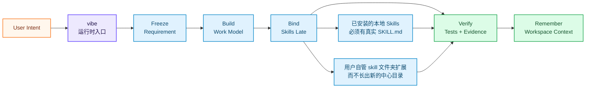

<div align="right">
  <a href="./README.md">🇬🇧 English</a> &nbsp;|&nbsp; <b>🇨🇳 中文</b>
</div>

<br/>

<div align="center">

<a href="https://github.com/foryourhealth111-pixel/Vibe-Skills">
  
</a>

<br/>


<br/><br/>

### 组织本地 Skills 协作，处理复合任务

VibeSkills 是一个给 AI Agent 用的工作流运行时。它会把一条任务拆成多个有边界的部分，再让合适的本地 Skills 分别负责规划、实现、测试、文档、研究或评审。

<div align="center">

| 核心功能 | 最擅长 | 适配环境 |
|:---|:---|:---|
| 在同一次任务里组织多个本地 Skills 协作 | 代码改动加测试加文档加 review，或研究加写作加交付这类复合任务 | Codex、Claude Code、Windsurf、Cursor、OpenCode、OpenClaw，以及其他支持 Skills 的环境 |

</div>

从 `vibe` 开始。运行时会处理范围澄清、任务拆分、Skill 协作和验证，让 Agent 更适合完成多步骤工作。

<details>
<summary><b>给进阶用户的运行时说明</b></summary>

在公开叙事里，已安装的本地 skill 根目录仍然是唯一专家来源。宿主声明的额外本地根目录，是沿着同一条本地扩展面继续扩展，不长出新的中心目录。这不是在宣称最终架构已经完成。

一个 skill 只有在当前 Agent 把工作结果写入 `module-execution.json`，并通过 canonical 验收后，才会被算作实际使用。`module_assignments` 只记录批准后的绑定关系，不证明工作已经执行。

在当前运行时边界里，Python 负责 canonical validation、任务语义、`module_assignments`，以及从 `agent_skill_organization` 到 `module-work-plan.json`、`agent-execution-handoff.json`、`module-execution.json` 的真相链。PowerShell 负责阶段编排、环境准备、脚本桥接、宿主收据和 shell 原生检查；批准后的模块工作由当前 Agent 真正完成。不要再把新的任务语义或任务执行加到 PowerShell；现有 PowerShell 阶段脚本只是迁移期编排面。

</details>

<br/>

<a href="https://github.com/foryourhealth111-pixel/Vibe-Skills/stargazers">
  
</a>
<a href="https://github.com/foryourhealth111-pixel/Vibe-Skills/network/members">
  
</a>
<a href="https://github.com/foryourhealth111-pixel/Vibe-Skills/pulse">
  
</a>

&nbsp;

&nbsp;

&nbsp;

&nbsp;

&nbsp;


<br/><br/>

🧠 规划 · 🛠️ 工程 · 🤖 AI · 🔬 科研 · 🎨 创作

<br/><br/>

<a href="docs/install/README.md">
  
</a>

<br/><br/>

<a href="docs/quick-start.md">
  
</a>
&nbsp;
<a href="./README.md">
  
</a>

<br/><br/>

<kbd>安装</kbd> &nbsp;→&nbsp;
<kbd>vibe | update</kbd> &nbsp;→&nbsp;
<kbd>结构化流程</kbd> &nbsp;→&nbsp;
<kbd>本地 Skill 绑定</kbd> &nbsp;→&nbsp;
<kbd>TDD / 验证</kbd> &nbsp;→&nbsp;
<kbd>持续上下文</kbd>

</div>

## 📋 目录

- [运行时一眼看懂](#-运行时一眼看懂)
- [实践演示](#-实践演示看得见的真实任务)
- [一个公开面更小的运行时入口](#-一个公开面更小的运行时入口)
- [为什么与众不同](#-为什么它与众不同)
- [适合你吗](#-适用人群)
- [工作组织](#-工作组织skills-如何变成有边界的工作)
- [记忆系统](#-记忆系统让-ai-在同一工作区里持续接上上下文)
- [代表性工作领域](#-代表性工作领域)
- [安装与管理](#️-安装与-skills-管理)
- [开始使用](#-开启你的-vibe-体验)


<details>
<summary><b>🔑 初次使用？点击展开关键概念说明</b></summary>

<br/>

| 术语 | 通俗解释 |
|:---|:---|
| **Harness** | 包在 AI Agent 外层的工作流层。它判断下一步、调用合适的 Skills、检查结果，并保存有用上下文。 |
| **Skill** | 一个聚焦的专家能力，例如 `tdd-guide`、`code-review`、数据分析、文档处理、科研写作等。 |
| **Vibe / VCO** | 运行这套 harness 的 canonical runtime。公开工作入口只有 `vibe`；已安装副本的更新走 `update` 管理路径。 |
| **晚绑定 Skills** | harness 先把工作边界定清楚，再把 Skills 绑定到真正需要它们的工作单元。 |
| **本地 skill 根目录** | 运行时只从声明的本地 skill 根目录里发现额外 Skills；一个 skill 必须有可读取的 `SKILL.md`，才可能被选中。 |
| **TDD / 验证交付** | 完成不能只靠模型一句“做好了”，而要有测试、检查、产物证据，或明确的人工复核状态。 |
| **工作区记忆** | 结构化保存需求、计划、决策和证据，让后续会话不用从零开始。 |
| **实际绑定记录** | 最终到底绑定了哪个 skill，要以 `module_assignments` 为准。发现缓存或宽泛产品说法都不能替代这份记录。 |

</details>

> [!IMPORTANT]
> ### 🎯 核心愿景
>
> VibeSkills 适合需要完整工作流程的 AI Agent。
>
> 运行时会先澄清请求、规划工作、在合适的位置绑定本地 Skills，并保留评审或继续工作需要的证据。
>
> 在当前版本里，公开入口保持收敛：`vibe` 是公开入口，额外 Skills 只会从声明的本地 skill 根目录里发现，重复 skill id 按根目录优先级处理，`module_assignments` 记录本次运行实际绑定了什么。

<br/>


---

## 🛰️ 运行时一眼看懂

从 `vibe` 开始，运行时会先冻结请求，再建立有边界的工作模型，扫描宿主声明的本地 skill 根目录，只在需要的地方绑定带真实 `SKILL.md` 的 Skills，检查结果，并把上下文留给下一次。任务越复合，这套组织多个本地 Skills 协作的能力就越重要。



<div align="center">

| 信号 | 它代表什么 |
|:---|:---|
| `one entry` | 从 `vibe` 开始，用 `update` 刷新同一个已安装 skills 目录。 |
| `late skill binding` | 先把工作边界说清楚，再在合适步骤绑定合适 Skills。 |
| `local skill roots` | 运行时只从声明的本地 skill 根目录里发现额外 Skills；如果有重复项，按扫描顺序保留第一个可用入口。 |
| `actual binding record` | Agent 先冻结 `agent_skill_organization`，`module_assignments` 是它经过校验后的执行投影；discovery 和 benchmark 产物只保留审计价值。 |
| `proof trail` | 测试、检查、产物证据或人工复核状态支撑交付声明。 |
| `memory plane` | 需求、计划、决策和证据不会随着聊天窗口消失。 |

</div>

---

## 🎬 实践演示：看得见的真实任务

_社区里有人问：VibeSkills 实际用起来是什么样？下面这些案例比功能清单更容易判断。它们都从一个普通目标出发，经过一次受管的 `vibe` 流程，最后落到能打开、能检查、能复现的东西。_

> 当前公开 proof 只保留三层说法，而且每层只对应一类证据：
>
> - `installed locally`：运行 `py -3 -m vgo_cli.main check --repo-root <repo-root> --skills-dir <skills-dir>`。
> - `runtime coherent`：一次真实的 `vibe` 运行返回 `session_root` 后，再去看 `host-launch-receipt.json`、`runtime-input-packet.json`、`governance-capsule.json`、`stage-lineage.json` 和 `runtime-summary.json`。
> - `delivery accepted`：查看 `delivery-acceptance-report.json` 或 `delivery-acceptance-report.md`。
>
> release proof bundle 继续保留为明确命名的 operator 本地产物。`check` 只证明 `installed locally`；它不证明任务完成，也不证明 `runtime coherent` 或 `delivery accepted`。

<div align="center">

| 演示 | 起点 | `vibe` 如何推进 |
|:---|:---|:---|
| **图像生成工作台** | 做一个能对话改提示词、上传参考图、调用真实生图接口的 GPT-image 工作台。 | 把想法拆成产品范围、UI/API 任务、流程检查和截图复核。 | 
| **视频剪辑流水线** | 把火箭登月历史素材剪成短视频节奏。 | 拆出字幕、配乐、节奏、渲染和复核几轮工作，并把粗糙点直接记下来。 | 
| **机器学习实验 + 论文** | 做一个人脸识别 ML 演示，并把实验整理成论文。 | 推进数据集与模型选择、训练、评估、图表生成和 LaTeX 编译。 | 

</div>

好演示应该同时展示结果和推进路径：


> 这些例子参考了 [VibeSkills 3.1.0 社区实践案例](https://linux.do/t/topic/2061161)：GPT-image 工作台、视频剪辑流程，以及直出论文的机器学习实验。README 里最好链接到具体东西：可运行应用、渲染视频、编译论文，或产生它们的命令和证据。

---

## 🧬 一个公开面更小的运行时入口

像 **[Superpowers](https://github.com/obra/superpowers)** 这样的项目说明了更强的开发纪律很有价值：先澄清、再设计、再实现、再测试。**[GSD / Get Shit Done](https://github.com/gsd-build/get-shit-done)** 则说明了规格、里程碑、上下文和持续推进的重要性。

VibeSkills 把这套纪律放到运行时入口上。公开入口是 `vibe`。运行过程中，系统会按当前有边界的工作，从声明的本地根目录里选择带可读 `SKILL.md` 的相关 Skills。真正拉开差异的地方，是它会先组织任务，再组织 Skills。遇到复合任务时，运行时可以先拆分请求，再让不同本地 Skills 分别覆盖不同工作单元。

<div align="center">

| 相关方向 | 有用之处 | VibeSkills 的处理方式 |
|:---|:---|:---|
| **传统 Skills 集合** | 给 Agent 增加更多工具 | 保持公开入口收敛，再把这些工具组织成分阶段、可检查的流程 |
| **Superpowers 式方法论** | 让 coding agent 更有开发习惯 | 把这种纪律扩展到能按阶段绑定相关本地 Skills 的运行时 |
| **GSD 式项目流** | 用规格、上下文和里程碑推进项目 | 把 Skill 绑定、验证和工作区记忆放进同一套运行时 |
| **VibeSkills** | 给支持 Skills 的 Agent 一个统一入口 | 保持一个公开入口，并提供验证、续作上下文和本地扩展能力 |

</div>

---


## ✨ 为什么它与众不同？

VibeSkills 关注的是用户给出请求之后，这条工作链怎么走。运行时会先澄清任务，再规划，再在需要的地方绑定本地 Skills，最后用测试、检查和产物来支持交付。

它最核心的优势，是组织本地 Skills 协作的能力。面对复合任务时，运行时不需要把整件事压给一个 Skill，而是可以把请求拆成多个有边界的单元，再把合适的本地 Skill 绑定到对应单元。

<sub>适用于 **Claude Code** · **Codex** · **Windsurf** · **OpenClaw** · **OpenCode** · **Cursor** 及所有支持 Skills 协议的 AI 环境。</sub>

<br/>

<div align="center">

| 能力 | 用户得到什么 |
|:---|:---|
| **一个入口** | 从 `vibe` 开始，用 `update` 刷新已安装副本，先不用学一长串命令。 |
| **清楚的工作流程** | AI 按「问清楚 → 写计划 → 做任务 → 检查 → 记住上下文」推进。 |
| **按工作单元绑定 Skills** | harness 只在当前工作真正需要的时候绑定合适的 Skills。 |
| **多 Skill 协作组织** | 复合任务可以先拆成多个工作单元，再让不同本地 Skills 在同一次运行里分别负责对应部分。 |
| **更少手动控制** | 你不用一直提醒 AI “先计划”“去测试”“别忘了保存上下文”。 |
| **验证交付** | 任务结果落到测试、检查、证据或明确人工复核状态上。 |
| **跨会话上下文** | 需求、计划、决策、交接信息和证据会存下来，方便下次接着做。 |
| **本地扩展** | 声明的本地 skill 根目录，是扩展这套流程的主要方式；一个 skill 需要真实 `SKILL.md` 才能被绑定。 |
| **通用入口** | 核心是一个可移植的运行时入口，能给支持 Skills 的 AI Agent 带来同一套工作流升级。 |

</div>

<br/>

<div align="center">

| 常见问题 | VibeSkills 的处理方式 |
|:---|:---|
| 用户需要自己决定下一句提示词、下一个工具和下一步质量检查。 | `vibe` 给 AI 一条受管路径，并在关键位置要求确认。 |
| Skills 很多，但 AI 不一定会用对。 | Skills 按阶段、按任务类型绑定，只在需要时加入当前工作。 |
| 每个新领域都容易带来额外流程成本。 | 新的本地 skill 文件夹可以接入同一个 `vibe` 流程。 |
| “完成”可能只是模型停止输出。 | 交付要绑定测试、检查、产物证据或明确复核状态。 |
| 长任务跨会话后上下文容易丢失。 | 需求、计划、决策和证据会被保存，方便继续。 |
| 每个宿主都要单独解释一套流程。 | 核心保持为一个可迁移的运行时入口，宿主适配围绕它展开。 |

</div>

<br/>

---


## 👥 适用人群

VibeSkills 适合希望 AI Agent 更容易上手、更泛用、更少手动控制的人。

<details>
<summary>适合你吗？点击展开</summary>

<br/>

<div align="center">

| 人群 | 描述 |
|:---:|:---|
| 🎯 **追求稳定交付的用户** | 希望 AI 先澄清、再规划、再测试验证，再给出可交付结果。 |
| ⚡ **重度使用 AI Agent 的人** | 需要一个 harness 来协调大量专家 Skills，不想每一步都自己调度。 |
| 🏢 **想规范 AI 工作流的团队** | 需要可复用的需求、计划、验证和交接产物。 |
| 🧩 **Skill 构建者与集成者** | 希望用易安装、可迁移的运行时入口作为核心封装，适配多种宿主环境。 |
| 😩 **厌倦手动调工具的人** | 希望系统自动判断哪个阶段该用哪个 Skill。 |

</div>

> _VibeSkills 更适合较长的任务。它的价值主要体现在需求澄清、多阶段推进和后续续作。_

</details>

<br/>

---


## 🔀 工作组织：Skills 如何变成有边界的工作

`vibe` 负责整个流程：什么时候澄清，什么时候建立工作模型，复合任务要怎么拆，什么时候把相关 Skills 绑定到当前工作单元，什么时候跑测试或检查，以及什么时候允许声明交付完成。用户只需要一个简单入口，不需要面对一堆选择题。

这套发现规则故意保持很窄：

- 额外 Skills 只会从声明的本地 skill 根目录里发现
- 一个 skill 必须有可读取的 `SKILL.md`，才可能被选中或锁定
- 运行时第一真相面仍然是 `module_assignments`，它记录了实际绑定了什么

<div align="center">

| 用户常见担心 | 实际怎么处理 |
|:---|:---|
| “Skills 太多了，我怎么选？” | 不需要你从完整列表里手动挑。运行时会先把工作边界定清楚，再只绑定当前单元真正需要的 Skills。 |
| “相似 Skills 会不会冲突？” | 每个 Skill 只在当前工作单元里承担有限职责，不会接管整条流程。 |
| “多个 Skills 怎么一起配合？” | 运行时会先把任务拆成有边界的单元，再把 Skills 分配到这些单元，并给出明确的所有权和验证方式。 |
| “多代理会不会乱跑？” | 大任务会先拆成有边界的单元，再明确所有权、验证方式和协调者批准。 |

</div>

### 运行时在实际里怎么协同

- **一个受管入口开始**：多数任务从 `vibe` 进入，用户不用手动选择一棵 workflow 树。
- **执行前先冻结意图**：需求和计划会变成稳定产物，方便继续和复核。
- **复合任务先拆分**：运行时会先把一条大请求拆成多个可分别负责、可分别检查的工作单元。
- **按工作单元绑定 Skills**：需求、规划、实现、测试、评审、清理，可以各自绑定不同 Skills。
- **结果必须落到证据**：TDD、定向检查、产物审阅和交付验收共同约束完成声明。
- **上下文要能延续**：运行时保存足够结构，方便下一个会话或下一个代理继续工作。
- **实际绑定要可回看**：`module_assignments` 会记录每个工作单元最终绑定了哪个 skill，以及可审计的来源信息。

---

### 为什么大量 Skills 可以共存

- 不同 Skills 会服务不同阶段：澄清、规划、实现、评审、验证。
- 不同 Skills 也会服务不同领域：代码、科研、数据、写作、设计、文档、运维。
- 一次交付可以组合多个本地 Skills，只要每个 Skill 都有明确的工作单元。
- 运行时负责整个流程，所以每个 Skill 都只处理自己被选中的那部分工作。

---

### M / L / XL 工作规模

当运行时已经把工作组织成有边界的模型后，它还会决定这次工作应该按多大规模推进：

<div align="center">

| 级别 | 适用场景 | 特点 |
|:---:|:---|:---|
| **M** | 窄范围执行，边界清楚的小范围工作 | 单代理，省 token，响应快 |
| **L** | 中等复杂任务，需要设计、计划与评审 | 受管的多步骤执行，通常按计划串行推进 |
| **XL** | 适合拆分的大任务，存在彼此独立的工作单元 | 先拆单元，再由协调者按波次调度，可对独立单元并行推进 |

</div>

> 即使到了 XL，系统也会先把工作边界定清楚，再给任务单元绑定需要的 Skills，整个过程仍由同一个受管协调者控制。

---

<details>
<summary><b>🔍 展开：入口 wrapper、级别覆盖与路由补充说明</b></summary>

<br/>

- 公开可发现的工作入口只有 `vibe`。
- `vibe` 是渐进式入口：先在 `requirement_doc` 停止，再在 `xl_plan` 停止，只有在每个边界都得到明确 re-entry 批准后才进入 `phase_cleanup`。
- 已安装副本的升级保留在命令路径上：对同一个 `--skills-dir` 使用 `update`。
- 旧阶段别名不再作为公开入口，也不会被安装成宿主可见的 command 或 skill wrapper。
- 公开允许的轻量级别覆盖只有 `--l` 和 `--xl`。像 `vibe-l`、`vibe-xl` 或阶段入口叠加级别的组合别名是故意不支持的。
- 当内部调用 `tdd-guide`、`code-review` 这类专项技能时，它们只负责当前阶段或当前任务单元，不会接管全局协调。
- 进入 `xl_plan` 前，Agent 会搜索声明的本地 skill 根目录、阅读候选 `SKILL.md`，并冻结 `agent_skill_organization`；XL 子代理只继承这份选择，不会重新选 skill。

</details>

<br/>

---


## 🧠 记忆系统：让 AI 在同一工作区里持续接上上下文

_工作状态决定还有什么没做完。记忆让下一次会话不用从零开始。_

<br/>

VibeSkills 只保留继续工作真正需要的受管上下文：

- **接上同一个项目**：同一工作区内，可以恢复已确认的背景、约定和关键决策。
- **继续长任务**：中断之后，进度、交接信息和证据线索仍然可用。
- **减少重复解释**：不用每次开新会话都重新讲一遍项目设定。
- **保持边界清楚**：记忆按当前工作区和当前任务取回，不把无关历史塞进提示词。

| 场景 | VibeSkills 帮你恢复什么 |
|:---|:---|
| 同一工作区的新会话 | 已确认的项目背景和工作约定 |
| 中断后继续任务 | 最近的有效进度、关键决策和验证线索 |
| 代理交接 | 交接说明和相关产物链接 |
| 切到另一个项目 | 默认隔离，不串上下文 |

记忆的作用是帮助下一次继续工作。Git、README、需求文档、执行计划和验证 receipt 仍然是权威记录。持久记忆写入受治理约束；如果记忆能力不可用，系统会把这个问题直接暴露出来。

技术契约见 [工作区记忆平面设计](./docs/design/workspace-memory-plane.md)，release / operator 收口用的 proof contract 见 [最小 proof contract](./docs/status/non-regression-proof-bundle.md)。


---


## ✦ 代表性工作领域

_这一节用来帮助你快速判断：`vibe` 适合组织哪些类型的任务。_

<br/>

<div align="center">

| 工作方向 | 它主要能帮你做什么 | 典型能力 |
|:---|:---|:---|
| **💡 规划与需求澄清** | 把模糊请求讲清楚，冻结需求，并转成可执行计划 | 需求澄清、计划编写、规格整理 |
| **🏗️ 工程开发与受管交付** | 设计边界、落地改动，并协调有边界的多步骤执行 | 架构工作、实现支持、受管执行 |
| **🔧 调试与核验** | 排查问题、补测试、做 review，并证明改动真的完成 | 调试、测试设计、评审、验证 |
| **📊 数据、模型与研究工作** | 分析数据、训练或评估模型，并支撑研究型任务 | 统计分析、建模、实验设计、文献综述 |
| **🎨 输出与外部交付** | 把结果变成文档、图表、浏览器动作或可交付产物 | 文档整理、图表制作、浏览器检查、交付打包 |

</div>

<br/>

这一列展示的是运行时可能会用到的本地能力类型。实际可用能力仍然取决于宿主当前声明了哪些本地 skill 根目录。

<br/>

---


## 📊 运行时核心在做什么

**VibeSkills** 背后的运行时核心是 **VCO**。它把工作流控制放在一个较小的运行时里，把领域能力留给本地 Skills，并把扩展边界写清楚。

<br/>

<div align="center">

|                               🧩 本地 Skills                               |                               ✅ 工作闭环                               |                               ⚖️ 运行时边界                                |
| :---------------------------------------------------------------------: | :--------------------------------------------------------------------: | :----------------------------------------------------------------------: |
| <h2>选择规则</h2>只看声明的本地 Skills<br/>真实 SKILL.md 才能绑定 | <h2>执行流程</h2>目标会变成有边界的工作<br/>再走向测试、检查和产物 | <h2>扩展规则</h2>运行时表面保持较小<br/>评审和扩展边界清楚 |

</div>

<br/>

---


## ⚙️ 安装与 Skills 管理

公开安装从发布版本 zip 开始。先下载公开 release 里的 zip，解压后再从这个目录运行安装脚本。

默认目录是 `~/.agents/skills`。如果某个宿主或你自己的工作流需要别的 skills 目录，就显式传入那个路径。

PowerShell：

```powershell
.\install.ps1 -SkillsDir C:\Users\you\.agents\skills
.\check.ps1 -SkillsDir C:\Users\you\.agents\skills
```

Shell：

```bash
bash ./install.sh --skills-dir "$HOME/.agents/skills"
bash ./check.sh --skills-dir "$HOME/.agents/skills"
```

更新和卸载使用同一个边界：

```powershell
.\update.ps1 -SkillsDir C:\Users\you\.agents\skills
.\uninstall.ps1 -SkillsDir C:\Users\you\.agents\skills
```

```bash
bash ./update.sh --skills-dir "$HOME/.agents/skills"
bash ./uninstall.sh --skills-dir "$HOME/.agents/skills"
```

公开发布物是 host-neutral、以 SkillsDir 为中心的包，例如 `vibe-skills-3.2.0-public.zip`。安装器只把 Vibe 自己拥有的文件写到 `<SkillsDir>/vibe`。公开发布包安装的是 `vibe` 运行时本体，不会额外安装一套内置 skill 目录。安装完成后，公开入口是 `vibe`；额外 Skills 则由共享 skills 目录和额外声明的本地根目录提供。

安装器只写 `<SkillsDir>/vibe` 下属于 Vibe 的文件，收据在 `<SkillsDir>/vibe/.vibeskills/install-receipt.json`。它不会改 Codex、Claude、Agents 的设置，不会写入系统提示词，也不会生成多宿主 wrapper。重复安装或更新会保留用户自己加的文件；如果未来包内文件会覆盖一个不属于收据的路径，安装器会失败，而不是删除目录。

安装后，Vibe 把 `<SkillsDir>` 视为共享 skills 目录。如果某个宿主或你自己的工作流需要别的 skills 目录，就显式传入那个路径；运行时契约仍然以 SkillsDir 为中心。额外扫描目录属于运行时配置，不属于安装器职责。

- 安装入口：`install.ps1 -SkillsDir <skills-dir>`
- 检查入口：`check.ps1 -SkillsDir <skills-dir>`
- 更新入口：先下载更新版本的发布版本 zip，再在新解压目录里运行 `update.ps1 -SkillsDir <skills-dir>`
- 卸载入口：`uninstall.ps1 -SkillsDir <skills-dir>`
- 详细说明：[`docs/install/README.md`](docs/install/README.md)

### 需要时再展开更多文档

- 旧安装或旧宿主细节：先看 [简化安装说明](docs/install/README.md)，需要时再跳到归档材料。
- 离线安装：先看 [简化安装说明](docs/install/README.md)，只有默认路径不适用时再继续看补充说明。

## 📦 参考来源与能力整合

_VibeSkills 会复用现有开源项目里的思路和工具，再把适合的部分接入这套运行时。_

VibeSkills 并不声称要替代、也不会完整复刻下面列出的每一个上游项目。更实际的目标是：在合适的地方复用已经被验证的方法和能力，再通过同一套运行时与治理层把它们串起来，减少日常使用时的切换和拼装成本。
更重要的是，用户最终看到的产品面应该比背后参考过的来源更小、更直接。

> 🙏 **鸣谢**
>
> 本项目参考、适配或接入了以下项目中的部分思路、工作流或工具能力：
>
> `superpower` · `claude-scientific-skills` · `get-shit-done` · `OpenSpec` · `spec-kit` · `mem0` · `scrapling` · `serena`
>
> _我们会尽量认真处理上游来源的署名与说明。如果有遗漏，或某处表述不准确，欢迎在 Issue 中指出，我们会及时修正。_
>
> 贡献者鸣谢：[xiaozhongyaonvli](https://github.com/xiaozhongyaonvli) 和 [ruirui2345](https://github.com/ruirui2345)，感谢你们对本项目的社区贡献。

<br/>

---


## 🚀 开启你的 Vibe 体验

_如果你已经装好了 VibeSkills，接下来只需要一次调用。_

> ⚠️ **调用说明**：VibeSkills 采用 **Skills 格式运行时**，请从宿主环境的 Skills 入口调用，**不要**把它当成独立 CLI 程序直接运行。

<br/>

<div align="center">

| 宿主环境 | 调用方式 | 示例 |
|:---:|:---:|:---|
| **Claude Code** | `/vibe` | `请帮我规划这个任务 /vibe` |
| **Codex** | `$vibe` | `请帮我规划这个任务 $vibe` |
| **OpenCode** | `/vibe` | `请用 vibe 帮我规划这次改动。` |
| **OpenClaw** | Skills 入口 | 参考宿主说明 |
| **Cursor / Windsurf** | Skills 入口 | 参考各平台 Skills 调用文档 |

</div>

<br/>

- 第一次可以先从一个很小的请求开始，比如让它先帮你澄清、规划或拆分任务。
- 如果你希望后续每一轮都留在受管工作流里，就在每条消息后面继续附上 `$vibe` 或 `/vibe`。
- 如果你还没安装，先回到 [简化安装（默认推荐）](docs/install/README.md)。

> 说明：`$vibe` 或 `/vibe` 只表示进入 governed runtime，不单独证明宿主插件、provider 或在线增强已经完成。

**当前宿主状态**：`codex` 和 `claude-code` 是目前最清晰、最完整的安装与使用路径。`cursor`、`windsurf`、`openclaw`、`opencode` 也可用，但其中一部分仍偏 preview 或带宿主特定约束。

<br/>

---

<details>
<summary><b>📚 文档导航与安装指引（点击展开）</b></summary>

<br/>

**先看这两个**

- ⚡️ [简化安装（默认推荐）](docs/install/README.md)
- 📖 [快速上手与运行时概览](docs/quick-start.md)

**下面这些按需再看**

- 🛠 [命令安装参考](docs/install/README.md)
- 🧩 [自定义工作流接入](docs/install/README.md)
- 📁 [手动复制安装（离线）](docs/install/README.md)
- 🧊 [其他环境与旧宿主说明](docs/cold-start-install-paths.md)

</details>

<br/>

<div align="center">

### 🤝 加入社区 · 共建生态

欢迎直接试用。有不清楚的地方、发现的问题，或改进建议，都可以提出来。

<br/>

**本项目完全开源，欢迎一切形式的贡献！**

修复 bug、提升性能、补功能、改文档，这些贡献都很有帮助。

```
Fork → 修改 → Pull Request → 合并 ✅
```

<br/>

> ⭐ 如果这个项目对你有帮助，点个 **Star** 能让更多人看到它。
> 目前代码库能用，但还有技术债和一些待打磨的地方。清楚的问题反馈和范围明确的 PR 都很有价值。

<br/>

感谢 **LinuxDo** 社区的支持！

[](https://linux.do/)

技术讨论、AI 实践交流和经验分享，都可以在 LinuxDo 继续聊。

</div>

<br/>

---


## Star History

<a href="https://www.star-history.com/?repos=foryourhealth111-pixel%2FVibe-Skills&type=date&legend=top-left">
  <picture>
    <source media="(prefers-color-scheme: dark)" srcset="https://api.star-history.com/image?repos=foryourhealth111-pixel/Vibe-Skills&type=date&theme=dark&legend=top-left" />
    <source media="(prefers-color-scheme: light)" srcset="https://api.star-history.com/image?repos=foryourhealth111-pixel/Vibe-Skills&type=date&legend=top-left" />
    
  </picture>
</a>

<br/>

---

<div align="center">
  <p><i>把真实工作里最容易失控的部分，变成一个更可调用、更可治理、也更可长期维护的系统。</i></p>
  <br/>
  <sub>Made with ❤️ &nbsp;·&nbsp; <a href="https://github.com/foryourhealth111-pixel/Vibe-Skills">GitHub</a> &nbsp;·&nbsp; <a href="./README.md">English</a></sub>
</div>
