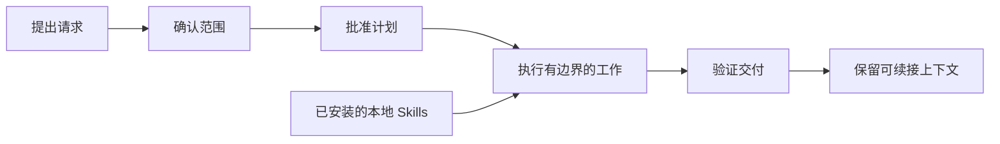

<div align="right">
  <a href="./README.md">English</a> | <strong>中文</strong>
</div>

<p align="center">
  
</p>

# VibeSkills

**面向复杂 AI 工作的受控工作流。**

VibeSkills 把一个难以直接完成的请求，整理成可确认的范围、有边界的
工作计划、按需使用的本地 Skills、可核对的交付证据，以及下次还能接上的
上下文。用户只需要从公开入口 `vibe` 开始，不必自己反复充当调度员。

[安装](#安装) · [快速开始](./docs/quick-start.md) ·
[v4.0.0 发布页](https://github.com/foryourhealth111-pixel/Vibe-Skills/releases/tag/v4.0.0) ·
[文档索引](./docs/README.md)

[](https://github.com/foryourhealth111-pixel/Vibe-Skills/releases/latest)
[](./LICENSE)
[](https://github.com/foryourhealth111-pixel/Vibe-Skills/stargazers)

## 它解决什么问题

复杂任务出问题，通常不是因为模型一句话都不会写，而是因为执行开始得太早：
需求还没确认，计划没有明确边界，Skills 选得过早，最后又缺少能支撑“完成”
的证据。VibeSkills 把这些关键决定放进同一条可检查的工作流里。

| 它帮你处理 | 实际影响 |
|:---|:---|
| 开工前先确认任务 | 需求会成为可审阅的材料，不再只是聊天里的默认假设。 |
| 把大任务拆成有边界的工作单元 | 每个单元都有负责人、输出、依赖关系和验证条件。 |
| 在合适的位置使用本地 Skills | Agent 先看清任务结构，再阅读候选 Skill 的真实合同。 |
| 用证据约束交付结论 | 测试、检查、产物或明确的人工审阅状态支撑完成声明。 |
| 中断后继续，而不是重讲一遍 | 需求、计划、决策和证据会保留在工作区里。 |

## 工作流



1. **确认范围**：把目标、约束、输入和预期交付讲清楚。
2. **确认计划**：把复合任务拆成可负责、可检查的模块，再让用户批准。
3. **执行工作**：当前 Agent 完成已批准模块，并在合同匹配时使用本地 Skill。
4. **验证交付**：检查声明的输出，让失败、阻塞和未完成状态保持可见。
5. **保留上下文**：留下下一次继续所需的需求、计划、决策和证据。

这里的批准节点是真正的停点。只生成需求，不等于已经有执行计划；只确认计划，
也不等于工作已经完成。

## 本地 Skills 放在哪里

公开运行时只把已安装的本地 skill 根目录当作唯一专家来源。候选项必须来自
宿主声明的本地根目录，并且存在可读的 `SKILL.md`，Agent 才能选择它。

面对复合任务，Agent 会冻结 `agent_skill_organization`，运行时再把这份决定
投影为 `module_assignments`。`module_assignments` 是每个批准模块实际绑定
哪个 Skill 的运行时真相面。发现候选不等于真的使用过，宽泛的扫描结果也不能
代替执行证据。

宿主可以增加本地根目录，让能力扩展时不长出新的中心目录。这不是说最终架构已经完成，而是 v4 当前公开且可验证的边界。

## 可以检查的证据

VibeSkills 把三层公开证明分开处理：

| 证明层 | 证据 | 能证明什么 |
|:---|:---|:---|
| `installed locally` | 安装收据与 `check` | 收据管理的安装文件存在，并且没有漂移。 |
| `runtime coherent` | 一次真实运行返回的 `session_root`，其中包含启动、输入、治理、阶段和摘要材料 | 这次受控运行完整跨过了运行时边界。 |
| `delivery accepted` | `delivery-acceptance-report.json` 或 `.md` | 声明的工作满足了交付条件。 |

三层证据不能相互冒充。安装成功不等于任务执行成功；出现执行文件，也不等于
交付已经通过。一个公开案例应该能顺着需求、计划、执行结果和验收报告完整核对，
而不是只放一张截图或一句“已完成”。

贡献者和维护者的收尾合同见
[非回归证明包](docs/status/non-regression-proof-bundle.md)。默认收尾应保持精简：
先证明受控运行时、入口真相、执行证据、发布一致性和仓库清洁，再按需要追加
更宽的审计。

### 当前发布事实

| 项目 | 已发布内容 |
|:---|:---|
| 版本 | [`v4.0.0`](https://github.com/foryourhealth111-pixel/Vibe-Skills/releases/tag/v4.0.0)，发布于 2026-07-17 |
| 安装包 | `vibe-skills-4.0.0-public.zip` |
| SHA-256 | `0b16a5f615a485b8d082407d458cc5c4ffe2cee443c6211fc941cd6678987dc9` |
| 标签目标提交 | `9cf0dcbf7c6e377806c00b2e0d2ffe75cb612d35` |

[v4 发布说明](./docs/releases/v4.0.0.md)记录了发布时使用的验证和迁移证据。

## 安装

公开安装从发布版本 ZIP 开始，不从仓库源码目录直接安装。下载发布 ZIP 后，
把它解压到受管 Skills 目录之外，再从解压目录运行安装脚本。

[下载 `vibe-skills-4.0.0-public.zip`](https://github.com/foryourhealth111-pixel/Vibe-Skills/releases/download/v4.0.0/vibe-skills-4.0.0-public.zip)

默认目录是 `~/.agents/skills`。

### Windows

```powershell
pwsh -NoProfile -File .\install.ps1 -SkillsDir "$HOME\.agents\skills"
pwsh -NoProfile -File .\check.ps1 -SkillsDir "$HOME\.agents\skills"
```

只安装给 Codex 使用时，显式指定 Codex 的 Skills 目录：

```powershell
pwsh -NoProfile -File .\install.ps1 -SkillsDir "$HOME\.codex\skills"
pwsh -NoProfile -File .\check.ps1 -SkillsDir "$HOME\.codex\skills"
```

### Linux 与 macOS

```bash
bash ./install.sh --skills-dir "$HOME/.agents/skills"
bash ./check.sh --skills-dir "$HOME/.agents/skills"
```

`check` 只证明 `installed locally`；它不证明 `runtime coherent`，也不证明
`delivery accepted`。

### 更新

先下载并解压更新版本，再从新版本目录对同一个 Skills 目录执行 `update` 和
`check`：

```powershell
pwsh -NoProfile -File .\update.ps1 -SkillsDir "$HOME\.agents\skills"
pwsh -NoProfile -File .\check.ps1 -SkillsDir "$HOME\.agents\skills"
```

卸载是单独操作。Windows 通用形式是
`uninstall.ps1 -SkillsDir <skills-dir>`；Shell 形式是
`uninstall.sh --skills-dir <skills-dir>`。

完整的 Windows 与 Shell 命令、更新规则、收据位置和 v3 到 v4 迁移说明，见
[安装指南](./docs/install/README.md)。

## 开始一次运行

VibeSkills 通过宿主的 Skills 入口调用，不是一个需要直接在终端运行的独立应用。

| 宿主 | 常见调用方式 |
|:---|:---|
| Codex | 在请求末尾加 `$vibe`。 |
| Claude Code | 在请求末尾加 `/vibe`。 |
| OpenCode | 使用 `/vibe` 或宿主支持的 Skills 调用方式。 |
| Cursor、Windsurf、OpenClaw | 按各自宿主的 Skills 入口说明调用。 |

目前 Codex 和 Claude Code 的安装与使用路径最清晰。其他支持 Skills 的宿主仍有
各自的配置和调用细节。

可以先试一个边界清楚的小任务：

> 请先和我确认需求范围，再把它整理成执行计划 `$vibe`

## 公开边界

- 公开运行时入口只有 `vibe`。
- 发布包只在 `<SkillsDir>/vibe` 下管理 Vibe 自有文件，不额外安装一套内置
  Skill 中心目录。
- 额外 Skills 来自共享 Skills 目录，或来自
  `~/.vibeskills/skill-roots.json` 与
  `<workspace>/.vibeskills/skill-roots.json` 配置的本地根目录。
- 安装器不会改写宿主设置、系统提示词或命令包装器，也不会自动配置 MCP 服务。
- 批准后的模块工作由当前 Agent 真正完成。运行时材料记录分配、返回、验证、
  失败和阻塞状态。
- Git、源码文档、需求、计划和验证收据仍是正式记录；工作区记忆帮助续接，
  但不能替代这些材料。

<details>
<summary><strong>当前运行时职责</strong></summary>

Python 负责 canonical validation、任务语义、`module_assignments`，以及从 `agent_skill_organization` 到 `module-work-plan.json`、`agent-execution-handoff.json`、`module-execution.json` 的真相链。

PowerShell 负责阶段编排、环境准备、脚本桥接、宿主收据和 Shell 原生检查。批准后的模块工作由当前 Agent 真正完成。

不要再把新的任务语义或任务执行加到 PowerShell；现有 PowerShell 阶段脚本只是迁移期编排面。未来是否完全迁移到 Python 是后续选择，不是本版本的完成条件。

</details>

## 文档入口

| 需求 | 从这里开始 |
|:---|:---|
| 安装、更新、卸载 | [简明安装指南](./docs/install/README.md) |
| 第一次受控运行 | [快速开始](./docs/quick-start.md) |
| 当前发布版本 | [v4.0.0 发布说明](./docs/releases/v4.0.0.md) |
| 运行时与设计合同 | [文档索引](./docs/README.md) |
| 排查问题 | [故障排查](./docs/troubleshooting.md) |
| 参与贡献 | [贡献指南](./CONTRIBUTING.md) |

## 社区与致谢

问题、纠错和范围清晰的贡献都可以通过
[GitHub Issues](https://github.com/foryourhealth111-pixel/Vibe-Skills/issues)
与 Pull Request 提交。项目参考并适配了 Superpowers、Get Shit Done、OpenSpec、
spec-kit、mem0、Scrapling、Serena 等开源项目的思路；归属说明见
[NOTICE](./NOTICE) 与 [第三方许可证](./THIRD_PARTY_LICENSES.md)。

社区贡献者包括
[xiaozhongyaonvli](https://github.com/xiaozhongyaonvli) 和
[ruirui2345](https://github.com/ruirui2345)。

## Star History

<p align="center">
  <a href="https://www.star-history.com/?repos=foryourhealth111-pixel%2FVibe-Skills&type=date&legend=top-left">
    <picture>
      <source media="(prefers-color-scheme: dark)" srcset="https://api.star-history.com/image?repos=foryourhealth111-pixel/Vibe-Skills&type=date&theme=dark&legend=top-left">
      <source media="(prefers-color-scheme: light)" srcset="https://api.star-history.com/image?repos=foryourhealth111-pixel/Vibe-Skills&type=date&legend=top-left">
      
    </picture>
  </a>
</p>
