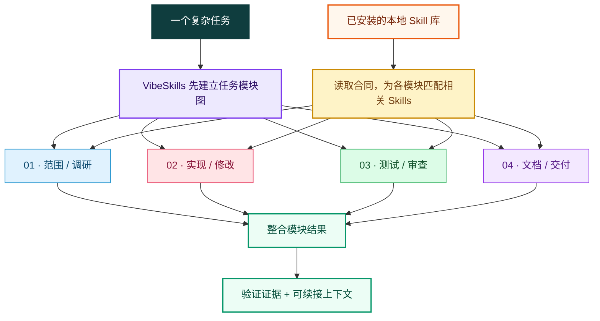

  <a href="./README.md">English</a> | <strong>中文</strong>

<h1>VibeSkills</h1>

<h3>让本地 Skills 成体系地工作起来。</h3>

<strong>复杂任务经常只触发最显眼的那几个 Skills。</strong> 
VibeSkills 先把整个任务拆开，再逐模块组织相关的本地 Skills， 
让你已经安装的能力真正参与到适合它的工作里。

  

  

<a href="./docs/quick-start.md">快速开始</a> ·
<a href="https://github.com/foryourhealth111-pixel/Vibe-Skills/releases/tag/v4.0.0">v4.0.0 发布页</a> ·
<a href="./docs/README.md">文档索引</a> ·
<a href="https://github.com/foryourhealth111-pixel/Vibe-Skills/stargazers">Star 项目</a>

  

<kbd>接收任务</kbd> &nbsp;→&nbsp;
<kbd>拆分模块</kbd> &nbsp;→&nbsp;
<kbd>匹配 Skills</kbd> &nbsp;→&nbsp;
<kbd>执行模块</kbd> &nbsp;→&nbsp;
<kbd>验证交付</kbd> &nbsp;→&nbsp;
<kbd>保存上下文</kbd>

---

## 核心问题：Skills 只靠被动触发，能力很容易闲置

> [!IMPORTANT]
> 一个任务明明有四个独立模块，Agent 却可能只给其中两个模块调用 Skills。
> 剩下两块继续用通用能力硬做，即使本地已经装着更合适的 Skill。VibeSkills
> 把 Skill 的使用放进工作计划，不再只靠提示词碰巧触发。

| 只靠被动触发 | 使用 VibeSkills |
|:---|:---|
| 根据请求里最显眼的词临时反应 | 开工前先画出完整的任务模块图 |
| 往往只叫来一两个熟悉的 Skills | 逐个模块判断有没有相关 Skill 可以提供帮助 |
| 其他模块继续由通用 Agent 临场处理 | 把有用的 Skills 绑定到明确模块和明确输出 |
| 多次调用彼此分散，缺少统一交付关系 | 所有模块回到同一条验证和续接链路里 |

这就是 VibeSkills 的核心作用：**把一批本地 Skills 组织成真正能协作的工作
系统**。它不会为了好看把所有 Skills 都叫一遍。它要解决的是另一件事：每个
有实际意义的模块，都应该认真判断一次有没有合适的 Skill 可以参与，避免现成
能力因为被动触发没命中而一直闲着。

## 先拆任务，再组织 Skills

先有模块图，再做 Skill 选择。四个模块如果需要四种不同的帮助，四块都可以得到
明确的 Skill 支持；某个模块不需要专门 Skill，就继续由当前 Agent 负责。目标
是把任务覆盖好，不是单纯把调用次数做大。

## VibeSkills 具体组织什么

| 工作面 | VibeSkills 的处理方式 |
|:---|:---|
| 需求 | 开工前确认目标、约束、输入和交付内容 |
| 模块图 | 把复合任务拆成有负责人、有依赖、有输出、有检查条件的工作单元 |
| Skills 组织 | 阅读相关本地 Skill 合同，判断它们分别能辅助哪些模块 |
| 执行 | 把批准后的模块交给当前 Agent，同时保留明确的 Skills 组织关系 |
| 交付 | 检查模块结果，让失败和阻塞保持可见，并保存下次继续所需的上下文 |

批准节点是真正的停点。只生成需求，不等于已经有执行计划；只确认计划，也不
等于工作已经完成。

## Skills 组织，不靠碰运气触发

公开运行时只把已安装的本地 skill 根目录当作唯一专家来源。候选项必须来自
宿主声明的本地根目录，并且存在可读的 `SKILL.md`，Agent 才能选择它。

面对复合任务，Agent 会冻结 `agent_skill_organization`，运行时再把这份决定
投影为 `module_assignments`。`module_assignments` 是每个批准模块实际绑定
哪个 Skill 的运行时真相面。发现候选不等于真的使用过，宽泛的扫描结果也不能
代替执行证据。

宿主可以增加本地根目录，让能力扩展时不长出新的中心目录。这不是说最终架构已经完成，而是 v4 当前公开且可验证的边界。

---

## 可以检查的证据

VibeSkills 把三层公开证明分开处理：

| 证明层 | 证据 | 能证明什么 |
|:---|:---|:---|
| `installed locally` | 安装收据与 `check` | 收据管理的安装文件存在，并且没有漂移。 |
| `runtime coherent` | 一次真实运行返回的 `session_root`，其中包含启动、输入、治理、阶段和摘要材料 | 这次受控运行完整跨过了运行时边界。 |
| `delivery accepted` | `delivery-acceptance-report.json` 或 `.md` | 声明的工作满足了交付条件。 |

三层证据不能相互冒充。安装成功不等于任务执行成功；出现执行文件，也不等于
交付已经通过。一个公开案例应该能顺着需求、计划、执行结果和验收报告完整核对，
而不是只放一张截图或一句“已完成”。

贡献者和维护者的收尾合同见
[非回归证明包](docs/status/non-regression-proof-bundle.md)。默认收尾应保持精简：
先证明受控运行时、入口真相、执行证据、发布一致性和仓库清洁，再按需要追加
更宽的审计。

### 当前发布事实

| 项目 | 已发布内容 |
|:---|:---|
| 版本 | [`v4.0.0`](https://github.com/foryourhealth111-pixel/Vibe-Skills/releases/tag/v4.0.0)，发布于 2026-07-17 |
| 安装包 | `vibe-skills-4.0.0-public.zip` |
| SHA-256 | `0b16a5f615a485b8d082407d458cc5c4ffe2cee443c6211fc941cd6678987dc9` |
| 标签目标提交 | `9cf0dcbf7c6e377806c00b2e0d2ffe75cb612d35` |

[v4 发布说明](./docs/releases/v4.0.0.md)记录了发布时使用的验证和迁移证据。

## 安装

公开安装从发布版本 zip 开始。请把发布 zip 下载到受管 `SkillsDir` 之外；
默认目录是 `~/.agents/skills`。

安装、更新、检查、卸载和版本迁移的命令统一放在这里：

**[打开完整安装与生命周期指南](./docs/install/README.md)**

当前安装包：
[vibe-skills-4.0.0-public.zip](https://github.com/foryourhealth111-pixel/Vibe-Skills/releases/download/v4.0.0/vibe-skills-4.0.0-public.zip)

## 核心宿主中立，载体通过适配器接入

VibeSkills 不绑定 Codex、Claude Code、Cursor 或任何单一宿主。运行合同和公开
发布包本身是宿主中立的。一个载体只要能够声明 Skill 根目录、调用 canonical
`vibe` 入口、保留受控停点，并回传规定的运行材料，就可以接入这套工作流。

| 可移植的部分 | 真实边界 |
|:---|:---|
| 普通本地 Skill | 任意 Skill 只要位于声明根目录中，拥有可读且有效的 `SKILL.md`、没有歧义的 ID，并且确实适合某个任务模块，就可以参与。 |
| 宿主或载体 | 新载体可以通过适配器或兼容的 canonical bridge 接入；核心不依赖某家产品的界面或命令语法。 |
| 支持口径 | 宿主中立不等于所有载体都已经完成即插即用验证。每个适配器仍保留自己的实测支持等级。 |

<strong>当前适配器证据</strong>

仓库目前有 Codex、Claude Code、Cursor、Windsurf、OpenClaw 和 OpenCode 的
明确适配器。Codex 与 Claude Code 标记为 `supported-with-constraints`，其他
几个命名适配器目前是 preview 路径。Generic Host 合同仍是 `advisory-only`，
所以新的载体可以消费运行合同，但不能在没有验证证据时声称已经完整支持。

准确状态见[宿主能力矩阵](./docs/universalization/host-capability-matrix.md)。

具体调用语法由宿主决定。`$vibe`、`/vibe` 或其他 Skills 入口形式只是适配器
示例，不是 VibeSkills 的产品边界。

## 公开边界

- 公开运行时入口只有 `vibe`。
- 发布包只在 `<SkillsDir>/vibe` 下管理 Vibe 自有文件，不额外安装一套内置
  Skill 中心目录。
- 额外 Skills 来自共享 Skills 目录，或来自
  `~/.vibeskills/skill-roots.json` 与
  `<workspace>/.vibeskills/skill-roots.json` 配置的本地根目录。
- 安装器不会改写宿主设置、系统提示词或命令包装器，也不会自动配置 MCP 服务。
- 批准后的模块工作由当前 Agent 真正完成。运行时材料记录分配、返回、验证、
  失败和阻塞状态。
- Git、源码文档、需求、计划和验证收据仍是正式记录；工作区记忆帮助续接，
  但不能替代这些材料。

<strong>当前运行时职责</strong>

Python 负责 canonical validation、任务语义、`module_assignments`，以及从 `agent_skill_organization` 到 `module-work-plan.json`、`agent-execution-handoff.json`、`module-execution.json` 的真相链。

PowerShell 负责阶段编排、环境准备、脚本桥接、宿主收据和 Shell 原生检查。批准后的模块工作由当前 Agent 真正完成。

不要再把新的任务语义或任务执行加到 PowerShell；现有 PowerShell 阶段脚本只是迁移期编排面。未来是否完全迁移到 Python 是后续选择，不是本版本的完成条件。

## 文档入口

| 需求 | 从这里开始 |
|:---|:---|
| 安装、更新、卸载 | [简明安装指南](./docs/install/README.md) |
| 第一次受控运行 | [快速开始](./docs/quick-start.md) |
| 当前发布版本 | [v4.0.0 发布说明](./docs/releases/v4.0.0.md) |
| 运行时与设计合同 | [文档索引](./docs/README.md) |
| 排查问题 | [故障排查](./docs/troubleshooting.md) |
| 参与贡献 | [贡献指南](./CONTRIBUTING.md) |

## 社区与致谢

问题、纠错和范围清晰的贡献都可以通过
[GitHub Issues](https://github.com/foryourhealth111-pixel/Vibe-Skills/issues)
与 Pull Request 提交。项目参考并适配了 Superpowers、Get Shit Done、OpenSpec、
spec-kit、mem0、Scrapling、Serena 等开源项目的思路；归属说明见
[NOTICE](./NOTICE) 与 [第三方许可证](./THIRD_PARTY_LICENSES.md)。

社区贡献者包括
[xiaozhongyaonvli](https://github.com/xiaozhongyaonvli) 和
[ruirui2345](https://github.com/ruirui2345)。

## Star History

  <a href="https://www.star-history.com/?repos=foryourhealth111-pixel%2FVibe-Skills&type=date&legend=top-left">
    <picture>
      <source media="(prefers-color-scheme: dark)" srcset="https://api.star-history.com/image?repos=foryourhealth111-pixel/Vibe-Skills&type=date&theme=dark&legend=top-left">
      <source media="(prefers-color-scheme: light)" srcset="https://api.star-history.com/image?repos=foryourhealth111-pixel/Vibe-Skills&type=date&legend=top-left">
      
    </picture>
  </a>

