  <a href="./README.md">English</a> | <strong>中文</strong>

<h1>VibeSkills</h1>

<h3>让本地 Skills 成体系地工作起来。</h3>

<strong>复杂任务经常只触发最显眼的那几个 Skills。</strong> 
VibeSkills 先把整个任务拆开，再逐模块组织相关的本地 Skills， 
让你已经安装的能力真正参与到适合它的工作里。

 

 

<a href="./docs/quick-start.md">快速开始</a> ·
<a href="https://github.com/foryourhealth111-pixel/Vibe-Skills/releases/tag/v4.0.0">v4.0.0 发布页</a> ·
<a href="./docs/README.md">文档索引</a> ·
<a href="https://github.com/foryourhealth111-pixel/Vibe-Skills/stargazers">Star 项目</a>

---

## 为什么需要 VibeSkills

> [!IMPORTANT]
> 一个复杂任务通常不止一件事。如果任务有四部分，AI 可能只在其中两部分想到
> 使用 Skill，剩下两部分仍然临场处理，即使你已经装了更合适的 Skill。
> VibeSkills 会先看完整任务，再决定每一部分需要什么帮助。

| 只靠被动触发 | 使用 VibeSkills |
|:---|:---|
| AI 临时根据几个关键词决定用什么 | 先把整个任务完整拆开 |
| 容易反复使用最熟悉的一两个 Skills | 每一部分都看看有没有更合适的 Skill |
| 没匹配到的部分继续临场处理 | 把合适的 Skill 安排到具体工作上，并写清要做出什么 |
| 各次调用互不衔接 | 最后把所有结果汇总起来一起检查 |

VibeSkills 做的事情很直接：**先把任务拆清楚，再把合适的 Skills 安排到对应的
部分**。它负责协调这些工作，并在最后把结果汇总起来检查。任务需要哪些 Skills
就使用哪些，不会把本地的 Skills 全部调用一遍。

## VibeSkills 怎样组织这些工作

  

图里的 VibeSkills 位于任务模块和本地 Skills 之间。它先拆任务，再根据每一部分
的需要选择 Skill，安排分工，并把结果汇总起来。四部分工作可以分别使用不同的
Skills，也可能只需要其中一部分。调用哪些 Skills 由任务本身决定。

## 实际案例：完成一项机器学习实验

> **任务**
>
> 使用公开数据完成一个可复现的分类实验，并交付数据审计、统计复核、4 张结果图、
> 科学报告和 7 页组会 Slides。

```mermaid
%%{init: {"flowchart": {"curve": "linear", "nodeSpacing": 18, "rankSpacing": 36}}}%%
flowchart LR
    subgraph DISC["Skill 发现"]
        direction TB
        A["本地 Skill 目录<br/>100+ Skills"]
        B["筛选候选<br/>读取 SKILL.md"]
        SEL["Skill 选择<br/>7 个 Skills 已分配"]
        A --> B
        B --> SEL
    end

    subgraph EXEC["执行 · 5 个工作组 · 10 个工作单元"]
        direction TB

        subgraph G1["G1 · 01 环境与数据"]
            direction LR
            u01["U01<br/>环境准备"]
            u02["U02<br/>数据审计"]
            u01 --> u02
        end

        subgraph G2["G2 · 02 建模与复现"]
            direction LR
            u03["U03<br/>基线实验"]
        end

        subgraph G3["G3 · 03 统计与科学复核"]
            direction LR
            u04["U04<br/>统计分析"]
            u05["U05<br/>科学复核"]
            u04 --> u05
        end

        subgraph G4["G4 · 04 图表与报告"]
            direction LR
            u06["U06<br/>结果图"]
            u07["U07<br/>报告初稿"]
            u08["U08<br/>报告复核"]
            u06 --> u07
            u07 --> u08
        end

        subgraph G5["G5 · 05 Slides 与验收"]
            direction LR
            u09["U09<br/>组会 Slides"]
            u10["U10<br/>案例打包与一致性检查"]
            u09 --> u10
        end

        G1 --> G2
        G2 --> G3
        G3 --> G4
        G4 --> G5
    end

    subgraph MID["运行与产物"]
        direction TB
        S(["运行状态<br/>10 / 10 完成<br/>0 失败 · 0 阻塞"])
        D["实际产物<br/>4 张图 · 科学报告<br/>7 页 Slides"]
        S --> D
    end

    subgraph VERIFY["验证 · 17 项检查"]
        direction TB

        subgraph V1["V1 · 基础与计划"]
            direction LR
            t01["T01<br/>必需文件"]
            t02["T02<br/>模块输出匹配"]
            t03["T03<br/>运行与计划绑定"]
            t04["T04<br/>环境合同"]
            t01 --> t02
            t02 --> t03
            t03 --> t04
        end

        subgraph V2["V2 · 数据、模型与复现"]
            direction LR
            t05["T05<br/>数据集合同"]
            t06["T06<br/>数据拆分与模型合同"]
            t07["T07<br/>基线结果"]
            t08["T08<br/>精确复现"]
            t05 --> t06
            t06 --> t07
            t07 --> t08
        end

        subgraph V3["V3 · 统计与交付物"]
            direction LR
            t09["T09<br/>不确定性一致性"]
            t10["T10<br/>统计文件写入保护"]
            t11["T11<br/>图表可追溯性"]
            t12["T12<br/>报告一致性"]
            t13["T13<br/>Slides 一致性"]
            t09 --> t10
            t10 --> t11
            t11 --> t12
            t12 --> t13
        end

        subgraph V4["V4 · 发布与边界"]
            direction LR
            t14["T14<br/>中英文摘要一致性"]
            t15["T15<br/>可视材料指引"]
            t16["T16<br/>Manifest 边界"]
            t17["T17<br/>产物路径边界"]
            t14 --> t15
            t15 --> t16
            t16 --> t17
        end

        V1 --> V2
        V2 --> V3
        V3 --> V4
    end

    E(["最终验收<br/>17 / 17 检查通过<br/>PASS"])

    DISC --> EXEC
    EXEC --> MID
    MID --> VERIFY
    VERIFY --> E

    classDef source fill:#EAF4F8,stroke:#1479A8,color:#182026;
    classDef selected fill:#E6F4F1,stroke:#167C70,color:#182026;
    classDef unit fill:#FFFFFF,stroke:#3A7CA5,color:#182026;
    classDef status fill:#FFF3E2,stroke:#D97706,color:#182026,stroke-width:2px;
    classDef output fill:#EAF5F3,stroke:#2D7F75,color:#182026;
    classDef check fill:#FFFFFF,stroke:#8A9AA7,color:#182026;
    classDef result fill:#EAF5EE,stroke:#237A45,color:#182026,stroke-width:2px;
    class A,B source;
    class SEL selected;
    class u01,u02,u03,u04,u05,u06,u07,u08,u09,u10 unit;
    class S status;
    class D output;
    class t01,t02,t03,t04,t05,t06,t07,t08,t09,t10,t11,t12,t13,t14,t15,t16,t17 check;
    class E result;

    style DISC fill:transparent,stroke:#AAB7C4,stroke-width:1px,stroke-dasharray:4 3;
    style EXEC fill:transparent,stroke:#AAB7C4,stroke-width:1px,stroke-dasharray:4 3;
    style MID fill:transparent,stroke:#AAB7C4,stroke-width:1px,stroke-dasharray:4 3;
    style VERIFY fill:transparent,stroke:#AAB7C4,stroke-width:1px,stroke-dasharray:4 3;
    style G1 fill:#FFFFFF,stroke:#DCE4EA,stroke-width:1px;
    style G2 fill:#FFFFFF,stroke:#DCE4EA,stroke-width:1px;
    style G3 fill:#FFFFFF,stroke:#DCE4EA,stroke-width:1px;
    style G4 fill:#FFFFFF,stroke:#DCE4EA,stroke-width:1px;
    style G5 fill:#FFFFFF,stroke:#DCE4EA,stroke-width:1px;
    style V1 fill:#FFFFFF,stroke:#DCE4EA,stroke-width:1px;
    style V2 fill:#FFFFFF,stroke:#DCE4EA,stroke-width:1px;
    style V3 fill:#FFFFFF,stroke:#DCE4EA,stroke-width:1px;
    style V4 fill:#FFFFFF,stroke:#DCE4EA,stroke-width:1px;
    linkStyle default stroke:#8A98A5,stroke-width:1px;
```

图中的 `U01` 到 `U10` 是 10 个实际工作单元；`T01` 到 `T17` 按
`consistency-check.json` 的记录顺序排列。检查节点之间的箭头只表示阅读顺序，
不表示业务依赖。

本次运行从已配置的本地 Skill 目录查找候选。发布准备时，这些目录中统计到
100 多个 Skills；VibeSkills 阅读筛选后的候选 `SKILL.md`，最后选择并使用了 7 个。

**10 / 10 个工作单元完成** · **0 个失败** · **0 个阻塞** ·
**17 / 17 项跨产物检查通过**

[查看完整案例](./docs/cases/ml-experiment/README.zh.md) ·
[查看原始材料](./docs/cases/ml-experiment/README.zh.md#原始材料) ·
[查看最终验收](./docs/cases/ml-experiment/evidence/delivery-acceptance-report.md)

## 从需求确认到最终检查

VibeSkills 会把需求确认、任务分级、Skill 分工、执行记录和最终检查放在同一条流程里。
任务记录会写明选择了哪些 Skills、它们负责什么，以及计划中的工作是否通过检查。

  

- **确认需求。** 开始工作前，VibeSkills 会先确认任务目标、限制条件、已有材料和
  最后需要交付的内容。需求没有确认时，它会停在这里，不会直接开始执行。

- **保存任务记录。** 需求、计划、执行进度和最终结果都会保存在这次任务的记录中。
  更换会话后，可以从已有记录继续；以后复查任务时，也能知道当时确认了什么、
  实际做了什么。

- **检查最终结果。** 工作完成后，VibeSkills 会把计划中的每一项与实际结果逐一
  对照。只要仍有必做项目未完成、失败或被卡住，任务就不会被写成已经完成。

<strong>查看任务分级和代码测试</strong>

- **自动推荐任务级别。** VibeSkills 会根据任务范围、步骤、依赖关系和能否同时推进，
  推荐 `L` 或 `XL`；用户也可以自己选择。

| 级别 | 适合的任务 | 处理方式 |
|:---|:---|:---|
| `L` | 步骤较多，但规模仍然可控 | 拆分后按顺序推进，处理过程较简单，使用的时间和上下文较少 |
| `XL` | 包含多个相对独立部分的大任务 | 拆得更细，互不影响时最多同时推进两项工作，并增加协调和结果汇总 |

- **安排测试。** 如果任务涉及代码，VibeSkills 会在适合时优先采用测试驱动开发
  （TDD）：先用失败测试确认问题，再完成修改并重新运行测试。测试结果会和其他
  任务结果一起记录。

## 它怎样找到合适的 Skill

VibeSkills 只会从你指定的本地 Skill 文件夹里寻找。一个 Skill 至少要有可读取的
`SKILL.md`，名称不能和另一个 Skill 重复，而且要真的适合当前这部分工作，AI
才会选择它。

你也可以在配置里增加其他本地文件夹。这样添加自己的 Skill 或第三方 Skill 时，
不必等 VibeSkills 项目本身收录它。VibeSkills 不会自动调用你安装的所有 Skills，
只会选择当前任务真正用得上的部分。

<strong>开发者：这些选择保存在哪里</strong>

计划阶段，`agent_skill_organization` 保存每一部分准备使用哪些 Skills。开始执行后，
`module_assignments` 保存实际分配。发现一个 Skill 只说明它可以考虑，不代表它
已经参与了工作。

---

## 运行后会保存什么

VibeSkills 会把安装情况、任务过程和最终检查分别保存下来。每个文件回答的问题
不同，不需要靠一张截图或一句“已经完成”来猜。

<strong>查看保存的文件</strong>

| 文件或目录 | 用来做什么 |
|:---|:---|
| `install-receipt.json` | 记录安装器写入的文件，供 `check` 检查安装是否完整、文件有没有被改动 |
| `session_root` | 保存一次任务的输入、进度、重要决定和运行摘要 |
| `module-work-plan.json` | 保存已经确认的任务安排，包括各部分由谁负责、需要交付什么、怎样检查 |
| `module-execution.json` | 保存各部分实际完成的结果，以及完成、失败或被卡住的状态 |
| `delivery-acceptance-report.json` 或 `.md` | 保存最终检查结果，说明哪些项目已经通过 |

这些记录不能互相代替。安装成功，不代表任务已经跑完；有运行记录，也不代表
最终结果已经通过检查。公开案例应该让人能顺着需求、计划、实际结果和最终检查
一路看下来。

维护项目时，可以使用这份[提交前检查清单](docs/status/non-regression-proof-bundle.md)。
一般先完成清单里的基础检查；只有发现风险时，再扩大检查范围。

## 安装

请从发布页面下载发布版本 zip，并先解压到准备安装 Skills 的文件夹之外。
默认目录是 `~/.agents/skills`。

安装、更新、检查、卸载和旧版本升级的命令都放在这里：

**[打开完整安装说明](./docs/install/README.md)**

当前版本下载：
[vibe-skills-4.0.0-public.zip](https://github.com/foryourhealth111-pixel/Vibe-Skills/releases/download/v4.0.0/vibe-skills-4.0.0-public.zip)

## 安装后会发生什么

- 你只需要记住一个入口：`vibe`。
- 安装器只会在 `<SkillsDir>/vibe` 中管理 VibeSkills 自己的文件，不会再安装一套
  内置 Skill 集合。
- 你自己的其他 Skills 保持原位。VibeSkills 会从共享 Skills 目录，或从
  `~/.vibeskills/skill-roots.json` 与
  `<workspace>/.vibeskills/skill-roots.json` 指定的本地文件夹中寻找。
- 安装器不会替你修改 AI 工具的设置、系统提示词或命令，也不会自动配置 MCP 服务。
- 你确认计划后，当前正在工作的 AI 会按计划完成任务。VibeSkills 会记下哪些部分完成了、
  哪些失败了、哪些被卡住。
- 需求、计划和源码仍然以项目文件与 Git 记录为准。工作区记忆只负责帮助你接着
  上次的进度继续，不会替代这些文件。

想了解内部实现，以及 Python 和 PowerShell 分别负责什么，请看
[架构说明](./docs/architecture/local-agent-kernel-v2.md)。

## 接下来可以看什么

| 你想做什么 | 从这里开始 |
|:---|:---|
| 查看一次完整的真实运行 | [机器学习实验案例](./docs/cases/ml-experiment/README.zh.md) |
| 安装、更新、卸载 | [简明安装指南](./docs/install/README.md) |
| 第一次使用 | [快速开始](./docs/quick-start.md) |
| 当前发布版本 | [v4.0.0 发布说明](./docs/releases/v4.0.0.md) |
| 查看哪些 AI 工具已经测试过 | [支持情况说明](./docs/universalization/host-capability-matrix.md) |
| 了解它怎么工作 | [文档索引](./docs/README.md) |
| 排查问题 | [故障排查](./docs/troubleshooting.md) |
| 参与贡献 | [贡献指南](./CONTRIBUTING.md) |

## 社区与致谢

问题、纠错和范围清晰的贡献都可以通过
[GitHub Issues](https://github.com/foryourhealth111-pixel/Vibe-Skills/issues)
与 Pull Request 提交。项目参考并适配了 Superpowers、Get Shit Done、OpenSpec、
spec-kit、mem0、Scrapling、Serena 等开源项目的思路；归属说明见
[NOTICE](./NOTICE) 与 [第三方许可证](./THIRD_PARTY_LICENSES.md)。

VibeSkills 的使用讨论和社区实践也可以在 [LINUX DO](https://linux.do/) 继续交流。
那里有技术讨论、AI 实践和使用经验分享。感谢 LINUX DO 社区一直以来对这个项目
的支持。

想看已经公开分享过的实践，可以从
[VibeSkills 3.1.0 社区实践案例](https://linux.do/t/topic/2061161) 开始。

社区贡献者包括
[xiaozhongyaonvli](https://github.com/xiaozhongyaonvli) 和
[ruirui2345](https://github.com/ruirui2345)。

## Star History

  <a href="https://www.star-history.com/?repos=foryourhealth111-pixel%2FVibe-Skills&type=date&legend=top-left">
    <picture>
      <source media="(prefers-color-scheme: dark)" srcset="https://api.star-history.com/chart?repos=foryourhealth111-pixel%2FVibe-Skills&type=date&theme=dark&legend=top-left">
      <source media="(prefers-color-scheme: light)" srcset="https://api.star-history.com/chart?repos=foryourhealth111-pixel%2FVibe-Skills&type=date&legend=top-left">
      
    </picture>
  </a>

