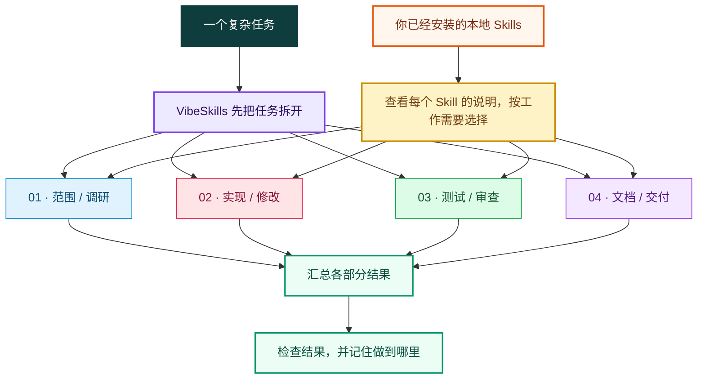

  <a href="./README.md">English</a> | <strong>中文</strong>

<h1>VibeSkills</h1>

<h3>让本地 Skills 成体系地工作起来。</h3>

<strong>复杂任务经常只触发最显眼的那几个 Skills。</strong> 
VibeSkills 先把整个任务拆开，再逐模块组织相关的本地 Skills， 
让你已经安装的能力真正参与到适合它的工作里。

  

  

<a href="./docs/quick-start.md">快速开始</a> ·
<a href="https://github.com/foryourhealth111-pixel/Vibe-Skills/releases/tag/v4.0.0">v4.0.0 发布页</a> ·
<a href="./docs/README.md">文档索引</a> ·
<a href="https://github.com/foryourhealth111-pixel/Vibe-Skills/stargazers">Star 项目</a>

  

<kbd>了解任务</kbd> &nbsp;→&nbsp;
<kbd>拆开任务</kbd> &nbsp;→&nbsp;
<kbd>选择 Skills</kbd> &nbsp;→&nbsp;
<kbd>完成工作</kbd> &nbsp;→&nbsp;
<kbd>检查结果</kbd> &nbsp;→&nbsp;
<kbd>记住进度</kbd>

---

## 为什么需要 VibeSkills

> [!IMPORTANT]
> 一个复杂任务通常不止一件事。如果任务有四部分，AI 可能只在其中两部分想到
> 使用 Skill，剩下两部分仍然临场处理，即使你已经装了更合适的 Skill。
> VibeSkills 会先看完整任务，再决定每一部分需要什么帮助。

| 只靠被动触发 | 使用 VibeSkills |
|:---|:---|
| AI 临时根据几个关键词决定用什么 | 先把整个任务完整拆开 |
| 容易反复使用最熟悉的一两个 Skills | 每一部分都看看有没有更合适的 Skill |
| 没匹配到的部分继续临场处理 | 把合适的 Skill 安排到具体工作上，并写清要做出什么 |
| 各次调用互不衔接 | 最后把所有结果汇总起来一起检查 |

VibeSkills 做的事情很直接：**先把任务拆清楚，再让合适的 Skills 去帮助合适的
部分**。它不会为了显得热闹而把所有 Skills 都叫一遍。某一部分不需要专门的
Skill，就由当前 AI 继续完成；需要时，则不会因为被动触发没碰上而错过。

## 先拆任务，再组织 Skills

先拆任务，再选 Skill。四部分工作如果分别需要不同的帮助，就可以分别安排；
某一部分不需要专门的 Skill，就继续由当前 AI 负责。重点是把事情做好，不是
单纯增加调用次数。

## VibeSkills 会怎么做

| 步骤 | 做法 |
|:---|:---|
| 弄清任务 | 开工前确认目标、限制、已有材料和最后要交什么 |
| 拆开任务 | 把复杂工作分成几部分，写清先后关系、负责人和预期结果 |
| 安排 Skills | 查看本地 Skill 的说明，判断它们分别适合帮哪一部分 |
| 完成工作 | 当前 AI 按确认过的安排逐项完成 |
| 检查结果 | 记录哪些完成了、哪些失败或被卡住，并保存下次继续需要的信息 |

需要你确认的地方，VibeSkills 会真的停下来。把需求说清楚，不等于计划已经定好；
确认了计划，也不等于工作已经完成。

## 它怎样找到合适的 Skill

VibeSkills 只会从你指定的本地 Skill 文件夹里寻找。一个 Skill 至少要有可读取的
`SKILL.md`，名称不能和另一个 Skill 重复，而且要真的适合当前这部分工作，AI
才会选择它。

你也可以在配置里增加其他本地文件夹。这样添加自己的 Skill 或第三方 Skill 时，
不必等 VibeSkills 项目本身收录它。VibeSkills 不会自动调用你安装的所有 Skills，
只会选择当前任务真正用得上的部分。

<strong>开发者：这些选择保存在哪里</strong>

计划阶段，`agent_skill_organization` 保存每一部分准备使用哪些 Skills。开始执行后，
`module_assignments` 保存实际分配。发现一个 Skill 只说明它可以考虑，不代表它
已经参与了工作。

---

## 运行后会保存什么

VibeSkills 会把安装情况、任务过程和最终检查分别保存下来。每个文件回答的问题
不同，不需要靠一张截图或一句“已经完成”来猜。

| 文件或目录 | 里面存什么 | 主要用途 |
|:---|:---|:---|
| `install-receipt.json` | 安装器写入了哪些文件，以及用来核对这些文件是否被改动的值 | 配合 `check` 查看安装是否完整、文件后来有没有被改动 |
| `session_root` | 一次任务的输入、当前做到哪一步、重要决定和运行摘要 | 查看这次任务实际进行到了哪里 |
| `module-work-plan.json` | 任务被拆成了哪些部分、谁负责、要交什么、怎么检查 | 查看已经确认的工作安排 |
| `module-execution.json` | 每一部分实际做了什么，以及完成、失败或被卡住的状态 | 查看工作是否真的执行过 |
| `delivery-acceptance-report.json` 或 `.md` | 最终检查清单，以及每一项是否通过 | 判断这次交付能不能算完成 |

这些记录不能互相代替。安装成功，不代表任务已经跑完；有运行记录，也不代表
最终结果已经通过检查。公开案例应该让人能顺着需求、计划、实际结果和最终检查
一路看下来。

维护项目时，可以使用这份[提交前检查清单](docs/status/non-regression-proof-bundle.md)。
一般先完成清单里的基础检查；只有发现风险时，再扩大检查范围。

### 当前版本

| 项目 | 内容 |
|:---|:---|
| 版本 | [`v4.0.0`](https://github.com/foryourhealth111-pixel/Vibe-Skills/releases/tag/v4.0.0)，发布于 2026-07-17 |
| 安装包 | `vibe-skills-4.0.0-public.zip` |
| SHA-256 | `0b16a5f615a485b8d082407d458cc5c4ffe2cee443c6211fc941cd6678987dc9` |
| 标签目标提交 | `9cf0dcbf7c6e377806c00b2e0d2ffe75cb612d35` |

[v4 发布说明](./docs/releases/v4.0.0.md)写明了发布前做过哪些检查，以及从旧版本
升级时要注意什么。

## 安装

请从发布页面下载发布版本 zip，并先解压到准备安装 Skills 的文件夹之外。
默认目录是 `~/.agents/skills`。

安装、更新、检查、卸载和旧版本升级的命令都放在这里：

**[打开完整安装说明](./docs/install/README.md)**

当前版本下载：
[vibe-skills-4.0.0-public.zip](https://github.com/foryourhealth111-pixel/Vibe-Skills/releases/download/v4.0.0/vibe-skills-4.0.0-public.zip)

## 不只支持某一种 AI 工具

VibeSkills 不是只为 Codex、Claude Code 或 Cursor 写的。它的主要工作方式不
依赖某个产品的按钮或命令格式。只要一个 AI 工具能够找到本地 Skills、启动
`vibe`、在需要确认时停下来，并把运行结果保存回来，就有办法接入。

| 想接入的内容 | 需要满足什么 |
|:---|:---|
| 本地 Skill | 任意本地 Skill 只要放在指定文件夹里，有有效且可读取的 `SKILL.md`，名称不重复，并且适合当前工作，就可以参与。 |
| AI 工具 | 这个工具需要知道去哪里找 Skills、怎样启动 `vibe`，以及把运行结果存到哪里。 |
| 实际支持情况 | 能接入，不等于已经在每种工具上完整测试过。项目会分别说明各个工具目前测试到了什么程度。 |

<strong>目前在哪些工具上测试过</strong>

仓库里已经有 Codex、Claude Code、Cursor、Windsurf、OpenClaw 和 OpenCode
使用 VibeSkills 所需的文件。Codex 和 Claude Code 已经跑过主要流程，但仍有一些
使用条件；其他几个工具还在早期支持阶段。对于名单之外的工具，项目提供通用说明，
但在实际测试之前不会写成“已经完整支持”。

各工具目前支持到什么程度，见[支持情况说明](./docs/universalization/host-capability-matrix.md)。

不同工具的启动写法可能不一样。Codex 里可以是 `$vibe`，Claude Code 里可以是
`/vibe`。这些只是各自的入口写法，不代表 VibeSkills 只能用在这几个工具里。

## 安装后会发生什么

- 你只需要记住一个入口：`vibe`。
- 安装器只会在 `<SkillsDir>/vibe` 中管理 VibeSkills 自己的文件，不会再安装一套
  内置 Skill 集合。
- 你自己的其他 Skills 保持原位。VibeSkills 会从共享 Skills 目录，或从
  `~/.vibeskills/skill-roots.json` 与
  `<workspace>/.vibeskills/skill-roots.json` 指定的本地文件夹中寻找。
- 安装器不会替你修改 AI 工具的设置、系统提示词或命令，也不会自动配置 MCP 服务。
- 你确认计划后，当前正在工作的 AI 会按计划完成任务。VibeSkills 会记下哪些部分完成了、
  哪些失败了、哪些被卡住。
- 需求、计划和源码仍然以项目文件与 Git 记录为准。工作区记忆只负责帮助你接着
  上次的进度继续，不会替代这些文件。

想了解内部实现，以及 Python 和 PowerShell 分别负责什么，请看
[架构说明](./docs/architecture/local-agent-kernel-v2.md)。

## 接下来可以看什么

| 你想做什么 | 从这里开始 |
|:---|:---|
| 安装、更新、卸载 | [简明安装指南](./docs/install/README.md) |
| 第一次使用 | [快速开始](./docs/quick-start.md) |
| 当前发布版本 | [v4.0.0 发布说明](./docs/releases/v4.0.0.md) |
| 了解它怎么工作 | [文档索引](./docs/README.md) |
| 排查问题 | [故障排查](./docs/troubleshooting.md) |
| 参与贡献 | [贡献指南](./CONTRIBUTING.md) |

## 社区与致谢

问题、纠错和范围清晰的贡献都可以通过
[GitHub Issues](https://github.com/foryourhealth111-pixel/Vibe-Skills/issues)
与 Pull Request 提交。项目参考并适配了 Superpowers、Get Shit Done、OpenSpec、
spec-kit、mem0、Scrapling、Serena 等开源项目的思路；归属说明见
[NOTICE](./NOTICE) 与 [第三方许可证](./THIRD_PARTY_LICENSES.md)。

社区贡献者包括
[xiaozhongyaonvli](https://github.com/xiaozhongyaonvli) 和
[ruirui2345](https://github.com/ruirui2345)。

## Star History

  <a href="https://www.star-history.com/?repos=foryourhealth111-pixel%2FVibe-Skills&type=date&legend=top-left">
    <picture>
      <source media="(prefers-color-scheme: dark)" srcset="https://api.star-history.com/image?repos=foryourhealth111-pixel/Vibe-Skills&type=date&theme=dark&legend=top-left">
      <source media="(prefers-color-scheme: light)" srcset="https://api.star-history.com/image?repos=foryourhealth111-pixel/Vibe-Skills&type=date&legend=top-left">
      
    </picture>
  </a>

