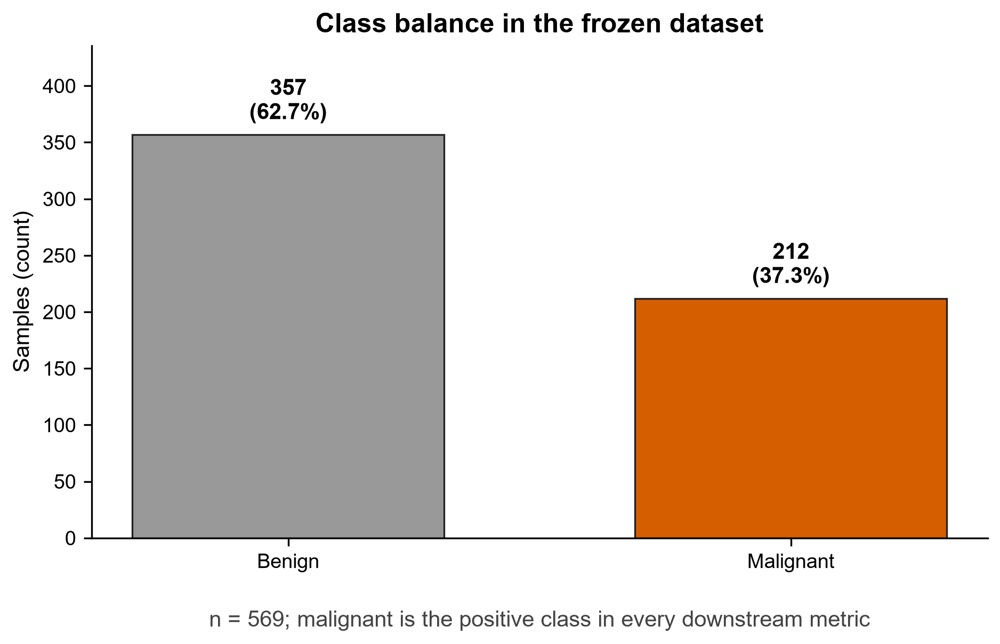
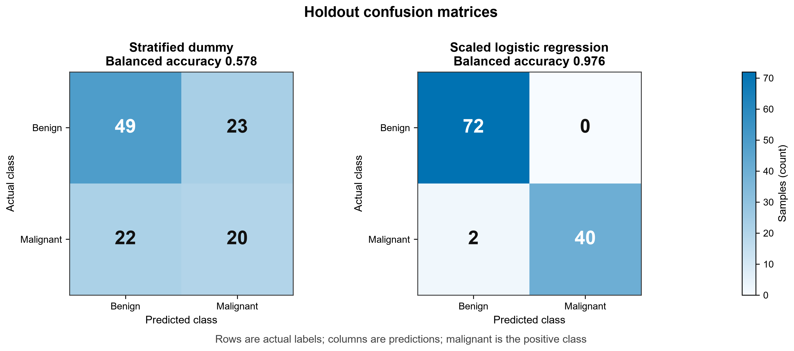
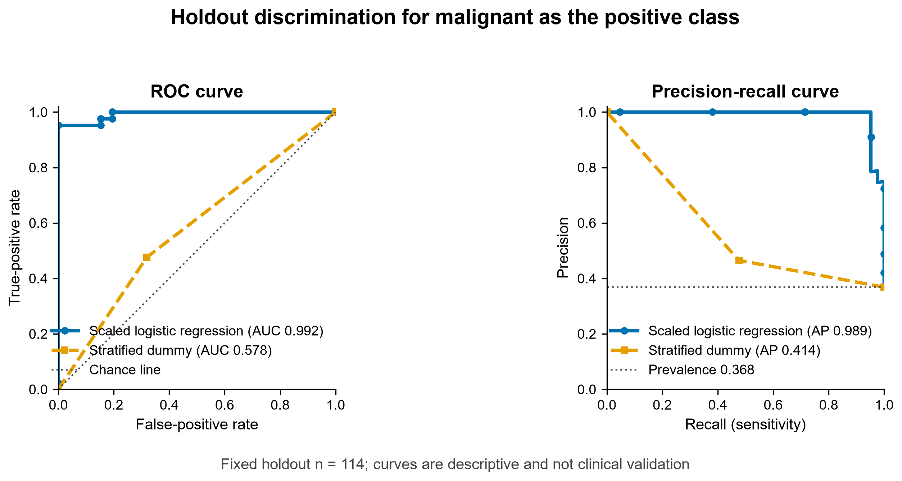
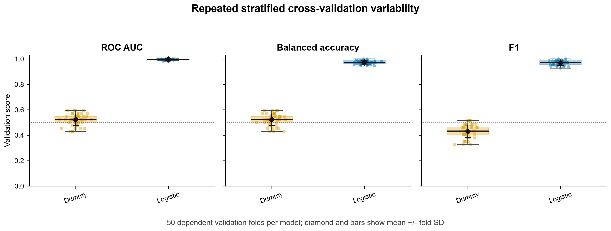
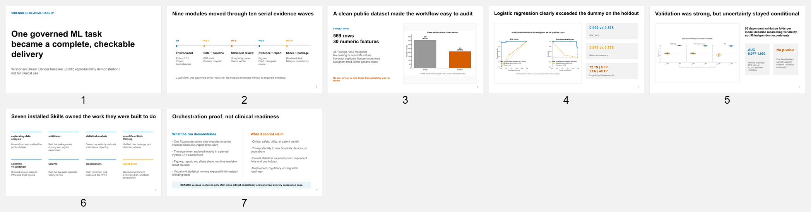

<div align="right">
  <strong>English</strong> | <a href="./README.zh.md">中文</a>
</div>

# Real case: completing a machine-learning experiment

This directory preserves one public VibeSkills case that passed final delivery
acceptance. The task used scikit-learn's bundled Wisconsin Breast Cancer dataset
and delivered a data audit, baseline model, statistical review, result figures,
scientific report, and group-meeting slides. The run ID is
`20260718T041559Z-51996499`.

This is a software-reproducibility case. It is not clinical validation and must
not be used for diagnosis or patient decisions.

## Result summary

| Item | Result |
|:---|:---|
| Local Skill scope | More than 100 available Skills were counted in the configured folders during publication preparation |
| Selected for this run | 7 Skills |
| Work plan | 9 modules completed as 10 serial work units |
| Execution | 10 completed, 0 failed, 0 blocked |
| Module acceptance | 18 criteria passed |
| Cross-artifact checks | 17 / 17 passed |
| Final acceptance | `PASS`, with readiness `fully_ready` |

The root README groups the 9 modules into 5 work groups for a quicker overview.
The original plan and execution records retain every module and work unit.

## How the Skills took part

VibeSkills searched the configured local Skill folders, read the shortlisted
candidates' `SKILL.md` files, and checked their purposes and limits. The case
then used these 7 Skills.

| Skill | Assigned work |
|:---|:---|
| `exploratory-data-analysis` | Materialize the public data and audit structure, quality, class balance, duplicates, and leakage risk |
| `scikit-learn` | Build the frozen comparator and logistic-regression baseline, then verify exact replay |
| `statistical-analysis` | Calculate variability and uncertainty intervals and state their assumptions |
| `scientific-critical-thinking` | Review bias, leakage, generalization limits, and unsupported claims |
| `scientific-visualization` | Produce 4 source-mapped PNG figures and matching SVG files |
| `sciwrite` | Review the scientific report in 5 passes without changing the approved scientific content |
| `presentations` | Build the 7-slide deck, render every slide, and inspect layout and data |

The complete selection record is in
[`selected-skills.json`](./evidence/selected-skills.json). The local Skill count
comes from [`skill-inventory-snapshot.json`](./evidence/skill-inventory-snapshot.json),
captured on the same host while preparing this public case. It is not a count
emitted by the accepted runtime.

## Delivered artifacts

| Data and model results | Delivery checks |
|:---:|:---:|
|  |  |
|  |  |

All 4 figures also have [SVG versions](./assets/vector/). The final written
report is [`scientific-report.md`](./outputs/scientific-report.md). The 7-slide
group-meeting deck is available as a [`PPTX`](./outputs/group-meeting-slides.pptx),
with the rendered montage below.



## Source materials

These files preserve the path from the original request to final acceptance.
Every number used on the root README can be traced to one of them.

| Stage | Material |
|:---|:---|
| Original task | [`original-task.md`](./evidence/original-task.md) |
| Confirmed requirement | [`requirement.md`](./evidence/requirement.md) |
| Execution plan | [`execution-plan.md`](./evidence/execution-plan.md) · [`module-work-plan.json`](./evidence/module-work-plan.json) |
| Skill selection | [`selected-skills.json`](./evidence/selected-skills.json) · [`skill-inventory-snapshot.json`](./evidence/skill-inventory-snapshot.json) |
| Actual execution | [`module-execution.json`](./evidence/module-execution.json) |
| Artifact consistency | [`consistency-check.json`](./evidence/consistency-check.json) |
| Final acceptance | [`delivery-acceptance-report.md`](./evidence/delivery-acceptance-report.md) · [`JSON`](./evidence/delivery-acceptance-report.json) |
| Public-copy notes | [`PUBLICATION-NOTES.md`](./PUBLICATION-NOTES.md) |

[`case-manifest.json`](./evidence/case-manifest.json) and
[`consistency-check.json`](./evidence/consistency-check.json) were generated
before final acceptance, so they preserve the pending state at that point in
the run. The later `module-execution.json` and `delivery-acceptance-report.*`
files record the final status.

## Reproduce the core experiment

The public package retains the data-audit, baseline, uncertainty, and figure
scripts. Confirm that `python` points to Python 3.12.12, then run these commands
from the repository root:

```powershell
python --version
python -m venv .\docs\cases\ml-experiment\reproduce\.venv
.\docs\cases\ml-experiment\reproduce\.venv\Scripts\python.exe -m pip install -r .\docs\cases\ml-experiment\reproduce\requirements.lock
pwsh .\docs\cases\ml-experiment\reproduce\reproduce.ps1
```

The script writes to `reproduce/generated/`, runs the frozen baseline twice,
and checks that the generated `metrics.json` exactly matches the accepted
result. The generated directory and virtual environment are excluded from Git.
